# 产品介绍
首先感谢选择keyes产品,
我们将继续为你提供好的产品和服务!
* 关于keyes                             
Keyes是KEYES Corporation旗下最畅销的品牌，我们的产品包括Arduino开发板、扩展板、传感器模块；树莓派、micro：bit扩展板和智能小车；以及为各阶段客户设计的完整入门套件。这些入门套件旨在为任何水平的客户学习Arduino、树莓派、micro：bit相关知识。
我们所有产品，均符合国际质量标准，在世界各地不同市场中，得到了极大的赞赏。 
欢迎从我们的官方网站查看更多内容：
http://www.keyes-robot.com

* 获取资料和售后服务                     
1.KEYES Beetlebot Pico 3合1 智能小车（含主板）资料下载地址：[https://pan.baidu.com/s/1jGUjGU5fUN4b3zK7aTUvZw](https://pan.baidu.com/s/1jGUjGU5fUN4b3zK7aTUvZw)
提取码：Keye   

2. 如果发现某些东西丢失或损坏，或者学习套件时遇到一些困难，keyes会提供免费和快速的支持。如果您有任何疑问，请联系我们我们客服或工作人员。
3. 欢迎提出建议和反馈，我们会根据您的反馈不断更新套件和教程，以使其更好。谢谢！
* 产品安全                               
1.本产品内含细小的零件（螺丝，铜柱等），请放在儿童接触不到的地方，防止划伤或误食。8岁及以下儿童使用，请在大人监督下使用。
2.本产品包含导电部件(控制板和电子模块），请按照本教程的要求进行操作，不当的操作可能导致过热并且损害零件，请勿触摸并立即断开电路电源（请按照正确的方式安装电池）。
* 版权                                   
keyes商标和徽标是KEYES DIY ROBOT co.,LTD的版权,任何人和公司在没有授权的情况下，不得复制，售卖，转卖，keyes品牌的产品。如果您有兴趣在当地售卖我们的产品，请联系我们专业的批发销售人员。

* 1. KEYES Beetlebot Pico 3合1 智能小车的介绍：

Beetlebot Pico 3合1 智能小车是一款兼容乐高积木的STEM教育产品，可以模拟道路环境中自动躲避路障，可以精准的循着地面的黑线行驶，可以识别自然环境中的光线并随之移动，还可以通过红外遥控或者WIFI APP遥控。Beetlebot有三种非常炫酷的外形，分别是：足球机器人，投石攻城车，搬运机器人。当然你也可以发挥想象力，搭建自己喜欢的结构形态。
相对于之前的智能小车，Beetlebot做了很多的革新。小车的电机驱动和传感器都采用集成式的设计，功能可靠并且安装简便。Beetlebot的控制核心是当今主流的开源硬件Raspberry Pi Pico，可以使用Beetlebot实现低成本的arduino C 编程、Python编程等学习计划。
Beetlebot不仅让孩子们学习到编程基础知识和人工智能的应用，还着力培养孩子们的创新思维、编程思维和动手实践的能力、解决问题的能力，以及团队协作的能力。比如使用自己编程的Beetlebot和小伙伴们来一场机器人踢足球比赛或者来一场攻城对战游戏，也是非常有趣的呢！

* 2. 特点：
（1）兼容乐高积木：可以用乐高积木扩展外形和增加兼容乐高的传感器。
（2）三种机器人外形：足球机器人，投石攻城车，搬运机器人。
（3）功能丰富：有表情显示，氛围灯控制，循迹，避障，追光，红外控制，WIFI控制。
（4）安装简单：车体采用嵌入式设计，只需要几个步骤就可以完成车体的安装和接线。
（5）兼容性强：车体预留了ESP32和Arduino Nano控制板的插口，兼容这两种开发板。
（6）充电功能: 集成了18650锂电池的充放电的电路，使用起来更经济便捷。
（7）WiFi控制：小车采用的是WiFi控制，有能力的朋友可以在此基础上进行二次开发
（8）小车APP：兼容Android和iOS系统，精美的软件界面和丰富灵活的控制系统

* 3. 参数：
工作电压：5v
输入电压：2.5V~4.2V（单节锂电池）
最大输出电流：≤3A
最大耗散功率：≤15W
WiFi工作频率：2.4G
电机转速：5V  200 rpm / min
电机驱动形式：DRV8833 双路H桥电机驱动
超声波感应角度：<15度
超声波探测距离：2cm-400cm
红外遥控距离：7米左右（实测）
尺寸：176mm×137mm×130mm(±1%)
工作温度：–10至+65摄氏度
环保属性：ROHS

* 4. 清单：
当收到这个Keyes Beetlebot Pico 3合1 智能小车工具包的时候，首先看到是一个包装精美的外盒，每个配件被安全且有序的装在外盒里面的小袋子里，先来清点一下：

|序号|规格|倍用量|图片|
| :--: | :--: | :--: | :--: |
|1|Raspberry Pi Pico开发板|1||
|2|光敏电阻传感器 |2|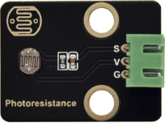|
|3|兼容乐高舵机 270°舵机|1|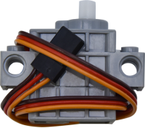|
|4|Beetlebot 3 in1 Robot STEM教育 扩展板|1|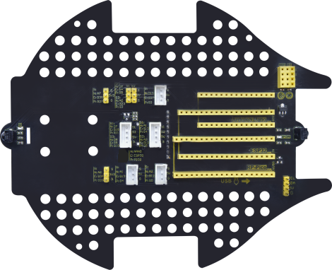|
|5|Beetlebot 3 in1 Robot STEM教育 驱动板|1||
|6|Beetlebot 3 in 1 Robot 乐高套件|1|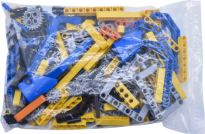|
|7|亚克力垫高板|1|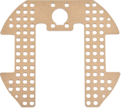|
|8|MD0487 超声波固定亚克力折弯板|1|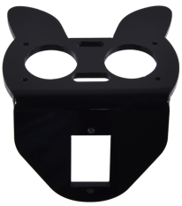|
|9|乐高孔位亚克力舵机固定平台|1||
|10|电机|2|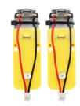|
|11|8X8点阵模块|1|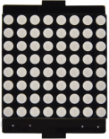|
|12|电机固定件|2|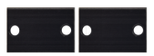|
|13|180度舵机|1||
|14|车轮|2|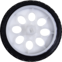|
|15|HC-SR04超声波传感器|1|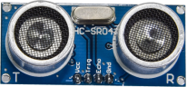|
|16| 十字螺丝刀|1|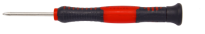|
| 17 | 大的万向轮 | 1 |  |
|18|USB数据线|1|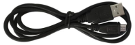|
|19|遥控器|1||
|20|USB2.0充电线|1|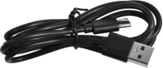|
|21|十字螺丝刀|1||
|22|3P转杜邦母单连接线 |2|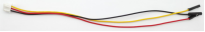|
| 23 | 4P 母对母连拼杜邦线（黑红蓝绿） | 1 |  |
| 24 | HX2.54mm-4P转2.54杜邦母单线（绿蓝红黑） | 1 |  |
| 25 | 10P XH2.54白色端子 两头同向线（绿蓝紫白棕橙灰黄红黑） | 1 |  |
|26|缠绕管|1|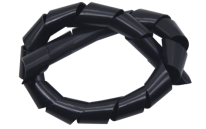|
|27|亚克力垫片|6|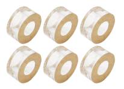|
|28|M3*40MM 双通六角铜柱|4|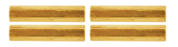|
|29|M1.2*5MM 圆头 十字 自攻螺钉|4|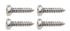|
|30|M2.3*16MM 圆头十字 自攻螺钉|2|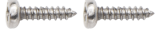|
|31|M1.4 镀镍螺母|4|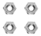|
|32|M1.4*10MM 圆头 十字 螺钉|4|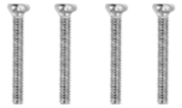|
|33|M2 镀镍螺母| 2 ||
|34|M2*8MM 圆头 十字螺钉| 2 |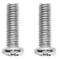|
|35|M3*10MM 圆头 十字螺钉|6|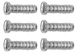|
|36|M3*6MM 圆头 十字螺钉|10|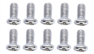|
|37|M3 镀镍螺母 |8|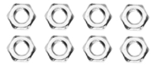|
|38|M3*30MM 圆头 十字螺钉|4|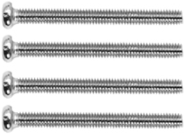|
|39|桌上足球 28mm|1||
|40|小的万向轮|1|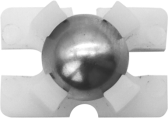|
|41|18650电池 2550mAh 动力5c| 1 |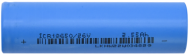|
|42|寻迹跑道|1||
|43|ESP8266串口WIFI ESP-01模块|1|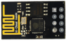|
|44|Keyes USB转ESP-01S WIFI模块串口测试扩展板|1|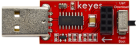|
