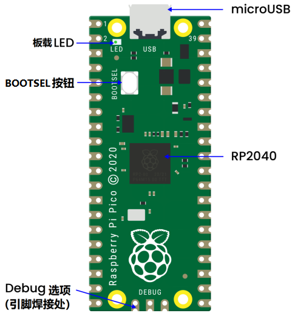

# Raspberry Pi Pico 主板

## Raspberry Pi Pico 简介：                    

2021年1月底的时候，树莓派基金会发布了一个重磅消息，推出了进军微控制器领域的Raspberry Pi Pico。功能强劲，价格便宜的特性让Raspberry Pi Pico受到了全世界创客们的关注，下面就来给大家介绍一下Raspberry Pi Pico这个小玩意儿。
Raspberry Pi Pico 主板是一块小小的板子，大小和Arduino Nano 主板差不多，为21mm × 51mm。

Raspberry Pi Pico是具有灵活数字接口的低成本高性能微控制器板。它集成了Raspberry Pi自己的RP2040微控制器芯片，运行速度高达133 MHz的双核Arm Cortex M0 +处理器，嵌入式264KB SRAM和2MB板载闪存以及26个多功能GPIO引脚。对于软件开发，可以使用Raspberry Pi的C/C++SDK或MicroPython，这个教程中我们使用MicroPython。

裸板不带针脚，需要自己焊。这是一块做工精良的电路板，也可以作为SMD元件，直接焊接到印刷电路板上。

主板上最主要的功能是一端的microUSB连接器。它既用于通信，也用于给Raspberry Pi Pico供电。
在microUSB连接器旁边安装了一个板载LED，它内部连接到GPIO针脚25，这是整个Raspberry Pi Pico主板上唯一的LED。
开机按钮安装在离LED稍低一点的地方，它可以让你改变Raspberry Pi Pico的启动模式，这样你就可以在上面加载MicroPython，进行拖拽式编程。
在板子的底部，你会看到三个连接点，这些连接点是用于串行Debug选项的，我们今天是入门，暂时不探讨这个问题，高级开发者会比较感兴趣。

在板子的中央是整个板子的“大脑”——RP2040 MCU，RP2040能够支持高达16MB的片外闪存，不过在Raspberry Pi Pico中只有4MB。
- 双核32位ARM Cortex-M0+处理器。
- 运行在48MHz，但可以超频到133MHz。
- 30个GPIO引脚(26个暴露)。
- 可支持USB主机或设备模式。
- 8个可编程I/O（PIO）状态机。

Raspberry Pi Pico是一个3.3V的逻辑器件，但由于内置了电压转换器和稳压器，它可以用一系列电源供电。
GND–––地线，8个地线加上3针Debug连接器上的一个附加地线，是方形的，而不是像其他连接的圆形。
VBUS–––这是来自microUSB总线的电源(5V)。如果Raspberry Pi Pico不是由microUSB连接器供电，那么这里将没有输出。
VSYS–––这是输入电压，范围为2V至5V。板载电压转换器将为Raspberry Pi Pico将其改为3.3V。
3V3–––这是Raspberry Pi Pico内部调节器的3.3V输出。只要将负载保持在300MA以下，它就可用于为其他组件供电。
3V3_EN–––你可以使用此输入禁用Raspberry Pi Pico 的内部电压调节器，从而关闭 Raspberry Pi Pico和由其供电的任何组件。
RUN–––可以启用或禁用RP2040微控制器，也可以将其复位。

Raspberry Pi Pico板上有26个裸露的GPIO连接，它们的排列顺序很好，在GP22和GP26之间有“空隙”（这些“缺失”的引脚在内部使用）。这些引脚都有多种功能，你可以为PWM配置多达16个引脚。有两个I2C总线，两个UART和两个SPI总线，这些可以配置使用多种GPIO引脚。
Raspberry Pi Pico有三个模数转换器分别为ADC0-GP26、ADC1-GP27、ADC2-GP28还有一个内部用于板载温度传感器的转换器ADC-VREF。注意：ADC的分辨率为12位。但MicroPython把范围映射到16位，也就是从0到65535，微处理器的工作电压是3.3V，也就是说0对应着0V，65535对应着3.3V。
你也可以在ADC_VREF引脚上提供一个外部精密电压参考。其中一个接地点，即33脚上的ADC_GND被用作该参考点的接地点。
| Raspberry Pi Pico 配置|
| :--: |
| 双核 Arm Cortex-M0 + @ 133MHz|
| 2 个 UART、2 个 SPI 控制器和 2 个 I2C 控制器|
| 芯片内置 264KB SRAM 和 2MB 的板载闪存|
| 16 个 PWM 通道1|
| 通过专用 QSPI 总线支持最高 16MB 的片外闪存|
| USB 1.1 主机和设备支持|
| DMA 控制器|
| 8 个树莓派可编程 I/O（PIO）状态机，用于自定义外围设备支持|
| 30 个 GPIO 引脚，其中 4 个可用作模拟输入|
| 支持 UF2 的 USB 大容量存储启动模式，用于拖放式编程|

## Raspberry Pi Pico原理图：

## 完整引脚图：

Raspberry Pi也在官网发布了一大堆技术文档，还有一本名为《Get Started with MicroPython on Raspberry Pi Pico》的说明书。它有纸质版，也有PDF版下载。
更多详情请了解树莓派官方网站：
https://www.raspberrypi.com/products/raspberry-pi-pico