# 扩展板及驱动板介绍

* 1. Beetlebot 3合1机器人STEM教育扩展板
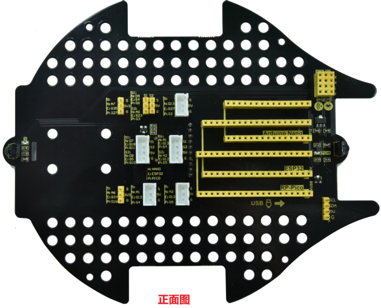
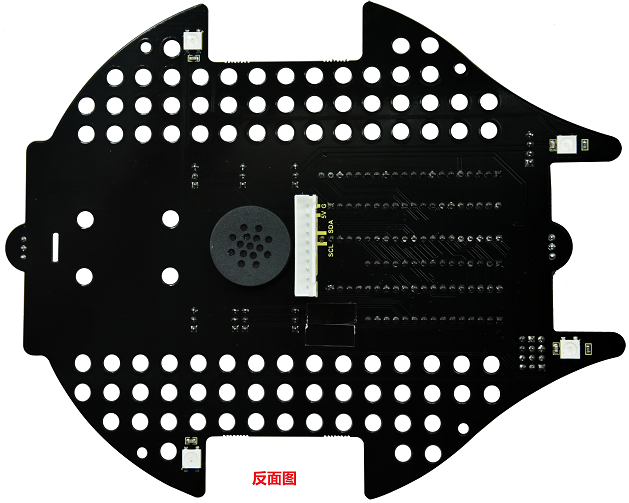

* 1. 扩展板介绍： 
这是基于Beetlebot Robot的扩展板，板上集成了蜂鸣器、红外接收和四个RGB灯，兼容arduino、ESP32和树莓派pico三款主流主控板，为学习不同语言（c/c++、python）提供了硬件支持。扩展板上添加了许多乐高孔，用乐高搭建多样的外形，配合Beetlebot Robot扩展板，可以实现许多趣味的功能，例如：足球机器人，投石攻城车, 搬运机器人等等。

* 2. 参数：
工作电压：3.3V-5V
工作电流：最大输出3.5A
最大功率：最大功率17.5W
工作温度范围：-10~50摄氏度
尺寸：169×136.7×29mm
重量：69.45g

* 3. 线路图：
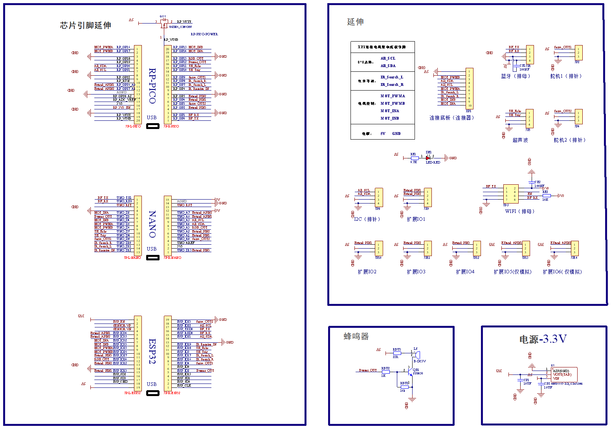
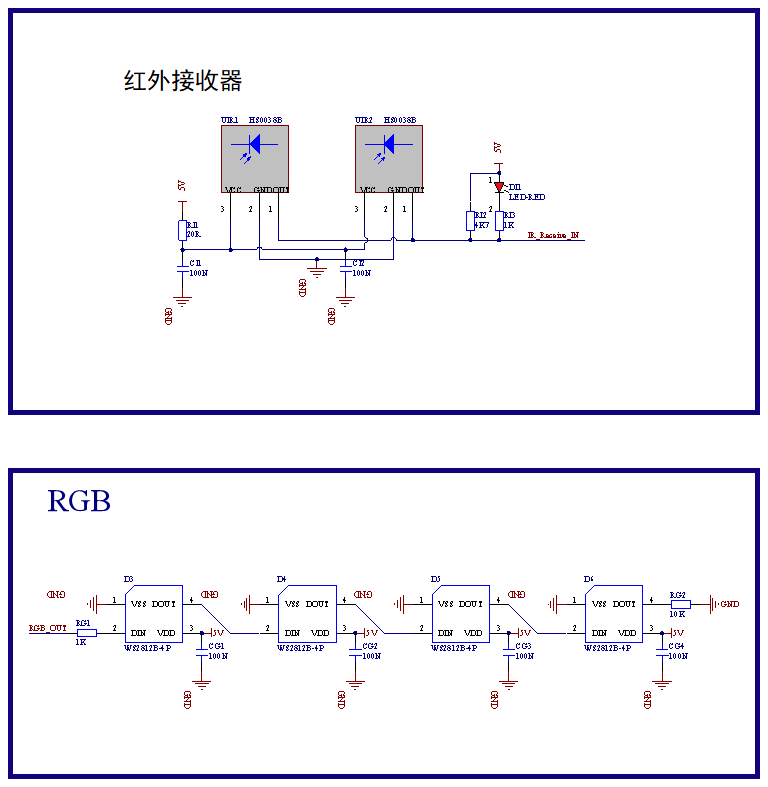

* 4. PCB板说明：
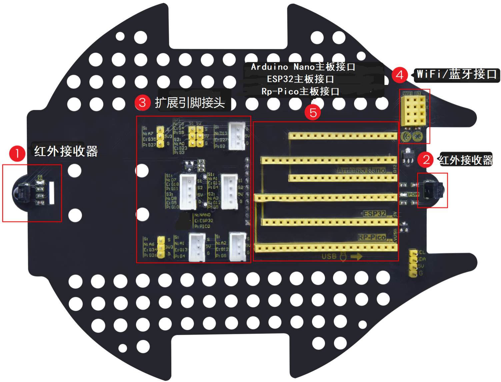
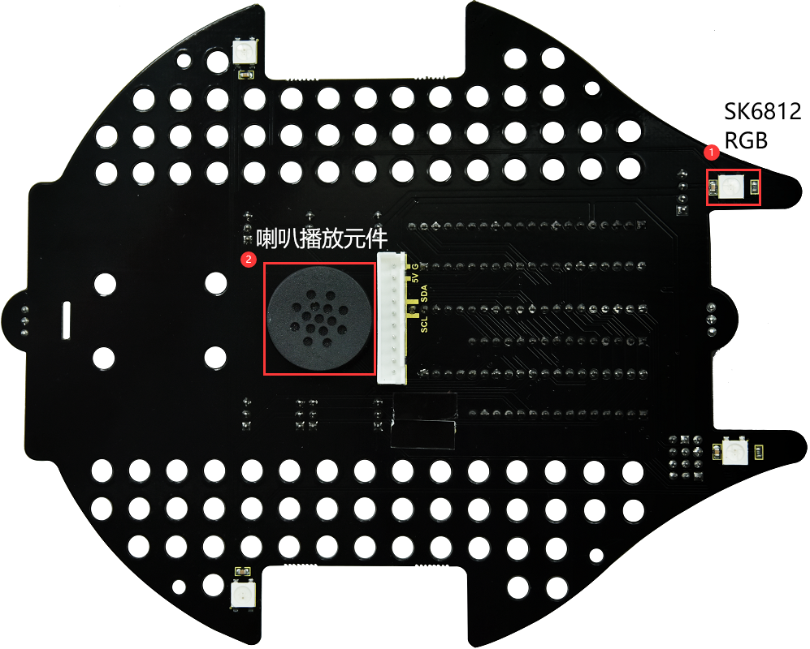

* 2. Beetlebot 3合1机器人STEM教育驱动板
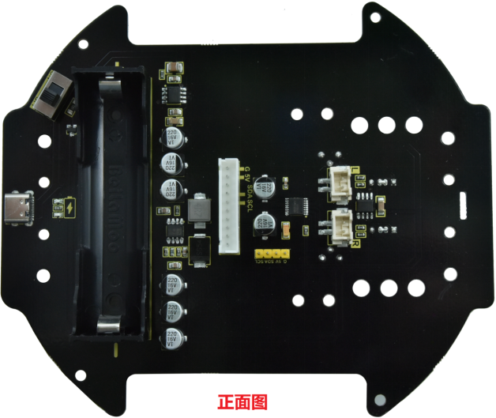
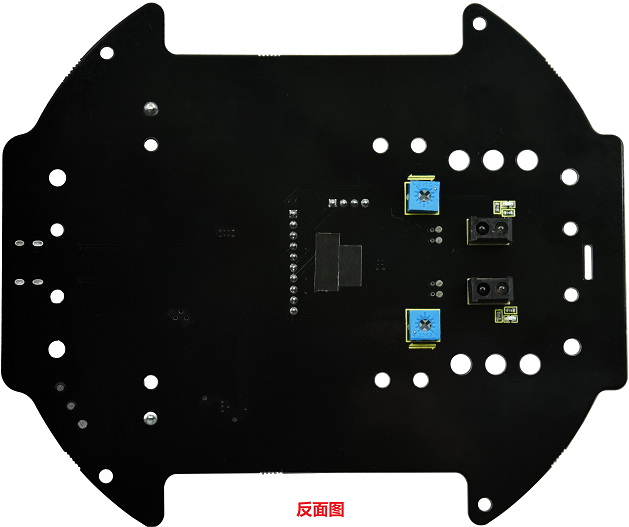
 
* 1. 驱动板介绍：
Beetlebot Robot驱动板上集成了充电模块、双电机模块，还有一个I2C接口（用来驱动8*8点阵屏），充电模块提供1A充电电流，电池反接保护和过充保护等，安全可靠。电机模块最大支持2A大电流放电驱动电机转动，提供强劲的动力，也可以用作其他大电流传感器供电。

* 2. 参数：
工作电压：3.3V-5V
工作电流：最大输出3.5A
最大功率：最大功率17.5W
工作温度范围：-10~50摄氏度
尺寸：145×122.5×19.5mm
重量：70.70g

* 3. 线路图：
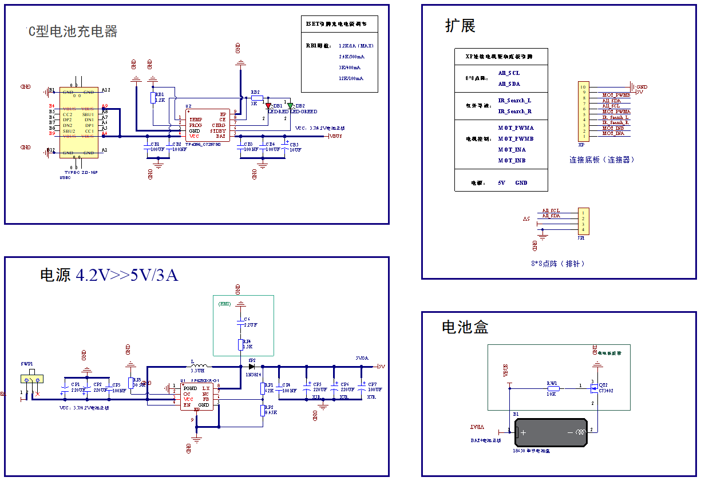
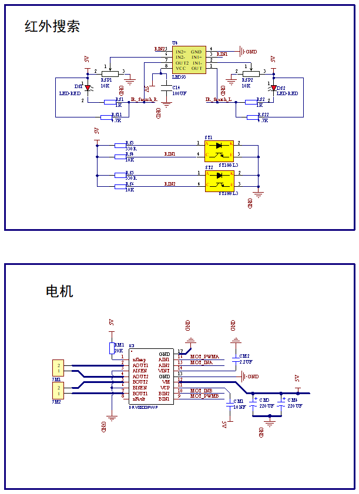

* 4. PCB板说明：
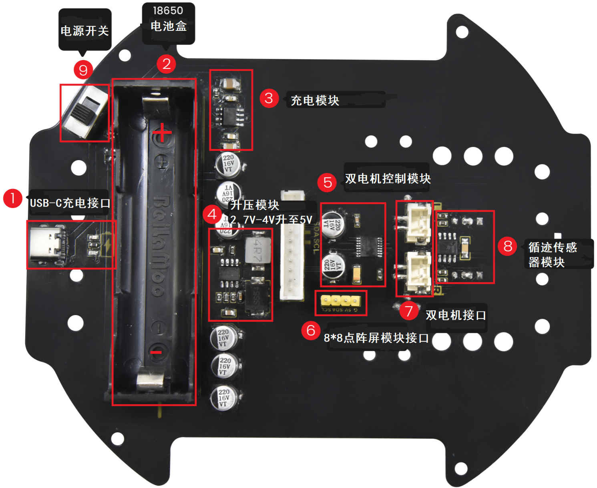
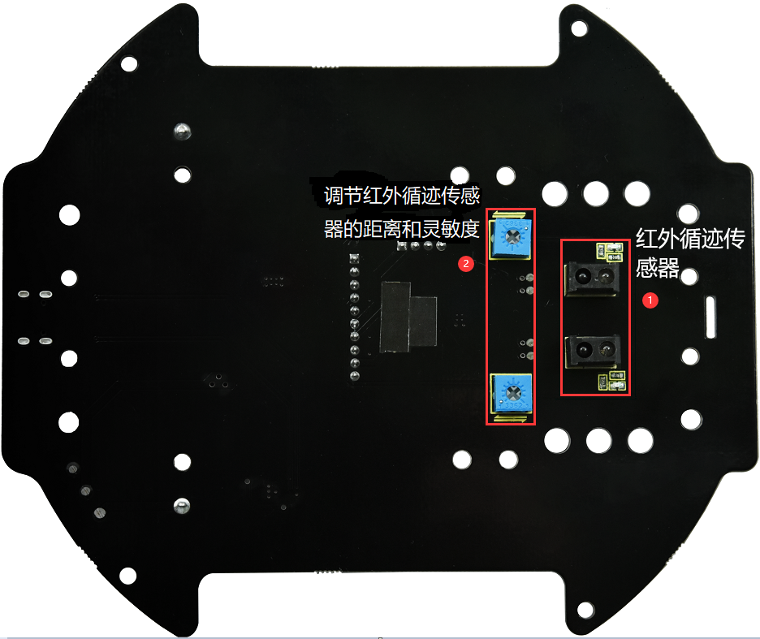

