# Arduino C 教程

## 开发环境配置

1. Windows系统：           


1.1. 下载安装Arduino软件：
(1)首先，进入Arduino官方网站：https://www.arduino.cc/ ，点击“**SOFTWARE**”进入下载页面，如下图所示：
 


(2)然后，根据你的操作系统选择并下载相应的安装程序。如果你是Windows用户，请选择安装2.0.3版本Arduino IDE，当点击“**Windows** Win10 and newer,64bits”或“**Windows** MSI installer”，代表下载安装文件(.exe) ，需要手动安装; 当点击“**Windows** ZIP file”，代表直接下载2.0.3版本Arduino IDE，是一个压缩文件，解压就可以直接使用，无需安装。


 点击下面图标，就可直接安装Arduino IDE了。


一般情况下，点击“**JUST DOWNLOAD**”就可以下载了，当然如果你愿意，你可以选择小小的赞助，以帮助伟大的Arduino开源事业。

(3)Arduino软件下载完成后,如果你是点击“**Windows** Win10 and newer,64bits”或“**Windows** MSI installer”下载的(.exe)文件“**arduino-ide_2.0.3_Windows_64bit.exe**” ，需要双击(.exe)文件继续安装，当你收到操作系统的警告时，请点击“**Allow access**”允许驱动程序安装。首先点击“**I Agree**”, 然后选择“Anyone who uses this computer(all users)”后再点击Next。

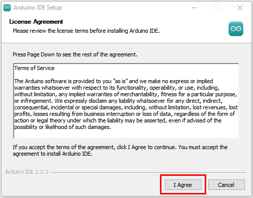


(4)点击“**Next**”后，如果又出现下面页面，点击“**I Agree**”。


(5)选择安装目录(我们建议保持默认目录)，然后点击“**Install**”。


(6)如果出现以下界面，则应选择“**Install**”。


该过程将提取并安装所有必需的文件，以正确执行Arduino软件(IDE)。


(7)安装完成后，会在桌面上生成一个Arduino IDE软件快捷方式。


(8)在电脑桌面上点击Arduino IDE软件快捷方式打开Arduino IDE。


(9)点击“File”→“Preferences”，选择“中文(简体)”之后点击“OK”。这样就对语言进行设置好了。

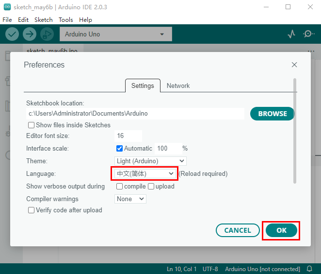
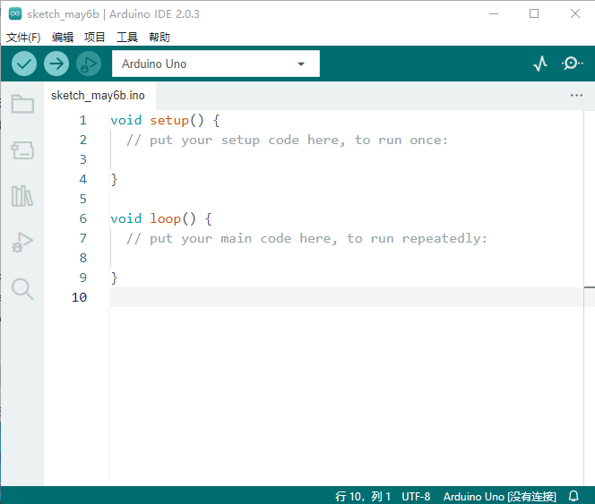

1.2. Arduino IDE工具栏介绍：
**点击电脑桌面上的图标，打开Arduino IDE。**


 -- 用于检查是否存在任何编译错误。
 -- 用于将程序上传到Arduino板。
 -- 用于编写程序时的单步调试。
 -- 用于从板接收串行数据并将串行数据发送到板的串行监视器。
 -- 用于串口接收的数据转换成动态曲线图。
 -- 用于打开最近保存的示例草图。
 -- 用手动安装开发板。

1.3. 安装开发板Pico
(相关资讯：https://github.com/earlephilhower/arduino-pico)
（1）网络连接良好的情况下，打开Arduino IDE，点击“文件”→“首选项”。

（2）打开下图标出的按钮。

（3）将这个地址：https://github.com/earlephilhower/arduino-pico/releases/download/global/package_rp2040_index.json ，复制粘贴到里面去再点击“**确定**”保存这个地址，如下图：

（4）再点击“**确定**”。

（5）单击“工具”→“开发板”→“开发板管理器...”。

（6）在搜索框中输入<span style="color: rgb(255, 76, 65);">“Pico”</span>，选择“**Raspberry Pi Pico/rp2040 by Earla F.Philhower**”，点击“**安装**”。

（7）安装过程中，当你收到操作系统的安全警告时，请单击**安装**允许设备软件安装。
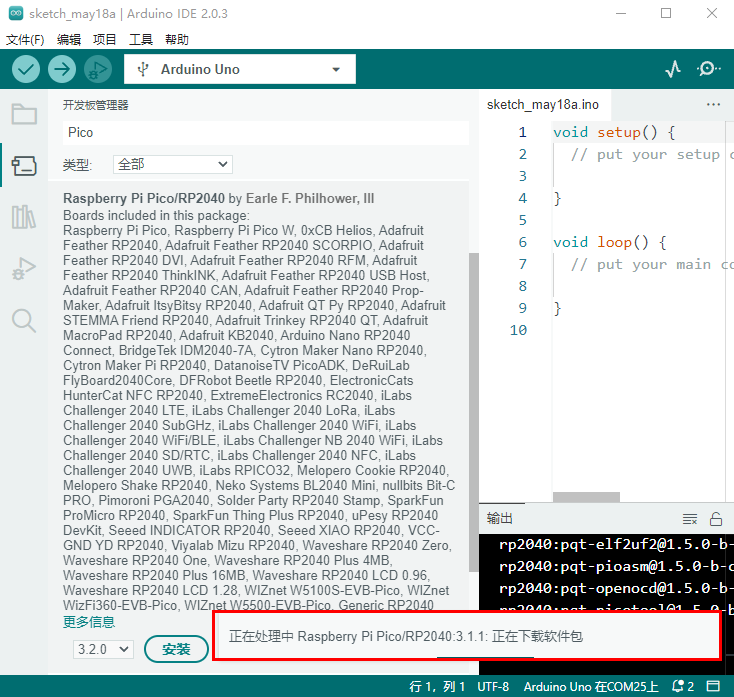

（8）安装完成后，单击“工具”→“开发板”，就可以看到刚刚安装的开发板Raspberry Pi Pico。


1.4. 安装驱动方法：
（<span style="color: rgb(255, 76, 65);">注意：如果电脑已经安装了驱动程序，则不需要再安装驱动；如果没有，则需要进行以下操作：</span>）

**Windows 10 系统：**

在使用Raspberry Pi Pico主板之前，必须安装驱动程序，否则Raspberry Pi Pico主板将无法与计算机通信。将Raspberry Pi Pico主板用USB线连接到电脑上，一般Windows10系统的电脑会自动识别串口，并安装相应的驱动程序，在设备管理器里可以找到“USB串行设备”。


**Windows 7/8 系统：**

如果你的电脑仍在用Windows7/8操作系统，当把Raspberry Pi Pico主板插到USB口后，电脑会发现一个"**Board CDC**"设备，但不能自动识别它，也无法安装驱动。

接下来你就可以参照“**1. 开发环境配置**”文件夹中的文件“**Raspberry Pi Pico win7系统不能识别端口解决办法**”来设置Windows7/8操作系统的驱动安装。


1.5. 上传Arduino兼容的Pico固件：
如果你的Raspberry Pi Pico板是新的，想使用Arduino学习和开发，则需要上传一个Adruino兼容的Raspberry Pi Pico固件。请参考以下步骤配置:

（1）断开Raspberry Pi Pico板与电脑的连接。继续按住Raspberry Pi Pico板上的白色按钮(BOOTSEL)，将Raspberry Pi Pico板连接到电脑。

等待电脑右下角出现Raspberry Pi Pico板对应的盘(RPI-RP2)，几秒钟之后再松开白色按钮(BOOTSEL)。<span style="color: rgb(255, 76, 65);">(注意：盘(RPI-RP2)出现前一定要一直按住白色按钮)</span>

（2）打开Arduino IDE，先单击“**工具**”→“**开发板**”，选择开发板Raspberry Pi Pico，然后再单击“**工具**”→“**端口**”，就可以看见端口“**UF2 Board** ”。

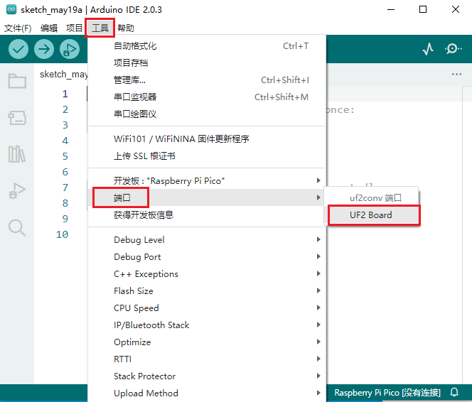
（3）打开Arduino IDE，单击 “**文件**”→“**示例**”→“**01.Basics**”→“**Blink**”。

（4）单击“**工具**”→“**开发板:**”→“**Raspberry Pi Pico/RP2040**”→“**Raspberry Pi Pico**”。

（5）单击“**工具**”→“**端口**”，选择端口“**UF2 Board** ”。

（6）点击上传按钮上传草图（Blink）到 Raspberry Pi Pico。
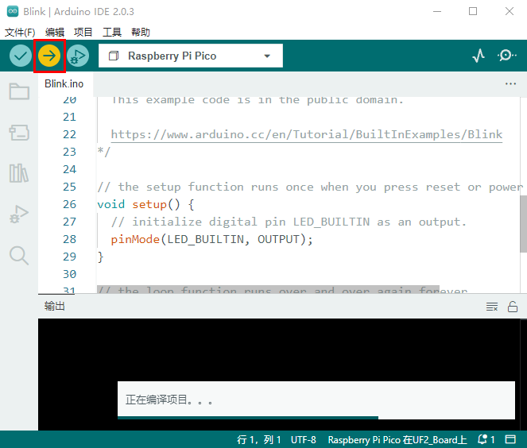
当草图完成上传时，可以看到以下提示。

（7）Raspberry Pi Pico板上的指示灯开始闪烁。

（8）单击“工具”→“端口”→COMx。COMx的X在不同的电脑上是不同的。请在你的电脑上选择正确的COM口。在这个的例子中，它是COM25。


<span style="color: rgb(255, 76, 65);">**特别注意:**</span>

A.每次使用Arduino IDE上传Raspberry Pi Pico的代码程序之前，都需要再次选择开发板(Raspberry Pi Pico)和端口(COMx)，否则可能导致代码上传失败。
B.有时在使用时，Raspberry Pi Pico可能会由于代码丢失固件而无法工作。此时，你可以如上所述步骤重新操作下上传Raspberry Pi Pico的固件。

2.Mac系统:


2.1.下载安装Arduino IDE:
进入Arduino官方网站：https://www.arduino.cc/ ，点击“**SOFTWARE**”进入下载页面，如下图所示：

接下来的操作类似于Windows系统，可以参考上面的Windows系统操作过程。

3.添加arduino库文件

我们提供的Arduino库文件的路径：**..\Keyes Beetlebot Pico 3合1 智能小车\3. Arduino C 教程\4. Arduino 库文件**。如下图：


3.1. Windows系统添加库文件的方法：

（1）打开Arduino IDE，在Arduino IDE界面点击“**项目**”→“**包含库**”→“**添加.ZIP库...**”。


（2）找到库文件存放的位置，选中对应的库文件，点击“**打开**”添加即可。库文件只能一个一个的添加。（<span style="color: rgb(255, 76, 65);">注意：库文件需要压缩为 **.ZIP**格式，我们在文件夹中是以 **.ZIP** 格式提供有；这里以“**Adafruit_NeoPixel.ZIP**”为演示，其他库文件的添加方法是一样的。</span>）


3.2. MacOS系统的库文件添加方法: 
（1）arduino IDE界面选择“**项目**” > “**包含库**” > “**添加.ZIP库...**”。


（2）找到库文件存放的位置，选中对应的库文件，点击“**打开**”添加即可。库文件只能一个一个的添加。（<span style="color: rgb(255, 76, 65);">这里以添加“**Adafruit_NeoPixel.ZIP**”库文件为例，其他库文件的添加方法一样</span>），如下图：


到这，正常是安装成功的了。


## Beetlebot ESP32 3合1 智能小车初始形态安装步骤


安装1

安装所需零件：


安装：


完成：


安装2

安装所需零件：


安装：


完成：


安装3

安装所需零件：


安装：


完成：


安装4

安装所需零件：


安装：


完成：


安装5

安装所需零件：


<span style="color: rgb(255, 76, 65);">先将电机、8*8点阵屏和上下pcb板的连接线都接上。</span>

|左电机|右电机|
| :--: | :--: |
|**L**|**R**|


|8*8点阵|小车PCB板|
| :--: | :--: |
|G|G|
|5V|5V|
|SDA|SDA|
|SCL|SCL|

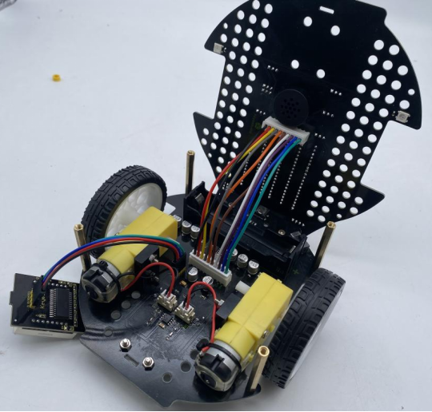

安装：


完成：


安装6

安装所需零件：
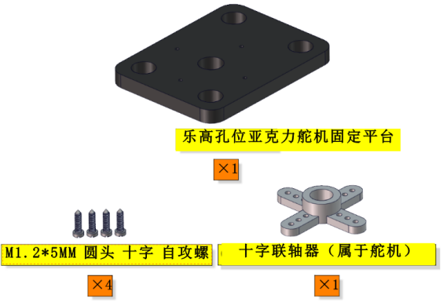

安 装：


完成：


安装7

安装所需零件：


安装：


完成：


安装8

安装所需零件：


安装：


完成：
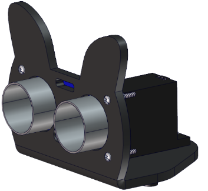

安装9

安装所需零件：
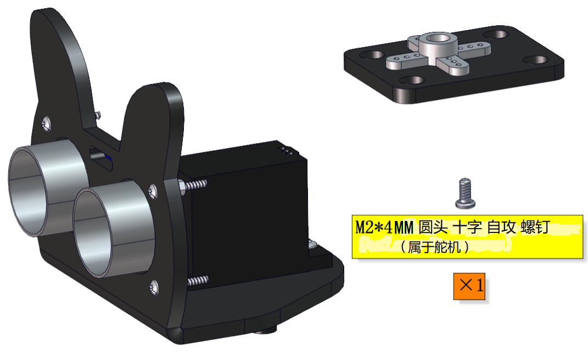

<span style="color: rgb(255, 76, 65);">安装前需要调节舵机角度为90°。</span>

|舵机|小车PCB板|
| :--: | :--: |
|棕线| G |
| 红线 | 5V |
| 橙黄线 | S1（G9）|


```
/*
  Project 00 Steering gear is initialized_Arduino
  调节舵机初始角度为90°.
*/
int servoPin = 9;//舵机的PIN

void setup() {
  pinMode(servoPin, OUTPUT);//舵机引脚设置为输出
  servopulse(servoPin, 90);//转动到90度
  delay(1000);
}

void loop() {
  
}

void servopulse(int pin, int myangle) { //脉冲函数
  int pulsewidth = map(myangle, 0, 180, 500, 2500); //将角度映射到脉宽
  for (int i = 0; i < 10; i++) { //多输出几次脉冲
    digitalWrite(pin, HIGH);//将舵机接口电平至高
    delayMicroseconds(pulsewidth);//延时脉宽值的微秒数
    digitalWrite(pin, LOW);//将舵机接口电平至低
    delay(20 - pulsewidth / 1000);
  }
}

```
上面的Arduino代码在资料中有提供，打开舵机的调整代码并烧录到Beetlebot的Raspberry Pi Pico主板，完成。代码如下图位置：


调整之后，正向前安装：


完成：


安装10

安装所需零件：
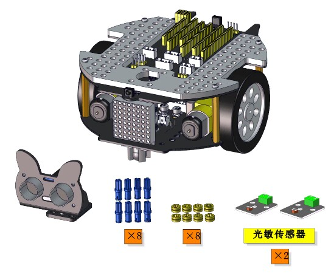

安装：


完成：


安装11

安装所需零件：


安装：


完成：


安装12

安装所需零件：


安装：


完成：


### 初始形态安装完成


### 初始形态接线图

超声波接线图：
|超声波传感器| 小车PCB板 |
| :--: | :--: |
|Vcc|5V|
|Trig|S2（G10）|
|Echo|S1（G11）|
| Gnd |G|


云台舵机接线图：
| 舵机 | 小车PCB板 |
| :--: | :--: |
| 棕线 | G |
| 红线 | 5V |
| 橙黄线 | S1（G9） |


左边光敏接线图：
|左边光敏传感器| 小车PCB板 |
| :--: | :--: |
| G| G |
| V| V |
|S|S（G26）|


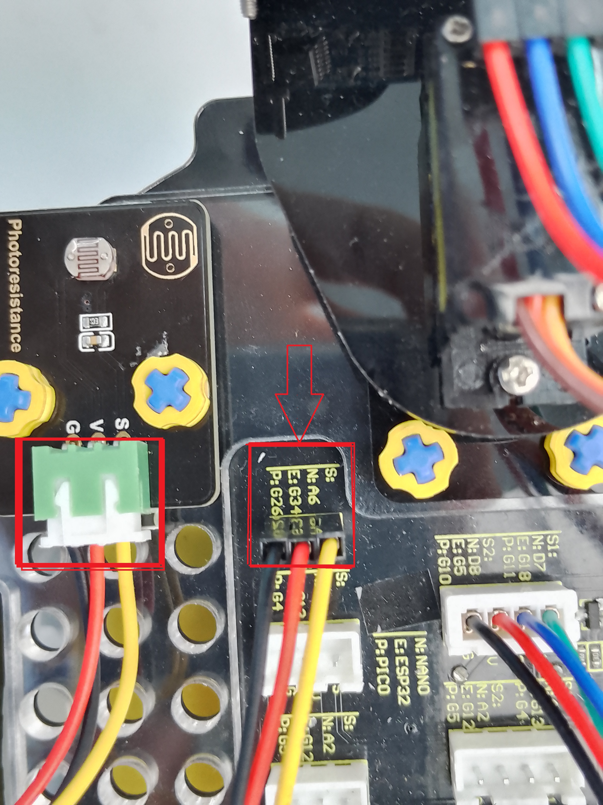

右边光敏接线图：
|右边光敏传感器| 小车PCB板 |
| :--: | :--: |
| G| G |
| V| V |
|S|S（G27）|


### 原型态安装完成示意图：


### 电池安装：

电池盒中标有( - )的一端是负极( - )，则另一端是正极( + )。


## 项目教程

### 项目01 板载LED闪烁

1.实验介绍：
Raspberry Pi Pico上有个板载LED，这个LED是固定接在Raspberry Pi Pico上的GP25引脚，在这个项目中，我们将来学习使板载LED闪烁的效果。

2.实验元件：
||  |
| :--: | :--: |
| Raspberry Pi Pico*1 |USB 线*1 |

3.实验接线：
在本项目中，用USB线将Raspberry Pi Pico和电脑连起来。连接方法请参照文档：<span style="color: rgb(255, 76, 65);">开发环境配置</span>


4.实验代码：
Raspberry Pi Pico板载LED是由GP25控制，当GP25输出高电平时，LED点亮;当输出低时，LED灯关闭。

```
//**********************************************************************
/*
项目 01：板载LED闪烁
使PICO主板上的LED闪烁.
*/
###define LED_BUILTIN 25

// 按复位键或单板上电时，设置功能运行一次
void setup() {
  // 初始化数字引脚LED_BUILTIN作为输出模式.
  pinMode(LED_BUILTIN, OUTPUT);
}

// 循环函数会一直运行下去
void loop() {
  digitalWrite(LED_BUILTIN, HIGH);   // 点亮LED (HIGH是高电平)
  delay(1000);                       // 延时1秒
  digitalWrite(LED_BUILTIN, LOW);    // 通过使电压为0来关闭LED
  delay(1000);                       // 延时1秒
}
//*************************************************************************************

```
在上传实验代码到Raspberry Pi Pico之前，请检查Arduino IDE的配置。
单击“**工具**”，确认“**开发板**”板型和“**端口**”，如下所示：


单击将实验代码上传到Raspberry Pi Pico。


实验代码上传成功！


5.实验结果：
项目代码上传成功后，利用USB线上电，可以看到的现象是：Raspberry Pi Pico的LED开始闪烁，循环进行。


### 项目02: SK6812 RGB

1.实验简介：
小车扩展板上有4个RGB LED，RGB LED属于简单的发光模块，可以通过调节色彩调出不同颜色的灯效，可广泛应用于建筑物、桥梁、道路、花园、庭院、地板等领域的装饰照明与会场布置、圣诞节、万圣节、情人节、复活节、国庆节等节日期间烘托气氛等场景。在本实验中，使小车扩展板上的4个RGB实现各种灯光效果。

2.元件知识：
**SK6812RGB：** 小车扩展板上有4个RGB LED，从原理图中可以看出，这4个RGBLED都是串联起来的，在电压电流充足的情况下可以接几百个RGB LED，都可以用一根信号线控制任意一个RGB LED，并且让它显示任意一种颜色。每一颗RGBLED都是一个独立的像素点，每个像素点都是由R、G、B三基色颜色组成，可实现256级亮度显示，完成16777216种颜色的全真色彩显示，同时像素点内部包含了智能数字接口数据锁存信号整形放大驱动电路，还内置信号整形电路，有效保证了像素点光的颜色高度一致。


3.添加库文件：
首先我们先确保安装了库文件，不然代码会编译出错，这里我们用到库文件“<span style="color: rgb(0, 209, 0);">Adafruit_NeoPixel</span>”，如何安装库文件请参考“<span style="color: rgb(255, 76, 65);">开发环境配置</span>”文件。如果库文件已安装，就跳过这一步骤。
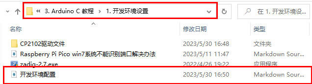

4.实验代码：
小车PCB板上的SK6812RGB是由Raspberry Pi Pico主板上的 GPIO13 控制。

```
//*************************************************************************************
/*
  项目 02 SK6812 RGB
  4个rgb用于各种照明效果。
*/
###include <Adafruit_NeoPixel.h>

###define PIN 13

// 参数1 =条带像素数
// 参数2 = Arduino引脚号(大部分有效)
// 参数3 =像素类型标志，根据需要添加在一起:
//   NEO_KHZ800  800 KHz比特流(大多数NeoPixel产品带WS2812 led)
//   NEO_KHZ400  400 KHz(经典的“v1”(不是v2) FLORA像素，WS2811驱动器)
//   NEO_GRB     像素连接到GRB位流(大多数NeoPixel产品)
//   NEO_RGB     像素连接到RGB位流(v1 FLORA像素，而不是v2)
Adafruit_NeoPixel strip = Adafruit_NeoPixel(4, PIN, NEO_GRB + NEO_KHZ800);

// 重要提示:为了降低NeoPixel烧毁风险，在像素电源引线上添加1000 uF电容，在第一个像素的数据输入上添加
// 300 - 500欧姆电阻，并最小化Arduino与第一个像素之间的距离。避免在带电电路上连接。如果必须，请先连接GND。

void setup() {
  strip.begin();
  strip.show(); // 将所有像素初始化为“off”
}

void loop() {
  // 一些示例程序显示如何显示到像素:
  colorWipe(strip.Color(255, 0, 0), 50); // 红
  colorWipe(strip.Color(0, 255, 0), 50); // 绿
  colorWipe(strip.Color(0, 0, 255), 50); // 蓝
  // 发送一系列像素追逐…
  theaterChase(strip.Color(127, 127, 127), 50); // 白
  theaterChase(strip.Color(127,   0,   0), 50); // 红
  theaterChase(strip.Color(  0,   0, 127), 50); // 蓝

  rainbow(20);
  rainbowCycle(20);
  theaterChaseRainbow(50);
}

// 用颜色一个接一个地填充圆点
void colorWipe(uint32_t c, uint8_t wait) {
  for(uint16_t i=0; i<strip.numPixels(); i++) {
      strip.setPixelColor(i, c);
      strip.show();
      delay(wait);
  }
}

void rainbow(uint8_t wait) {
  uint16_t i, j;

  for(j=0; j<256; j++) {
    for(i=0; i<strip.numPixels(); i++) {
      strip.setPixelColor(i, Wheel((i+j) & 255));
    }
    strip.show();
    delay(wait);
  }
}

// 稍有不同的是，这使得彩虹均匀地分布在各处
void rainbowCycle(uint8_t wait) {
  uint16_t i, j;

  for(j=0; j<256*5; j++) { // 5轮所有颜色
    for(i=0; i< strip.numPixels(); i++) {
      strip.setPixelColor(i, Wheel(((i * 256 / strip.numPixels()) + j) & 255));
    }
    strip.show();
    delay(wait);
  }
}

//剧院风格的爬行灯.
void theaterChase(uint32_t c, uint8_t wait) {
  for (int j=0; j<10; j++) {  //do 10 cycles of chasing
    for (int q=0; q < 3; q++) {
      for (int i=0; i < strip.numPixels(); i=i+3) {
        strip.setPixelColor(i+q, c);    //每三个像素打开
      }
      strip.show();
     
      delay(wait);
     
      for (int i=0; i < strip.numPixels(); i=i+3) {
        strip.setPixelColor(i+q, 0);        //每3个像素关闭
      }
    }
  }
}

//带有彩虹效果的剧院式爬行灯
void theaterChaseRainbow(uint8_t wait) {
  for (int j=0; j < 256; j++) {     // 来回循环所有256种颜色
    for (int q=0; q < 3; q++) {
        for (int i=0; i < strip.numPixels(); i=i+3) {
          strip.setPixelColor(i+q, Wheel( (i+j) % 255));    //每三个像素打开
        }
        strip.show();
       
        delay(wait);
       
        for (int i=0; i < strip.numPixels(); i=i+3) {
          strip.setPixelColor(i+q, 0);        //每3个像素关闭
        }
    }
  }
}

// 输入一个0到255的值来获得颜色值.
// 这些颜色是r - g - b -回到r.
uint32_t Wheel(byte WheelPos) {
  if(WheelPos < 85) {
   return strip.Color(WheelPos * 3, 255 - WheelPos * 3, 0);
  } else if(WheelPos < 170) {
   WheelPos -= 85;
   return strip.Color(255 - WheelPos * 3, 0, WheelPos * 3);
  } else {
   WheelPos -= 170;
   return strip.Color(0, WheelPos * 3, 255 - WheelPos * 3);
  }
}
//*************************************************************************************

```
在上传实验代码到Raspberry Pi Pico之前，请检查Arduino IDE的配置。
单击“**工具**”，确认“**开发板**”板型和“**端口**”，如下所示：


单击将实验代码上传到Raspberry Pi Pico。


实验代码上传成功！


5.实验现象：
安上电池，将小车底板上的电源拨码开关拨到ON一端，开启电源。实验代码上传至Raspberry Pi Pico成功后，小车底板上的4个RGB LED发出各种颜色灯光效果。


### 项目03: 演奏音乐

1.实验简介：
小车扩展板上有个喇叭功放元件，它常用来播放音乐，作为一些音乐播放设备的外接扩音设备。
在本实验中，我们利用喇叭功放元件来播放一首音乐。

2.元件知识：
**喇叭功放元件：** 喇叭功放元件（原理相当于无源蜂鸣器），其内部不带震荡电路，控制时需要在元件正极输入不同频率的方波，负极接地，从而控制喇叭功放元件响起不同频率的声音。

3.实验代码：
小车PCB板上的喇叭功放元件是由Raspberry Pi Pico主板的IO口GPIO12控制。

```
//*************************************************************************************
/*
项目 03 演奏音乐
蜂鸣器播放音乐
*/
###define PIN_BUZZER 12   //定义蜂鸣器的引脚

void setup() {
  pinMode(PIN_BUZZER, OUTPUT);
}

void loop() {
    alert();
}

void alert() {
  float sinVal;         // 定义一个变量来保存正弦值
  int toneVal;          // 定义一个变量来保存声音频率
  for (int x = 0; x < 360; x += 10) {     // X从0°到360°
    sinVal = sin(x * (PI / 180));       // 计算sinx
    toneVal = 2000 + sinVal * 500;      // 根据sinx计算声音频率
    freq(PIN_BUZZER, toneVal, 10);
  }
}

void freq(int PIN, int freqs, int times) {
  if (freqs == 0) {
    digitalWrite(PIN, LOW);
  }
  else {
    for (int i = 0; i < times * freqs / 1000; i ++) {
      digitalWrite(PIN, HIGH);
      delayMicroseconds(1000000 / freqs / 2);
      digitalWrite(PIN, LOW);
      delayMicroseconds(1000000 / freqs / 2);
    }
  }
}
//**********************************************************************

```
在上传实验代码到Raspberry Pi Pico之前，请检查Arduino IDE的配置。
单击“**工具**”，确认“**开发板**”板型和“**端口**”，如下所示：


单击将实验代码上传到Raspberry Pi Pico。


实验代码上传成功！


5.实验现象：
安上电池，将小车底板上的电源拨码开关拨到ON一端，开启电源。实验代码上传至Raspberry Pi Pico成功后，小车底板上的喇叭功放元件就开始播放不同频率声音。
### 项目04: 点阵屏

1.实验简介：
8×8 点阵屏通过LED(发光二极管）组成，以灯珠亮灭来显示文字、图片、动画、视频等，8×8 点阵显示屏制作简单，安装方便，被广泛应用于各种公共场合，如汽车报站器、广告屏、银行窗口屏、叫号屏以及停车系统等等。在本实验中，将使用8×8 点阵屏来显示图案。

2.元件知识：
**8×8点阵屏：** LED点阵屏按照LED发光颜色可分为单色、双色、三色灯等，可显示红、黄、绿甚至是真彩色。根据LED的数量又分为4×4、8×8、16×16等不同类型。这里我们通过单色8×8点阵屏来了解其原理。
不同点阵屏封装不同，8×8点阵屏由8行8列共64个LED灯组成，其内部结构如下图：

每个LED放置在行线和列线的交叉点上，当对应的某一行电平拉高，某一列电拉低，则对应交叉点的LED就会点亮。8×8点阵屏有16个管脚，将有丝印的一边朝下，逆时针编号为1-8，9-16。

其对应内部管脚定义如下如所示：
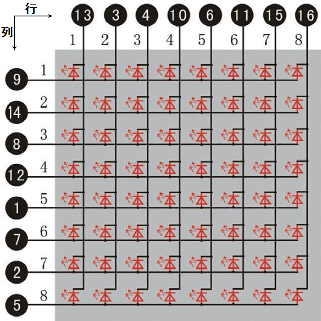
比如我们要点亮第一行第一列LED灯，则对应将点阵屏的第9脚拉高，第13脚拉低，其他LED控制以此类推即可。
**HT16K33 8X8点阵驱动模块：** 上面介绍了8*8点阵的原理，想控制8*8点阵需要多达16个单片机的引脚。这样既浪费资源也浪费时间。这里用了一个驱动点阵屏的芯片：HT16K33。HT16K33是一款内存映射和多功能LED控制器驱动芯片。利用HT16K33芯片驱动1个8*8点阵，只需要利用单片机的I2C通信端口控制点阵，大大的节约了单片机资源。下图是HT16K33 芯片工作原理图。

我们基于以上原理设计了一个8X8点阵驱动模块，从上图我们可以看出，我们只要通过I2C 通讯利用单片机的2个引脚就可以很好的控制点阵显示。
**8X8点阵模块的参数：**
- 工作电压: 5V    
- 额定输入频率: 400KHZ 
- 输入功率: 2.5W  
- 输入电流: 500mA  
**取模工具的使用说明：**
点阵和驱动的原理都已经介绍完了，那点阵上显示的内容是怎么来的呢，有没有比较简便的方法？这里给大家介绍一款点阵取模工具，这块工具使用的是在线版，链接：http://dotmatrixtool.com/#
现在就一起看看怎么使用吧。
①打开链接如下图：

②我们的点阵是8X8的，所以调整高度为8，宽度为8，如下图：

③在Endian 这里选择Big Endian(MSB)这个模式

④将图案生成16进制的数据
如下图，按鼠标左键选中，右键取消，画好自己想要的图案，点击<span style="color: rgb(255, 76, 65);">Generate</span>，就会生成我们所需要的十六进制的数据了，这里是以下面的图案为例的。

这个生成的十六进制的代码（0x22, 0x14, 0x48, 0x40, 0x40, 0x48, 0x14, 0x22）就是点阵需要显示的内容，如果想要点阵显示这样的图案，则需要将这十六进制的代码放到程序里面。

3.实验接线：
| 8X8点阵 | 小车PCB板 |
| :--: | :--: |
| G | G |
| 5V | 5V |
| SDA | SDA |
| SCL | SCL |


4.添加库文件：
首先我们先确保安装了库文件，不然代码会编译出错，这里我们用到库文件“<span style="color: rgb(0, 209, 0);">Matrix_pico</span>”，如何安装库文件请参考“<span style="color: rgb(255, 76, 65);">开发环境配置</span>”文件。如果库文件已安装，就跳过这一步骤。


5.实验代码：
8X8点阵是由Raspberry Pi Pico主板的GPIO20（SDA），GPIO21（SCL）控制。

```
//*************************************************************************************
/*
 项目 04 8*8 点阵
 8*8点阵屏幕显示图案
*/
###include <Matrix_pico.h>
Matrix myMatrix(20,21);
uint8_t LedArray1[8]={0x00,0x18,0x24,0x42,0x81,0x99,0x66,0x00};
uint8_t  LEDArray[8];
void setup(){
myMatrix.begin(0x70);
}

void loop(){
  myMatrix.clear();
  for(int i=0; i<8; i++)
  {
    LEDArray[i]=LedArray1[i];
    for(int j=7; j>=0; j--)
    {
      if((LEDArray[i]&0x01)>0)
      myMatrix.drawPixel(j, i,1);
      LEDArray[i] = LEDArray[i]>>1;
    }
  }
  myMatrix.write();
}
//**********************************************************************************

```
在上传实验代码到Raspberry Pi Pico之前，请检查Arduino IDE的配置。
单击“**工具**”，确认“**开发板**”板型和“**端口**”，如下所示：


单击将实验代码上传到Raspberry Pi Pico。


实验代码上传成功！


6.实验现象：
安上电池，将小车底板上的电源拨码开关拨到ON一端，开启电源。实验代码上传至Raspberry Pi Pico成功后，小车前的8*8点阵屏显示如下图案。


### 项目05: 舵机转动

1.实验简介：
小车上有两个舵机，这里以接在引脚GPIO9的舵机为例，舵机是一种可以非常精确地旋转的电机。目前已广泛应用于玩具车、遥控直升机、飞机、机器人等领域。在这个项目中，我们将使用Raspberry Pi Pico主板控制舵机转动。

2.元件知识：

**舵机：** 舵机是一种位置伺服的驱动器，主要是由外壳、电路板、无核心马达、齿轮与位置检测器所构成。其工作原理是由接收机或者单片机发出信号给舵机，其内部有一个基准电路，产生周期为20ms，宽度为1.5ms 的基准信号，将获得的直流偏置电压与电位器的电压比较，获得电压差输出。经由电路板上的IC 判断转动方向，再驱动无核心马达开始转动，透过减速齿轮将动力传至摆臂，同时由位置检测器送回信号，判断是否已经到达定位。适用于那些需要角度不断变化并可以保持的控制系统。当电机转速一定时，通过级联减速齿轮带动电位器旋转，使得电压差为0，电机停止转动。
舵机有多种规格，但它们都有三根连接线，分别是棕色、红色、橙色(不同品牌可能有不同的颜色)。棕色为GND，红色为电源正极，橙色为信号线

舵机的伺服系统由可变宽度的脉冲来进行控制，橙色的控制线是用来传送脉冲的。一般而言，PWM控制舵机的基准信号周期为20ms（50Hz），理论上脉宽应在1ms到2ms之间，对应控制舵机角度是0°～180°。但是，实际上更多控制舵机的脉宽范围是0.5ms 到2.5ms，具体需要自己实际调试下。

经过实测，舵机的脉冲范围为0.65ms~2.5ms。180度舵机，对应的控制关系是这样的：
|高电平时间|舵机角度|基准信号周期时间（20ms）|
| :--: | :--: | :--: |
|0.65ms|0度|0.65ms高电平+19.35ms低电平|
|1.5ms|90度|1.5ms高电平+18.5ms低电平|
|2.5ms|180度|2.5ms高电平+17.5ms低电平|

舵机的规格参数：
|工作电压：|DC 4.8V〜6V|
| :--: | :--: |
|可操作角度范围：|可操作角度范围：|
|脉波宽度范围：|500→2500 μsec|
|外观尺寸：|22.9*12.2*30mm|
|空载转速：|0.12±0.01 sec/60度（DC 4.8V）  0.1±0.01 sec/60度（DC 6V）|
|空载电流：|200±20mA（DC 4.8V）  220±20mA（DC 6V）|
|停止扭力：|1.3±0.01kg·cm（DC 4.8V）  1.5±0.1kg·cm（DC 6V）|
|停止电流：|≦850mA（DC 4.8V）  ≦1000mA（DC 6V）|
|待机电流：|3±1mA（DC 4.8V）  4±1mA（DC 6V）|
|重量:|9±1g (不带舵机轴)|
|使用温度：|-30℃~60℃|

3.实验接线：
| 舵机 | 小车PCB板 |
| :--: | :--: |
| 棕线 | G |
| 红线 | 5V |
| 橙黄线 | S1（G9） |


4.添加库文件：
首先我们先确保安装了库文件，不然代码会编译出错，这里我们用到库文件“<span style="color: rgb(0, 209, 0);">Servo</span>”，如何安装库文件请参考“<span style="color: rgb(255, 76, 65);">开发环境配置</span>”文件。如果库文件已安装，就跳过这一步骤。


5.实验代码：
控制超声波传感器转动的舵机是由Raspberry Pi Pico主板的 G9 控制。

```
//*************************************************************************************
/*
项目05 舵机转动
控制舵机进行扫地
*/
###include <Servo.h>
###define servoPin 9

Servo myServo;  // 创建舵机对象来控制舵机
int pos = 0;    // 变量存储舵机位置

void setup() {
  myServo.attach(servoPin);  // 将引脚9上的伺服连接到伺服对象上
}

void loop() {
  for (pos = 0; pos <= 180; pos += 1) { // 从0°到180°
    // in steps of 1 degree
    myServo.write(pos);              // 告诉舵机到变量“pos”的位置
    delay(15);                       // 等待15毫秒舵机到达“pos”的位置
  }
  for (pos = 180; pos >= 0; pos -= 1) { // 从180°到0°
    myServo.write(pos);              // 告诉舵机到变量“pos”的位置
    delay(15);                       // 等待15毫秒舵机到达“pos”的位置
  }
}
//********************************************************************************

```
在上传实验代码到Raspberry Pi Pico之前，请检查Arduino IDE的配置。
单击“**工具**”，确认“**开发板**”板型和“**端口**”，如下所示：


单击将实验代码上传到Raspberry Pi Pico。


实验代码上传成功！


6.实验现象：
安上电池，将小车底板上的电源拨码开关拨到ON一端，开启电源。实验代码上传至Raspberry Pi Pico成功后，舵机将从0°旋转到180°，然后反向方向，使其从180°旋转到0°，循环往复地重复这些动作。

### 项目06: 电机驱动和调速

1.实验简介：
驱动电机的方法有很多，我们这个小车用到的是最常用的DRV8833电机驱动芯片，该芯片为玩具、打印机及其它电机一体化应用提供了一款双通道桥式电动驱动器解决方案。
在本实验中，我们使用扩展板上的DRV8833电机驱动芯片驱动小车的两个直流电机，通过编写代码实现小车分别向前，向后，向左，向右行走的效果。

2.元件知识：
**DRV8833电机驱动芯片：** 具有电流控制功能的双H桥电机驱动器，可以驱动两个直流电机、一个双极步进电机、电磁阀或其他电感负载。每个H桥的输出驱动器块由N沟道功率MOSFET组成，配置为H桥以驱动电机绕组。每个H桥包括调节或限制绕组电流的电路。
带有故障输出引脚的内部停机功能是用于过大电流保护、短路保护、欠压锁定和超温。还提供了低功耗睡眠模式。我们来看一下DRV8833电机驱动芯片驱动两个直流电机的电路图和示意图：
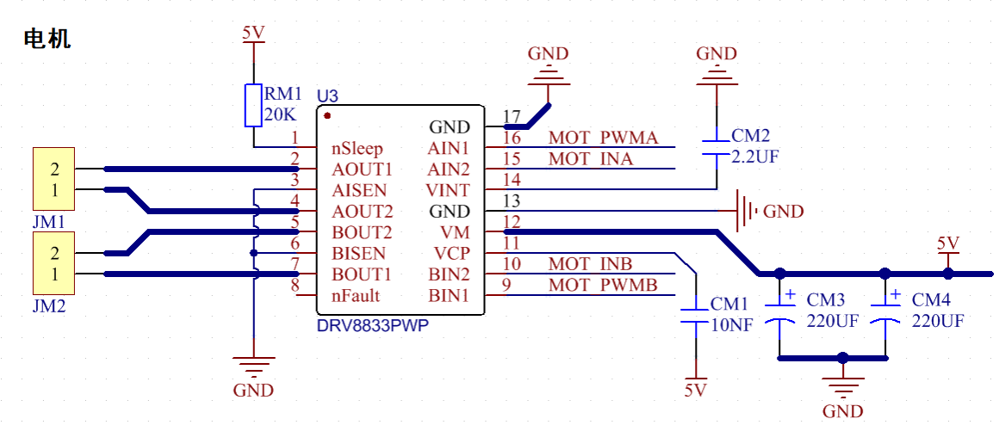

如果想更深了解DRV8833电机驱动芯片，可以查看我们提供的芯片规格书，在资料的“附件”文件夹里。


3.规格参数：
- 逻辑部分输入电压：DC 5V
- 驱动部分输入电压：DC 5V
- 逻辑部分工作电流：<30mA
- 驱动部分工作电流：<2A
- 最大耗散功率：10W（T=80℃）
- 电机转速：5V  200 rpm / min
- 电机驱动形式：DRV8833双路H桥驱动
- 控制信号输入电平：高电平2.3V<Vin<5V  ，低电平-0.3V<Vin<1.5V
- 工作温度：-25~130℃

4.驱动小车运行原理：
根据上面电机驱动板的电路图和示意图，我们知道左电机的方向引脚在GPIO15，调速引脚在GPIO17；右电机的方向引脚在GPIO14，调速引脚在GPIO16，按照以下表格的运动逻辑，就可以知道如何通过控制数字口，PWM口控制2个电机转动，从而实现智能小车的行走。其中PWM值范围为0-255，设置数字越大，电机转动越快。

|功能|GPIO15|GPIO17（PWM）|左电机|GPIO14|GPIO16（PWM）|右电机|
| :--: | :--: | :--: | :--: | :--: | :--: | :--: |
|前进|LOW|200|正转|LOW|200|正转|
|后退|HIGH|50|反转|HIGH|50|反转|
|左转|HIGH|55|反转|LOW|200|正转|
|右转|LOW|200|正转|HIGH|55|反转|
|停止|LOW|0|停止|LOW|0|停止|

5.实验代码：

```
//*************************************************************************************
/*
 项目 06 电机驱动和调速
 小车向前、向后、向左、向右移动
*/ 
const int left_ctrl = 15;//定义左电机方向控制引脚GPIO15
const int left_pwm = 17;//定义左电机速度控制引脚GPIO17
const int right_ctrl = 14;//定义右电机方向控制引脚GPIO14
const int right_pwm = 16;//定义右电机速度控制引脚GPIO16

void setup()
{
  pinMode(left_ctrl,OUTPUT);//设置左电机方向控制引脚为输出
  pinMode(left_pwm,OUTPUT);//设置左电机pwm控制速度引脚为输出
  pinMode(right_ctrl,OUTPUT);//设置右电机方向控制引脚为输出
  pinMode(right_pwm,OUTPUT);//设置右电机pwm控制速度引脚为输出
}

void loop()
{ 
  //向前
  digitalWrite(left_ctrl,LOW); //左电机方向控制引脚低电平
  analogWrite(left_pwm,200); //左电机PWM控制速度200
  digitalWrite(right_ctrl,LOW); //右电机方向控制引脚低电平
  analogWrite(right_pwm,200); //右电机PWM控制速度200
  delay(2000);//延时2秒
  
  //向后
  digitalWrite(left_ctrl,HIGH); //左电机方向控制引脚高电平
  analogWrite(left_pwm,50); //左电机PWM控制速度50
  digitalWrite(right_ctrl,HIGH); //右电机方向控制引脚高电平
  analogWrite(right_pwm,50); //右电机PWM控制速度50
  delay(2000);//延时2秒
  
  //向左
  digitalWrite(left_ctrl,HIGH); //左电机方向控制引脚高电平
  analogWrite(left_pwm,55); //左电机PWM控制速度55
  digitalWrite(right_ctrl,LOW); //右电机方向控制引脚低电平
  analogWrite(right_pwm,200); //右电机PWM控制速度200
  delay(2000);//延时2秒
  
  //向右
  digitalWrite(left_ctrl,LOW); //左电机方向控制引脚低电平
  analogWrite(left_pwm,200); //左电机PWM控制速度200
  digitalWrite(right_ctrl,HIGH); //右电机方向控制引脚高电平
  analogWrite(right_pwm,55); //右电机PWM控制速度55
  delay(2000);//延时2秒
  
  //停止
  digitalWrite(left_ctrl,LOW);//左电机方向控制引脚低电平
  analogWrite(left_pwm,0);//左电机PWM控制速度0
  digitalWrite(right_ctrl,LOW);//右电机方向控制引脚低电平
  analogWrite(right_pwm,0);//右电机PWM控制速度0
  delay(2000);//延时2秒
}
//*************************************************************************************

```
在上传实验代码到Raspberry Pi Pico之前，请检查Arduino IDE的配置。
单击“**工具**”，确认“**开发板**”板型和“**端口**”，如下所示：
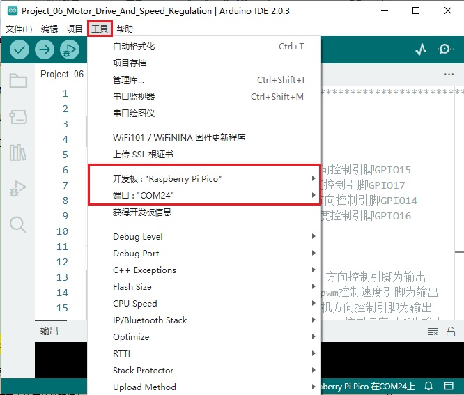

单击将实验代码上传到Raspberry Pi Pico。


实验代码上传成功！


6.实验现象：
安上电池，将小车底板上的电源拨码开关拨到ON一端，开启电源。实验代码上传至Raspberry Pi Pico成功后，小车前进2秒，后退2秒，左转2秒，右转2秒，停止2秒，循环。

### 项目07: 超声波传感器

1.实验简介：

小车上有个超声波传感器，超声波传感器是一种非常实惠的距离传感器，它可以检测前方是否存在障碍物，并且检测出传感器与障碍物的详细距离。它的原理和蝙蝠飞行的原理一样，就是超声波传感器发送出一种频率很高的超声波信号，超过正常人听力的声波范围。这些超声波的信号若是碰到障碍物，就会立刻反射回来，在接收到返回的信息之后，通过判断发射信号和接收信号的时间差，计算出传感器和障碍物的距离。超声波传感器主要用于各种机器人项目中的物体躲避和测距，也常被用于水位传感，甚至作为一个停车传感器。
在本实验中，我们使用超声波传感器来测量距离，并将数据打印在串口监视器上。

2.元件知识：
**HC-SR04超声波传感器：** 像蝙蝠一样使用声纳来确定与物体的距离，它提供了精准的非接触范围检测，高精度和稳定的读数。它的操作不受阳光或黑色材料的影响，就像精密的照相机(在声学上像布料这样比较软的材料很难被探测到)。它带有超声波发射器和接收器。

**参数：**
- 工作电压:+5V DC
- 静态电流: <2mA
- 工作电流: 15mA
- 有效角度: <15°
- 距离范围: 2cm – 400 cm
- 精度: 0.3 cm
- 测量角度: 30 degree
- 触发输入脉宽: 10us

**原理：**

最常用的超声测距的方法是回声探测法，如图：

超声波发射器向某一方向发射超声波，在发射时刻的同时计数器开始计时，超声波在空气中传播，途中碰到障碍物面阻挡就立即反射回来，超声波接收器收到反射回的超声波就立即停止计时。超声波也是一种声波，其声速V与温度有关。一般情况下超声波在空气中的传播速度为340m/s，根据计时器记录的时间t，就可以计算出发射点距障碍物面的距离s，即：s=340t/2：
(1)采用IO口TRIG触发测距，给至少10us的高电平信号;
(2)模块自动发送8个40khz的方波，自动检测是否有信号返回；
(3)有信号返回，通过ECHO输出一个高电平，单片机读取到高电平持续的时间就是超声波从发射到返回的时间。

超声波模块的电路图：


3.实验接线：
|超声波传感器| 小车PCB板 |
| :--: | :--: |
|Vcc|5V|
|Trig|S2（GPIO10）|
|Echo|S1（GPIO11）|
| Gnd |G|


4.实验代码：
超声波传感器的Trig引脚是由Raspberry Pi Pico主板的GPIO10控制，Echo引脚是由Raspberry Pi Pico主板的GPIO11控制。

```
//**********************************************************************************
/*
项目07 超声波传感器
超声波检测与物体的距离
*/
###define trigPin 10 // 定义trigPin引脚 G10
###define echoPin 11 // 定义echoPin引脚 G11
###define MAX_DISTANCE 700 // 最大传感器距离额定为400-500cm。
//timeOut= 2*MAX_DISTANCE /100 /340 *1000000 = MAX_DISTANCE*58.8
float timeOut = MAX_DISTANCE * 60; 
int soundVelocity = 340; // 定义声速=340m/s
void setup() {
 pinMode(trigPin,OUTPUT);// 设置trigPin为输出模式
 pinMode(echoPin,INPUT); // 设置echoPin为输入模式
 Serial.begin(115200); // 以115200波特打开串行监视器，查看打印结果。
}
void loop() {
 delay(100); // 等待100毫秒
 Serial.print("Distance: ");
 Serial.print(getSonar()); // 发送距离值，以厘米为单位获取距离并打印结果
 Serial.println("cm");
}
float getSonar() {
 unsigned long pingTime;
 float distance;
 // 使trigPin输出高电平持续10us触发HC_SR04
 digitalWrite(trigPin, HIGH); 
 delayMicroseconds(10);
 digitalWrite(trigPin, LOW);
 // 等待HC-SR04回到高电平并测量这个等待时间
 pingTime = pulseIn(echoPin, HIGH, timeOut); 
 // 根据时间计算距离
 distance = (float)pingTime * soundVelocity / 2 / 10000; 
 return distance; // 返回距离值
}
//**********************************************************************************
```
在上传实验代码到Raspberry Pi Pico之前，请检查Arduino IDE的配置。
单击“**工具**”，确认“**开发板**”板型和“**端口**”，如下所示：
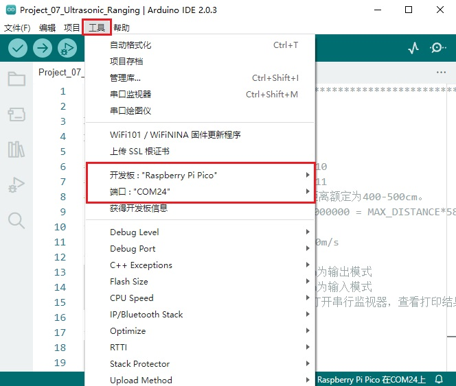

单击将实验代码上传到Raspberry Pi Pico。


实验代码上传成功！


5.实验现象：
安上电池，将小车底板上的电源拨码开关拨到ON一端，开启电源。实验代码上传至Raspberry Pi Pico成功后，利用USB线上电，再打开串口监视器，设置波特率为115200，当把一个物体放在超声波传感器前面移动时(远近)，它会检测到物体的距离，该值将显示在串口监视器上。


### 项目08: 跟随我


1.实验简介：
在上面实验中，我们已经了解了8*8点阵、电机驱动和调速、超声波传感器、舵机等硬件知识，那么在本实验中，我们将结合它们打造一款跟随小车! 在电路设计过程中，我们可以利用超声波传感器来检测小车与前方物体的距离。通过测量距离控制电机的旋转，从而控制小车的运动状态，使小车跟随物体运动。
2.工作原理：
|检测|检测前方物体的距离（单位：cm）|
| :--: | :--: |
|条件1|距离＜8|
|状态|小车后退|
|条件2|8≤距离<13|
|状态|小车停止|
|条件3|13≤距离<35|
|状态|小车前进|
|条件3|距离≥35|
|状态|小车停止|

3.流程图：


4.添加库文件：
首先我们先确保安装了库文件，不然代码会编译出错，这里我们用到库文件“<span style="color: rgb(0, 209, 0);">UltrasonicSensor</span>”，如何安装库文件请参考“<span style="color: rgb(255, 76, 65);">开发环境配置</span>”文件。如果库文件已安装，就跳过这一步骤。


5.实验代码：

```
//*************************************************************************************
/*
项目 08: 跟随我
小车跟随物体走
*/ 
//电机
const int left_ctrl = 15;//定义左电机方向控制引脚GPIO15
const int left_pwm = 17;//定义左电机速度控制引脚GPIO17
const int right_ctrl = 14;//定义右电机方向控制引脚GPIO14
const int right_pwm = 16;//定义右电机速度控制引脚GPIO16

//超声波传感器
###include <UltrasonicSensor.h> //定义超声波模块函数库
###define TRIG_PIN 10// 定义超声波的信号输入在GPIO10
###define ECHO_PIN 11//定义超声波的信号输出在GPIO11
UltrasonicSensor ultrasonic(10, 11);//连接Trigger和Echo引脚
long distance;

 //舵机
const int servopin = 9;//定义舵机的脚位在GPIO9
int myangle;
int pulsewidth;

void setup() {
  Serial1.begin(9600);
  pinMode(left_ctrl,OUTPUT);//设置左电机方向控制引脚为输出
  pinMode(left_pwm,OUTPUT);//设置左电机pwm控制速度引脚为输出
  pinMode(right_ctrl,OUTPUT);//设置右电机方向控制引脚为输出
  pinMode(right_pwm,OUTPUT);//设置右电机pwm控制速度引脚为输出
  pinMode(TRIG_PIN,OUTPUT);//设置TRIG_PIN为输出
  pinMode(ECHO_PIN,INPUT);//设置ECHO_PIN为输入
  
  servopulse(servopin,90);//设置舵机初始角度为90
  delay(300);
}

void loop() {
  distance = ultrasonic.distanceInCentimeters();//超声波测量的距离
  Serial.println(distance);
  if(distance<8)//如果距离小于8
  {
    back();//后退
  }
  else if((distance>=8)&&(distance<13))//如果距离大于等于8，小于13
  {
    Stop();//停止
  }
  else if((distance>=13)&&(distance<35))//如果距离大于等于13，小于35
  {
    front();//跟随
  }
  else//如果以上都不是
  {
    Stop();//停止
  }
}

void servopulse(int servopin,int myangle)//舵机运行角度
{
  for(int i=0; i<20; i++)
  {
    pulsewidth = (myangle*11)+500;
    digitalWrite(servopin,HIGH);
    delayMicroseconds(pulsewidth);
    digitalWrite(servopin,LOW);
    delay(20-pulsewidth/1000);
  }  
}

void front()//定义前进的状态
{
  digitalWrite(left_ctrl,LOW); //左电机方向控制引脚低电平
  analogWrite(left_pwm,150); //左电机PWM控制速度150
  digitalWrite(right_ctrl,LOW); //右电机方向控制引脚低电平
  analogWrite(right_pwm,150); //右电机PWM控制速度150
}
void back()//定义后退的状态
{
  digitalWrite(left_ctrl,HIGH); //左电机方向控制引脚高电平
  analogWrite(left_pwm,150); //左电机PWM控制速度150
  digitalWrite(right_ctrl,HIGH); //右电机方向控制引脚高电平
  analogWrite(right_pwm,150); //右电机PWM控制速度150
}
void Stop()//定义停止的状态
{
  digitalWrite(left_ctrl,LOW);//左电机方向控制引脚低电平
  analogWrite(left_pwm,0);//左电机PWM控制速度0
  digitalWrite(right_ctrl,LOW);//右电机方向控制引脚低电平
  analogWrite(right_pwm,0);//右电机PWM控制速度0
}
//*************************************************************************************

```
在上传实验代码到Raspberry Pi Pico之前，请检查Arduino IDE的配置。
单击“**工具**”，确认“**开发板**”板型和“**端口**”，如下所示：


单击将实验代码上传到Raspberry Pi Pico。


实验代码上传成功！


6.实验现象：
安上电池，将小车底板上的电源拨码开关拨到ON一端，开启电源。实验代码上传至Raspberry Pi Pico成功后，小车可以随着前方障碍物的移动而移动（只能在一条线直上，不能转弯）。
# 项目09: 躲避障碍物


1.实验简介：
在上一实验中，我们制作了一个超声波跟随小车。实际上，利用同样硬件，我只需要更改一个测试代码就可以将跟随小车变为避障小车。那超声波避障小车，是怎么实现的呢？当然也是通过超声波传感器的测距来实现的。通过超声波传感器检测机器人前方障碍物，然后根据这一个数据获得机器人运动方向。

2.工作原理：


3.流程图：


4.添加库文件：
首先我们先确保安装了库文件，不然代码会编译出错，这里我们用到库文件“<span style="color: rgb(0, 209, 0);">UltrasonicSensor</span>”和“<span style="color: rgb(0, 209, 0);">Matrix_pico</span>”，如何安装库文件请参考“<span style="color: rgb(255, 76, 65);">开发环境配置</span>”文件。如果库文件已安装，就跳过这一步骤。


5.实验代码：

```
//*************************************************************************************
/*
项目 09: 躲避障碍物
*/  
###include <Matrix_pico.h>
Matrix myMatrix(20,21);//定义点阵的引脚在GPIO20,GPIO21
//数组，用于储存图案的数据，可以自己算也可以从取摸工具中得到
uint8_t matrix_front[8]={0x18,0x24,0x42,0x99,0x24,0x42,0x81,0x00};
uint8_t matrix_back[8]={0x00,0x81,0x42,0x24,0x99,0x42,0x24,0x18};
uint8_t matrix_left[8]={0x12,0x24,0x48,0x90,0x90,0x48,0x24,0x12};
uint8_t matrix_right[8]={0x48,0x24,0x12,0x09,0x09,0x12,0x24,0x48};
uint8_t matrix_stop[8]={0x18,0x18,0x18,0x18,0x18,0x00,0x18,0x18};
uint8_t  LEDArray[8];

//电机
const int left_ctrl = 15;//定义左电机方向控制引脚GPIO15
const int left_pwm = 17;//定义左电机速度控制引脚GPIO17
const int right_ctrl = 14;//定义右电机方向控制引脚GPIO14
const int right_pwm = 16;//定义右电机速度控制引脚GPIO16

//超声波传感器
###include <UltrasonicSensor.h> //定义超声波模块函数库.
###define TRIG_PIN 10 // 定义超声波的信号输入在gpio10.
###define ECHO_PIN 11 //定义超声波的信号输出在gpio11.
UltrasonicSensor ultrasonic(10, 11);//定义超声波对象并关联引脚.
long distance,a1,a2;//定义三个距离变量

//舵机
###include <Servo.h>
###define servoPin 9
Servo myServo;

void setup() {
  pinMode(left_ctrl,OUTPUT);//设置左电机方向控制引脚为输出
  pinMode(left_pwm,OUTPUT);//设置左电机pwm控制速度引脚为输出
  pinMode(right_ctrl,OUTPUT);//设置右电机方向控制引脚为输出
  pinMode(right_pwm,OUTPUT);//设置右电机pwm控制速度引脚为输出
  pinMode(TRIG_PIN,OUTPUT);//设置TRIG_PIN为输出
  pinMode(ECHO_PIN,INPUT);//设置ECHO_PIN为输入
  
  myServo.attach(servoPin);  // 将引脚9上的伺服连接到伺服对象上
  myServo.write(90);//设置舵机初始角度为90
  delay(300);
  
  myMatrix.begin(0x70);//初始化点阵
  myMatrix.clear(); //点阵清屏
  myMatrix.write();
}
 
void loop()
 {
  avoid();//运行避障主程序
}

void avoid()
{
  distance = ultrasonic.distanceInCentimeters(); //获取超声波距离的值
  if((distance < 10)&&(distance != 0))//如果距离小于10且大于0
  {
    car_Stop();//停止
    myMatrix.clear();
    matrix_display(matrix_stop);//点阵显示停止图案
    myMatrix.write();//点阵显示停止图案
    delay(500);
    myServo.write(180);//设置舵机初始角度为180°
    delay(500);
    a1=ultrasonic.distanceInCentimeters();//测量距离
    delay(500);
    myServo.write(0);//设置舵机初始角度为0
    delay(500);
    a2=ultrasonic.distanceInCentimeters();//测量距离
    delay(500);
    if(a1 > a2)//比较距离，如果左边大于右边
    {
      car_left();//向左转
      myMatrix.clear();
      matrix_display(matrix_left);//点阵显示向左图案
      myMatrix.write();//点阵显示向左图案
      myServo.write(90);//设置舵机初始角度为90°
      delay(500);
      myMatrix.clear();
      matrix_display(matrix_front);//点阵显示向前图案
      myMatrix.write();//点阵显示向前图案
    }
    else//如果右边大于左边
    {
      car_right();//向右转
      myMatrix.clear();
      matrix_display(matrix_right);//点阵显示向右图案
      myMatrix.write();//点阵显示向右图案
      myServo.write(90);//设置舵机初始角度为90°
      delay(500);
      myMatrix.clear();
      matrix_display(matrix_front);//点阵显示前进图案
      myMatrix.write();//点阵显示前进图案
    }
  }
  else//如果以上都不是
  {
    car_front();//前进
    myMatrix.clear();
    matrix_display(matrix_front);//点阵显示前进图案
    myMatrix.write();//点阵显示前进图案
  }
}

//点阵显示图案功能
void matrix_display(unsigned char matrix_value[])
{
  for(int i=0; i<8; i++)
    {
      LEDArray[i]=matrix_value[i];
      for(int j=7; j>=0; j--)
      {
        if((LEDArray[i]&0x01)>0)
        myMatrix.drawPixel(j, i,1);
        LEDArray[i] = LEDArray[i]>>1;
      }
    } 
    myMatrix.write();
}

void car_front()//定义前进的状态
{
  digitalWrite(left_ctrl,LOW); //左电机方向控制引脚低电平
  analogWrite(left_pwm,100); //左电机PWM控制速度100
  digitalWrite(right_ctrl,LOW); //右电机方向控制引脚低电平
  analogWrite(right_pwm,100); //右电机PWM控制速度100
}
void car_back()//定义后退的状态
{
  digitalWrite(left_ctrl,HIGH); //左电机方向控制引脚高电平.
  analogWrite(left_pwm,155); //左电机PWM控制速度155
  digitalWrite(right_ctrl,HIGH); //右电机方向控制引脚高电平.
  analogWrite(right_pwm,155); //右电机PWM控制速度155
}
void car_left()//定义左转的状态
{
  digitalWrite(left_ctrl,HIGH); //左电机方向控制引脚高电平
  analogWrite(left_pwm,155); //左电机PWM控制速度155
  digitalWrite(right_ctrl,LOW); //右电机方向控制引脚低电平
  analogWrite(right_pwm,100); //右电机PWM控制速度100
}
void car_right()//定义右转的状态
{
  digitalWrite(left_ctrl,LOW); //左电机方向控制引脚低电平
  analogWrite(left_pwm,100); //左电机PWM控制速度100
  digitalWrite(right_ctrl,HIGH); //右电机方向控制引脚高电平
  analogWrite(right_pwm,155); //右电机PWM控制速度155
}
void car_Stop()//定义停止的状态
{
  digitalWrite(left_ctrl,LOW);//左电机方向控制引脚低电平
  analogWrite(left_pwm,0);//左电机PWM控制速度0
  digitalWrite(right_ctrl,LOW);//右电机方向控制引脚低电平
  analogWrite(right_pwm,0);//右电机PWM控制速度0
}
//*************************************************************************************
```
在上传实验代码到Raspberry Pi Pico之前，请检查Arduino IDE的配置。
单击“**工具**”，确认“**开发板**”板型和“**端口**”，如下所示：


单击将实验代码上传到Raspberry Pi Pico。


实验代码上传成功！


6.实验现象：
安上电池，将小车底板上的电源拨码开关拨到ON一端，开启电源。实验代码上传至Raspberry Pi Pico成功后，小车可以自动避障。
# 项目10: 红外循迹读值

1.实验简介：
小车上有2个红外循迹，实际上就是2对ST188L3红外对管，常应用于循迹小车循线。红外循迹可以用来检测黑白线，在本实验中，我们使用ST188L3红外对管来检测黑白线，并将数据打印在串口监视器上。

2.元件知识：
**红外循迹传感器：** 红外循迹传感器的红外对管分为两部分，一部分是红外发射端，另一部分是红外接收端。

黑线或黑色物体对红外线有很好的吸收效果。当红外循迹发射端向黑线发射时，发射的红外线被吸收而未形成反射信号，红外循迹接收端未接收到信号，这样红外循迹输出高电平(1);白线或白色物体对红外线没有吸收作用，红外循迹发射端的红外信号会反射回接收端，这样红外循迹输出低电平(0)。

下表给出了小车底板上的红外循迹传感器检测不同颜色物体的所有情况下的数值。其中检测到黑线、黑色物体或无物体代表1，检测到白线或白色物体代表0。

|左边红外循迹传感器|右边红外循迹传感器|值（二进制）|
| :--: | :--: | :--: |
|0|0|00|
|0|1|01|
|1|0|10|
|1|1|11|

<span style="color: rgb(255, 76, 65);">警告：反射式光学传感器(包括红外循迹)应避免在阳光等有红外干扰的环境中使用。阳光中含有许多不可见光，如红外线和紫外线。在强光环境下，反射式光学传感器不能正常工作。</span>

3.实验代码：
小车PCB板上的左边红外循迹是由Raspberry Pi Pico主板的GPIO7控制，右边红外循迹是由Raspberry Pi Pico主板的GPIO8控制。

```
//*************************************************************************************
/*
项目 10: 循迹传感器读取值
*/ 
###define tracking_left  7  //定义左红外循迹引脚gpio7
###define tracking_right  8  //定义右红外循迹引脚gpio8
int L_val,R_val; //定义左,右红外循迹两个变量

void setup() {
 Serial.begin(115200); //设置波特率为115200
 pinMode(tracking_left, INPUT); //设置左红外循迹引脚为输入模式
 pinMode(tracking_right, INPUT); //设置右红外循迹引脚为输入模式
}

void loop() {
 L_val = digitalRead(tracking_left); //读取左红外循迹的值
 R_val = digitalRead(tracking_right); //读取右红外循迹的值
 Serial.print("L_val: "); //串口打印字符串L_val
 Serial.print(L_val); //串口打印L_val值
 Serial.print("    "); //串口打印空格
 Serial.print("R_val: "); //串口打印字符串R_val
 Serial.println(R_val); //串口打印R_val值
 delay(300); //延时0.3秒
}
//*************************************************************************************
```
在上传实验代码到Raspberry Pi Pico之前，请检查Arduino IDE的配置。
单击“**工具**”，确认“**开发板**”板型和“**端口**”，如下所示：


单击将实验代码上传到Raspberry Pi Pico。


实验代码上传成功！


4.实验现象：
安上电池，将小车底板上的电源拨码开关拨到ON一端，开启电源。实验代码上传至Raspberry Pi Pico成功后，利用USB线上电，再打开串口监视器，设置波特率为115200，在小车的红外循迹下面放个黑色的东西，移动它，你会看到不同的指示灯亮起来，同时在串口监视器上看到红外循迹读取的值。


<span style="color: rgb(255, 76, 65);">旋转电位器可调节灵敏度，将指示灯调节至亮与不亮的临界点时，灵敏度最高。</span>


### 项目11: 循线行走


1.实验简介：
在前面的项目中，我们详细的介绍了在上面实验中，我们已经了解了电机驱动和调速、红外循迹等硬件知识。在本实验中，小车会根据红外循迹传送的数值做出不同的动作。

2.工作原理：
|左边红外循迹传感器|右边红外循迹传感器|值（二进制）|动作|
| :--: | :--: | :--: | :--: |
|0|0|00|停止|
|0|1|01|向右转|
|1|0|10|向左转|
|1|1|11|向前走|


3.流程图：


4.实验代码：

```
//*************************************************************************************
/*
项目 11: 循线行走
*/
//电机
const int left_ctrl = 15;//定义左电机方向控制引脚GPIO15
const int left_pwm = 17;//定义左电机速度控制引脚GPIO17
const int right_ctrl = 14;//定义右电机方向控制引脚GPIO14
const int right_pwm = 16;//定义右电机速度控制引脚GPIO16

//红外循迹
###define tracking_left  7  //定义左红外循迹引脚gpio7
###define tracking_right  8  //定义右红外循迹引脚gpio8
int L_val,R_val;//定义左,右红外循迹两个变量

//舵机
const int servopin = 9;//定义舵机的脚位在GPIO9
int myangle;
int pulsewidth;

void setup() {
  pinMode(left_ctrl,OUTPUT);//设置左电机方向控制引脚为输出
  pinMode(left_pwm,OUTPUT);//设置左电机pwm控制速度引脚为输出
  pinMode(right_ctrl,OUTPUT);//设置右电机方向控制引脚为输出
  pinMode(right_pwm,OUTPUT);//设置右电机pwm控制速度引脚为输出
  
  pinMode(tracking_left, INPUT); //设置左红外循迹引脚为输入
  pinMode(tracking_right, INPUT); //设置右红外循迹引脚为输入
 
  servopulse(servopin,90);//设置舵机初始角度为90
  delay(300);
}

void loop() 
{
  tracking(); //运行主程序
}

void tracking()
{
  L_val = digitalRead(tracking_left);//读取左红外循迹的值
  R_val = digitalRead(tracking_right);//读取右红外循迹的值
  if((L_val == 1)&&(R_val == 1))//如果左,右红外循迹都读到黑线
  {
    front();//小车前进
  }
  else if((L_val == 1)&&(R_val == 0))//否则如果左红外循迹读到黑线，右红外循迹没有
  {
    left();//小车左转
  }
  else if((L_val == 0)&&(R_val == 1))//如果右红外循迹读到黑线，左红外循迹没有
  {
    right();//小车右转
  }
  else//如果左,右红外循迹都没有读到黑线
  {
    Stop();//小车停止
   }
}

void servopulse(int servopin,int myangle)//舵机运行角度
{
  for(int i=0; i<20; i++)
  {
    pulsewidth = (myangle*11)+500;
    digitalWrite(servopin,HIGH);
    delayMicroseconds(pulsewidth);
    digitalWrite(servopin,LOW);
    delay(20-pulsewidth/1000);
  }  
}

void front()//定义前进的状态
{
  digitalWrite(left_ctrl,LOW); //左电机方向控制引脚低电平
  analogWrite(left_pwm,100); //左电机PWM控制速度100
  digitalWrite(right_ctrl,LOW); //右电机方向控制引脚低电平
  analogWrite(right_pwm,100); //右电机PWM控制速度100
}
void left()//定义左转的状态
{
  digitalWrite(left_ctrl,HIGH); //左电机方向控制引脚高电平
  analogWrite(left_pwm,155); //左电机PWM控制速度155
  digitalWrite(right_ctrl,LOW); //右电机方向控制引脚低电平
  analogWrite(right_pwm,100); //右电机PWM控制速度100
}
void right()//定义右转的状态
{
  digitalWrite(left_ctrl,LOW); //左电机方向控制引脚低电平
  analogWrite(left_pwm,100); //左电机PWM控制速度100
  digitalWrite(right_ctrl,HIGH); //右电机方向控制引脚高电平
  analogWrite(right_pwm,155); //右电机PWM控制速度155
}
void Stop()//定义停止的状态
{
  digitalWrite(left_ctrl,LOW);//左电机方向控制引脚低电平
  analogWrite(left_pwm,0);//左电机PWM控制速度0
  digitalWrite(right_ctrl,LOW);//右电机方向控制引脚低电平
  analogWrite(right_pwm,0);//右电机PWM控制速度0
}
//*************************************************************************************

```
在上传实验代码到Raspberry Pi Pico之前，请检查Arduino IDE的配置。
单击“**工具**”，确认“**开发板**”板型和“**端口**”，如下所示：


单击将实验代码上传到Raspberry Pi Pico。


实验代码上传成功！


5.实验现象：
安上电池，将小车底板上的电源拨码开关拨到ON一端，开启电源。实验代码上传至Raspberry Pi Pico成功后，然后把小车放在循迹轨道（**我们提供有**）上，小车就开始根据红外循迹传送的数值做出不同的动作。


### 项目12: 读取光敏传感器的值

1.实验简介：

我们都知道人类可以通过自己的眼睛在黑暗中寻找光源，那么机器人是怎样完成这项任务呢？让机器人完成这项任务首先需要给机器人安装上能看见光亮的眼睛，即光敏传感器，这样就能让机器人通过光源的强弱来寻找光源。我们的小车上左右各装有1个光敏传感器，当外界环境光线的强、弱发生变化的时候，光敏传感器的电阻也跟随发生相应的改变，并把这种变化传输给小车上的Raspberry Pi Pico主板，Raspberry Pi Pico主板就像人的大脑一样可以判断和思考，指挥着小车寻找光线。两个光敏传感器不停的检测是否有光线，检测到光线后就判断左、右两边哪个方向的光线较强，最后就指挥小车向着光线强的方向前进。

在本实验中，我们将了解光敏传感器的工作原理。

2.元件知识：
**光敏传感器：** 它主要采用光敏电阻元件，该电阻元件电阻大小随着光照强度的变化而变化。传感器信号端连接单片机模拟口，当光线越强时，模拟口电压越大，即单片机的模拟值也大；反之，光照强度越弱时，模拟口电压越小，即单片机的模拟值也小。这样，就可以利用光敏传感器读取对应的模拟值来反映环境光线强度。

3.实验接线：
通过前面的安装接线知道，两个光敏传感器的信号脚位已经接到了Raspberry Pi Pico主板的GPIO26和GPIO27，下面我们就利用接到GPIO26的光敏传感器来完成下面的实验，首先我们来读取模拟值。
|左边光敏传感器| 小车PCB板 |
| :--: | :--: |
| G| G |
| V| V |
|S|S（GPIO26）|


4.实验代码：
左边光敏传感器是由Raspberry Pi Pico主板的GPIO26控制。

```
//*************************************************************************************
/*
项目 12:读取光敏传感器值
*/
###define PHOTOSENSITIVE_PIN 26 //定义树莓派pico读取光敏的引脚
int photosensitiveADC;        //定义一个变量来存储ADC值

void setup()
{
  pinMode(PHOTOSENSITIVE_PIN, INPUT);//配置输入模式的引脚
  Serial.begin(115200);          //初始化串口，波特率设置为115200
}

void loop()
{
  photosensitiveADC = analogRead(PHOTOSENSITIVE_PIN);//读取光敏电阻值
  Serial.print("photosensitiveADC: ");
  Serial.println(photosensitiveADC);         //打印光敏电阻值
  delay(500);
}
//*************************************************************************************

```
在上传实验代码到Raspberry Pi Pico之前，请检查Arduino IDE的配置。
单击“**工具**”，确认“**开发板**”板型和“**端口**”，如下所示：


单击将实验代码上传到Raspberry Pi Pico。


实验代码上传成功！


5.实验现象：
安上电池，将小车底板上的电源拨码开关拨到ON一端，开启电源。实验代码上传至Raspberry Pi Pico成功后，利用USB线上电，再打开串口监视器，设置波特率为115200，当光线增强时，串口监视器显示的模拟值增大；反之，串口监视器显示的模拟值减小。


### 项目13: 寻光车


1.实验简介：
前面实验已经了解过光敏传感器的工作原理、电机驱动与调速，在本实验中，我们利用光敏传感器检测光线强弱来实现小车寻光效果，哪边光敏传感器接收到的光线较强，小车就往那边走。

2.工作原理：
|左光敏传感器的模拟值|右光敏传感器的模拟值|功能|
| :--: | :--: | :--: |
|大于700|大于700|向前移动|
|大于700|小于等于700|向左移动|
|小于等于700|大于700|向右移动|
|小于700|小于700|停止|

3.实验接线：
|左边光敏传感器|小车PCB板|右边光敏传感器|小车PCB板|
| :--: | :--: | :--: | :--: |
| G| G| G | G |
| V | V | V | V |
| S |S（GPIO26）| S |S（GPIO27）|
  
4.流程图：


5.实验代码：
左边光敏传感器是由Raspberry Pi Pico主板的GPIO26控制，右边光敏传感器是由Raspberry Pi Pico主板的GPIO27控制。

（<span style="color: rgb(255, 76, 0);">程序代码中的条件值700可以根据实际环境中的光线强度进行调整。</span>）

```
//*************************************************************************************
/*
项目 13:寻光车
*/ 
//电机
const int left_ctrl = 15;//定义左电机方向控制引脚GPIO15
const int left_pwm = 17;//定义左电机速度控制引脚GPIO17
const int right_ctrl = 14;//定义右电机方向控制引脚GPIO14
const int right_pwm = 16;//定义右电机速度控制引脚GPIO16

//左右光敏传感器
###define light_L_Pin  26   //定义左光敏传感器引脚gpio26
###define light_R_Pin  27   //定义右光敏传感器引脚gpio27
int left_light; 
int right_light;

//舵机
const int servopin = 9;//定义舵机的脚位在GPIO9
int myangle;
int pulsewidth;

void setup(){
  Serial.begin(115200); //设置波特率为115200.
  pinMode(light_L_Pin, INPUT); //设置左光敏传感器引脚为输入
  pinMode(light_R_Pin, INPUT); //设置右光敏传感器引脚为输入
  
  pinMode(left_ctrl,OUTPUT);//设置左电机方向控制引脚为输出
  pinMode(left_pwm,OUTPUT);//设置左电机pwm控制速度引脚为输出
  pinMode(right_ctrl,OUTPUT);//设置右电机方向控制引脚为输出
  pinMode(right_pwm,OUTPUT);//设置右电机pwm控制速度引脚为输出
  
  servopulse(servopin,90);//设置舵机初始角度为90
  delay(300);
}

void loop(){
  left_light = analogRead(light_L_Pin);//读取左光敏传感器的值
  right_light = analogRead(light_R_Pin);//读取右光敏传感器的值
  Serial.print("left_light_value = ");
  Serial.println(left_light);
  Serial.print("right_light_value = ");
  Serial.println(right_light);
  if (left_light > 700 && right_light > 700) //左,右光敏传感器测到的范围值
  {  
    Car_front(); //小车前进
  } 
  else if (left_light > 700 && right_light <= 700)  //左,右光敏传感器测到的范围值
  {
    Car_left(); //小车左转
  } 
  else if (left_light <= 700 && right_light > 700) //左,右光敏传感器测到的范围值
  {
    Car_right(); //小车右转
  } 
  else  //除以上情况之外
  {
    Car_Stop(); //小车停止
  }
}

void servopulse(int servopin,int myangle)//舵机运行角度
{
  for(int i=0; i<20; i++)
  {
    pulsewidth = (myangle*11)+500;
    digitalWrite(servopin,HIGH);
    delayMicroseconds(pulsewidth);
    digitalWrite(servopin,LOW);
    delay(20-pulsewidth/1000);
  }  
}

void Car_front()
{
  digitalWrite(left_ctrl,LOW); //左电机方向控制引脚低电平
  analogWrite(left_pwm,100); //左电机PWM控制速度100
  digitalWrite(right_ctrl,LOW); //右电机方向控制引脚低电平
  analogWrite(right_pwm,100); //右电机PWM控制速度100
}
void Car_left()
{
  digitalWrite(left_ctrl,HIGH); //左电机方向控制引脚高电平
  analogWrite(left_pwm,155); //左电机PWM控制速度155
  digitalWrite(right_ctrl,LOW); //右电机方向控制引脚低电平
  analogWrite(right_pwm,100); //右电机PWM控制速度100
}
void Car_right()
{
  digitalWrite(left_ctrl,LOW); //左电机方向控制引脚低电平
  analogWrite(left_pwm,100); //左电机PWM控制速度100
  digitalWrite(right_ctrl,HIGH); //右电机方向控制引脚高电平
  analogWrite(right_pwm,155); //右电机PWM控制速度155
}
void Car_Stop()
{
  digitalWrite(left_ctrl,LOW);//左电机方向控制引脚低电平
  analogWrite(left_pwm,0);//左电机PWM控制速度0
  digitalWrite(right_ctrl,LOW);//右电机方向控制引脚低电平
  analogWrite(right_pwm,0);//右电机PWM控制速度0
}
//*************************************************************************************
```
在上传实验代码到Raspberry Pi Pico之前，请检查Arduino IDE的配置。
单击“**工具**”，确认“**开发板**”板型和“**端口**”，如下所示：


单击将实验代码上传到Raspberry Pi Pico。


实验代码上传成功！


6.实验现象：
安上电池，将小车底板上的电源拨码开关拨到ON一端，开启电源。实验代码上传至Raspberry Pi Pico成功后，用手电筒光对着小车上光敏传感器，寻光车能够跟随着光移动。


### 项目14: 红外遥控和接收

1.实验简介：
红外遥控在日常生活中随处可见，它被用来控制各种家电，如电视、音响、录影机和卫星信号接收器。红外遥控是由红外发射和红外接收系统组成的，也就是一个红外遥控器、红外接收器和一个能解码的单片机组成的，小车上有个红外接收器。

在本实验中，使用红外接收器和红外遥控器相结合，读取红外遥控器上的按键值并将按键值打印在串口监视器上。

2.元件知识：
**红外(IR)遥控器：** 是一种具有一定数量按钮的设备。按下不同的按钮会使位于遥控器前端的红外发射管以不同的编码发送红外信号。红外遥控技术应用广泛，如电视、空调等。因此，在当今科技发达社会，红外遥控技术使你切换电视节目和调节空调温度都很方便。
我们使用的遥控器如下所示：
该红外遥控器采用NEC编码，信号周期为110ms。


**红外(IR)接收器：** 它是一种元件，可以接收红外光，所以可以用它来检测红外遥控器发出的红外光信号。红外接收器解调接收到的红外光信号，并将其转换回二进制，然后将信息传递给微控制器。
红外信号调制过程图：


3.实验代码：
小车PCB板上的红外接收器是由Raspberry Pi Pico主板的GPIO6控制。

```
//**********************************************************************************
/*
项目 14:红外遥控和接收器
*/
###include "IR.h"
###define IR_Pin 6

void setup() {
  Serial.begin(115200);
  IR_Init(IR_Pin);
}

void loop() {
  if(flagCode){
    int irValue = IR_Decode(flagCode);
    Serial.println(irValue, HEX);
    IR_Release();
  }
}
//**********************************************************************************

```
代码文件夹中包含有对应的库文件，则不需要另外去添加库文件。


在上传实验代码到Raspberry Pi Pico之前，请检查Arduino IDE的配置。
单击“**工具**”，确认“**开发板**”板型和“**端口**”，如下所示：


单击将实验代码上传到Raspberry Pi Pico。


实验代码上传成功！


4.实验现象：
安上电池，将小车底板上的电源拨码开关拨到ON一端，开启电源。实验代码上传至Raspberry Pi Pico成功后，利用USB线上电，再打开串口监视器，设置波特率为115200.
按下红外遥控器上的一个按钮，你会在串口显示器上看到一个代码。多次按下相同的按钮以确保你拥有该按钮的正确代码。如果看到FFFFFFFF，请忽略它。


写下红外遥控器与每个按钮相关联的代码，因为你稍后将需要这些信息。


### 项目15: 红外遥控车


1.实验简介：
在上面实验中，我们已经了解了8*8点阵、电机驱动和调速、红外接收器和红外遥控器等硬件知识，在本实验中，我们将使用红外遥控器和红外接收器来控制小车做一些动作。

2.工作原理：
|按键|按键代码|功能|
| :--: | :--: | :--: |
|| FF629D |前进，点阵屏显示“前进”图案|
|| FFA857 | 后退，点阵屏显示“后退”图案 |
|| FF22DD | 向左转，点阵屏显示“左转”图案|
|| FFC23D |向右转，点阵屏显示“右转”图案 |
|| FF02FD|停止，点阵屏显示“停止”图案 |

3.流程图：


4.实验代码：

```
//*************************************************************************************
/*
项目 15: 红外遥控车
*/ 
//红外接收
###include "IR.h" //红外接收的库
###define IR_Pin 6  //红外接收引脚

//点阵
###include <Matrix_pico.h> //点阵的库
Matrix myMatrix(20,21);//定义点阵的引脚在GPIO20,GPIO21
//数组，用于储存图案的数据，可以自己算也可以从取摸工具中得到
uint8_t matrix_front[8]={0x18,0x24,0x42,0x99,0x24,0x42,0x81,0x00};
uint8_t matrix_back[8]={0x00,0x81,0x42,0x24,0x99,0x42,0x24,0x18};
uint8_t matrix_left[8]={0x12,0x24,0x48,0x90,0x90,0x48,0x24,0x12};
uint8_t matrix_right[8]={0x48,0x24,0x12,0x09,0x09,0x12,0x24,0x48};
uint8_t matrix_stop[8]={0x18,0x18,0x18,0x18,0x18,0x00,0x18,0x18};
uint8_t  LEDArray[8];

//电机
const int left_ctrl = 15;//定义左电机方向控制引脚GPIO15
const int left_pwm = 17;//定义左电机速度控制引脚GPIO17
const int right_ctrl = 14;//定义右电机方向控制引脚GPIO14
const int right_pwm = 16;//定义右电机速度控制引脚GPIO16

//舵机
const int servopin = 9;//定义舵机的脚位在GPIO9
int myangle;
int pulsewidth;

void setup() {
  Serial.begin(115200);//打开串口，波特率115200
  pinMode(left_ctrl,OUTPUT);//设置左电机方向控制引脚为输出
  pinMode(left_pwm,OUTPUT);//设置左电机pwm控制速度引脚为输出
  pinMode(right_ctrl,OUTPUT);//设置右电机方向控制引脚为输出
  pinMode(right_pwm,OUTPUT);//设置右电机pwm控制速度引脚为输出
  
  // In case the interrupt driver crashes on setup, give a clue
  // to the user what's going on.
  IR_Init(IR_Pin); // 开始接收信号
 
  servopulse(servopin,90);//设置舵机初始角度为90
  delay(300);
  
  myMatrix.begin(0x70);//初始化点阵
  myMatrix.clear(); //点阵清屏
  myMatrix.write();
}

void loop() {
    if(flagCode){
    int irValue = IR_Decode(flagCode);
    Serial.println(irValue, HEX);
    handleControl(irValue);
    IR_Release();
  }
}
void handleControl(unsigned long value) {

  // Handle the commands
  if (value == 0xFF629D){
     car_front(); //前进
     myMatrix.clear();
     matrix_display(matrix_front);//点阵显示前进图案
     myMatrix.write();//点阵显示前进图案
  }
  else if (value == 0xFFA857){
     car_back(); //后退
     myMatrix.clear();
     matrix_display(matrix_back);//点阵显示向后图案
     myMatrix.write();//点阵显示向后图案
  }
  else if (value == 0xFF22DD){ 
     car_left(); //向左转
     myMatrix.clear();
     matrix_display(matrix_left);//点阵显示向左图案
     myMatrix.write();//点阵显示向左图案
  } 
  else if (value == 0xFFC23D){
     car_right(); // 向右转
     myMatrix.clear();
     matrix_display(matrix_right);//点阵显示向右图案
     myMatrix.write();//点阵显示向右图案
  }
  else if (value == 0xFF02FD){ 
     car_Stop();
     myMatrix.clear();
     matrix_display(matrix_stop);//点阵显示停止图案
     myMatrix.write();//点阵显示停止图案 
    }
}

void servopulse(int servopin,int myangle)//舵机运行角度
{
  for(int i=0; i<20; i++)
  {
    pulsewidth = (myangle*11)+500;
    digitalWrite(servopin,HIGH);
    delayMicroseconds(pulsewidth);
    digitalWrite(servopin,LOW);
    delay(20-pulsewidth/1000);
  }  
}

//点阵显示图案功能
void matrix_display(unsigned char matrix_value[])
{
  for(int i=0; i<8; i++)
    {
      LEDArray[i]=matrix_value[i];
      for(int j=7; j>=0; j--)
      {
        if((LEDArray[i]&0x01)>0)
        myMatrix.drawPixel(j, i,1);
        LEDArray[i] = LEDArray[i]>>1;
      }
    } 
    myMatrix.write();
}

void car_front()//定义前进的状态
{
  digitalWrite(left_ctrl,LOW); //左电机方向控制引脚低电平
  analogWrite(left_pwm,150); //左电机PWM控制速度150
  digitalWrite(right_ctrl,LOW); //右电机方向控制引脚低电平
  analogWrite(right_pwm,150); //右电机PWM控制速度150
}
void car_back()//定义后退的状态
{
  digitalWrite(left_ctrl,HIGH); //左电机方向控制引脚高电平.
  analogWrite(left_pwm,100); //左电机PWM控制速度100
  digitalWrite(right_ctrl,HIGH); //右电机方向控制引脚高电平.
  analogWrite(right_pwm,100); //右电机PWM控制速度100
}
void car_left()//定义左转的状态
{
  digitalWrite(left_ctrl,HIGH); //左电机方向控制引脚高电平
  analogWrite(left_pwm,100); //左电机PWM控制速度100
  digitalWrite(right_ctrl,LOW); //右电机方向控制引脚低电平
  analogWrite(right_pwm,100); //右电机PWM控制速度100
}
void car_right()//定义右转的状态
{
  digitalWrite(left_ctrl,LOW); //左电机方向控制引脚低电平
  analogWrite(left_pwm,150); //左电机PWM控制速度150
  digitalWrite(right_ctrl,HIGH); //右电机方向控制引脚高电平
  analogWrite(right_pwm,150); //右电机PWM控制速度150
}
void car_Stop()//定义停止的状态
{
  digitalWrite(left_ctrl,LOW);//左电机方向控制引脚低电平
  analogWrite(left_pwm,0);//左电机PWM控制速度0
  digitalWrite(right_ctrl,LOW);//右电机方向控制引脚低电平
  analogWrite(right_pwm,0);//右电机PWM控制速度0
}
//*************************************************************************************

```
代码文件夹中包含有对应的库文件，则不需要另外去添加库文件。


在上传实验代码到Raspberry Pi Pico之前，请检查Arduino IDE的配置。
单击“**工具**”，确认“**开发板**”板型和“**端口**”，如下所示：


单击将实验代码上传到Raspberry Pi Pico。


实验代码上传成功！


6.实验现象：
安上电池，将小车底板上的电源拨码开关拨到ON一端，开启电源。实验代码上传至Raspberry Pi Pico成功后，按下红外遥控器对应按键，小车跟着遥控器按下的按键做出相应的动作。

### 项目16 WiFi 测试

1. 实验简介：
ESP8266串口WiFi ESP-01模块，它是一款超低功耗的UART-WiFi 透传模块，拥有业内极富竞争力的封装尺寸和超低能耗技术，专为移动设备和物联网应用设计，可将用户的物理设备连接到Wi-Fi 无线网络上，进行互联网或局域网通信，实现联网功能。
在本实验中，我们使用ESP8266串口WiFi ESP-01模块通过WiFi测试代码软硬件相结合来读取WiFi 的IP地址。

2. 实验元件：
|||
| :--: | :--: |
| ESP8266串口WiFi ESP-01*1 | USB转ESP-01S WiFi模块串口测试扩展板*1 |

3. 元件知识：
    
USB转ESP-01S WiFi模块串口测试扩展板：适用于ESP-01S WiFi模块，扩展板的<span style="color: rgb(0, 209, 0);">拨动开关</span>打到<span style="color: rgb(255, 76, 65);">flash boot</span>端，直插于电脑USB口，用安信可串口调试助手测试AT指令。
扩展板的<span style="color: rgb(0, 209, 0);">拨动开关</span>打到<span style="color: rgb(255, 76, 65);">Uart Download </span>端，直插于电脑USB口，ESP-01模块处于下载模式，通过安信可固件下载软件可下载固件到ESP-01模块中。

     
ESP8266串口WiFi ESP-01：ESP8266串口WiFi ESP-01是一款超低功耗的UART-WiFi 透传模块，ESP8266串口WIFI ESP-01可广泛应用于智能电网、智能交通、智能家具、手持设备、工业控制等领域。

4. 将WIFI模块串口测试扩展板插入电脑的USB口：
A. 将ESP8266串口WIFI ESP-01模块正确方向插入USB转ESP-01S WIFI模块串口测试扩展板上。

B. 先将USB转ESP-01S WIFI模块串口测试扩展板上的<span style="color: rgb(0, 209, 0);">拨码开关</span>拨到<span style="color: rgb(255, 76, 65);">Uart Download</span>端，再将USB转ESP-01S WIFI模块串口测试扩展板插入电脑的USB口。


5. 安装驱动文件
这个USB转ESP-01S WIFI模块串口测试扩展板的USB转串口芯片为CH340，我们需要安装这芯片的驱动，**驱动为 <span style="color: rgb(255, 76, 65);">usb_ch341_3.1.2009.06</span>**，我们把该驱动文件放到D盘（即：复制
放到D盘），然后开始安装驱动。在不同系统在安装驱动方式大同小异，这里我们在win10系统上开始安装驱动。

A. 当USB转ESP-01S WIFI模块串口测试扩展板第一次接入你的电脑, 右击桌面上的“**我的电脑**”—>“**属性**”—>“**设备管理器**”, 即可看到“**USB-Serial**”。


B. 点击 “**USB-Serial**”, 选择“**更新驱动程序（P）**”。


C. 然后点击“**浏览计算机以查找驱动程序软件**”。 


D. 点击“**浏览（R）...**”找到提供的“**usb_ch341_3.1.2009.06**”驱动文件。(我这里是将“**usb_ch341_3.1.2009.06** ”文件放D盘，你也可以把驱动文件夹放在方便的地方也行)


E. 安装完成后点击“**关闭**”。


F. 驱动安装完成后右键点击“**我的电脑**”—>“**属性**”—>“**设备管理器**”, 你可以看到你CH340驱动程序已经成功安装到电脑，如下图。 


5.Arduino搭建Esp8266开发环境                                                  
确保已经将ESP8266串口WIFI ESP-01模块正确插入USB转ESP-01S WIFI模块串口测试扩展板中，然后已经将USB转ESP-01S WIFI模块串口测试扩展板插入电脑的USB口，点击arduino IDE进入arduino IDE界面。


（1）在Arduino IDE里面进行下载安装：
A.点击“**文件**” →“**首选项**”。

B. 打开下图标出的按钮。

C. 将这个地址：http://arduino.esp8266.com/stable/package_esp8266com_index.json ，复制粘贴到里面去再点击“**确定**”保存这个地址，如下图：


D. 再点击“**确定**”。


E. 先点击“**工具**”→“**开发板：**”，再点击“**开发板管理器...**”进入“**开发板管理器**”页面，如下图。


F. 在空格文本框中输入“<span style="color: rgb(255, 76, 65);">ESP8266</span>”，出现搜索内容，选择最新版本进行安装，安装包不大，点击“安装”开始安装相关插件。如下图。（可能会出现下载安装出错，有可能是服务器原因，需要重新点击“安装”就可以了，但由于网络原因，大多用户可能无法搜到<span style="color: rgb(0, 209, 0);">esp8266 by esp8266 Community</span>，对于小白而言不推荐使用此方法添加，推荐下面方法2）


G. 安装成功后点击“**关闭**”关闭页面，然后重启 Arduino IDE 软件，点击 Arduino IDE菜单栏“**工具**”→“**开发板：**” ，可查看到各种不同型号ESP8266开发板。选择对应的ESP8266开发板型号和端口（COMx），选中后即可对ESP8266进行编程。

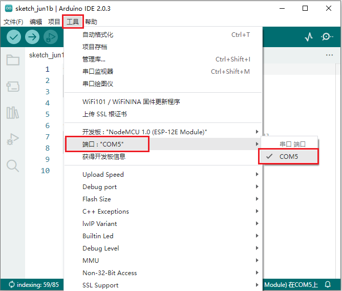

（2）通过工具对ESP8266进行安装：（推荐使用这种方法）
A. 点击“**文件**” →“**首选项**”，在“**其他开发板管理器网址：**”框中复制粘贴这个地址：http://arduino.esp8266.com/stable/package_esp8266com_index.json ，然后点击“确定”保存这个地址。


B. 使用“<span style="color: rgb(255, 76, 65);">esp8266一键安装arduino板_2.5.0版.exe</span>”，一键安装，此方法安装便捷，且安装较快，推荐此方法安装。


鼠标左键双击“esp8266一键安装arduino板_2.5.0版.exe”，然后就安装完成了。


C. 在上述工具安装完成之后，重启 Arduino IDE 软件，点击 Arduino IDE菜单栏“**工具**”→“**开发板：**”  ，可查看到各种不同型号ESP8266开发板。选择对应的ESP8266开发板型号和端口（COMx），选中后即可对ESP8266进行编程。


6.实验代码：                                                                      
<span style="color: rgb(255, 76, 65);">注意：打开IDE后，一定要先设置好ESP8266板型和COM口。手机和设备需要连接在同一个WiFi上，如果家里没有WiFi需要打开手机热点共享WiFi，打开手机热点共享WiFi是最好的方法。</span>

```
//**********************************************************************************
/*  
项目16 : Wifi 测试
Wifi模块测试Wifi的ip
*/
###include <ESP8266WiFi.h>
###include <ESP8266mDNS.h>
###include <WiFiClient.h>

###ifndef STASSID
//#define STASSID "your-ssid"
//#define STAPSK  "your-password"
###define STASSID "ChinaNet_2.4G"   //用户的wifi名称
###define STAPSK  "ChinaNet@233"       //用户的wifi密码
###endif

const char* ssid = STASSID;
const char* password = STAPSK;

// 端口80的TCP服务器将响应HTTP需求
WiFiServer server(80);

void setup(void) {
  Serial.begin(115200);

  // 连接 WiFi 
  WiFi.mode(WIFI_STA);
  WiFi.begin(ssid, password);
  Serial.println("");

  // 等待连接
  while (WiFi.status() != WL_CONNECTED) {
    delay(500);
    Serial.print(".");
  }
  Serial.println("");
  Serial.print("Connected to ");
  Serial.println(ssid);
  Serial.print("IP address: ");
  Serial.println(WiFi.localIP());

//设置mDNS响应器:本例中。第一个参数是域名，全限定域名为“esp8266.local”；
//第二个参数是IP地址通过WiFi发送IP地址。

  if (!MDNS.begin("esp8266")) {
    Serial.println("Error setting up MDNS responder!");
    while (1) {
      delay(1000);
    }
  }
  Serial.println("mDNS responder started");

  // 激活TCP (HTTP)服务器
  server.begin();
  Serial.println("TCP server started");

  // 将服务器加入mmds - sd
  MDNS.addService("http", "tcp", 80);
}

void loop(void) {

  MDNS.update();
  Serial.print("Connected to ");
  Serial.println(ssid);
  Serial.print("IP address: ");
  Serial.println(WiFi.localIP());
  delay(1000);

  // 检查客户端是否连接
  WiFiClient client = server.available();
  if (!client) {
    return;
  }
  Serial.println("");
  Serial.println("New client");

  // 等待来自客户端的有效数据
  while (client.connected() && !client.available()) {
    delay(1);
  }

  // 读取HTTP需求的第一行
  String req = client.readStringUntil('\r');

// HTTP需求的第一行如下所示:"GET /path HTTP/1.1"
// 通过查找空格来检索"/path"部分

  int addr_start = req.indexOf(' ');
  int addr_end = req.indexOf(' ', addr_start + 1);
  if (addr_start == -1 || addr_end == -1) {
    Serial.print("Invalid request: ");
    Serial.println(req);
    return;
  }
  req = req.substring(addr_start + 1, addr_end);
  Serial.print("Request: ");
  Serial.println(req);
  client.flush();

  String s;
  if (req == "/") {
    IPAddress ip = WiFi.localIP();
    String ipStr = String(ip[0]) + '.' + String(ip[1]) + '.' + String(ip[2]) + '.' + String(ip[3]);
    s = "HTTP/1.1 200 OK\r\nContent-Type: text/html\r\n\r\n<!DOCTYPE HTML>\r\n<html>Hello from ESP8266 at ";
    s += ipStr;
    s += "</html>\r\n\r\n";
    Serial.println("Sending 200");
  } else {
    s = "HTTP/1.1 404 Not Found\r\n\r\n";
    Serial.println("Sending 404");
  }
  client.print(s);

  Serial.println("Done with client");
}
//**********************************************************************************

```
**<span style="color: rgb(255, 76, 65);">特别注意：需要先将实验代码中的用户Wifi名称和用户Wifi密码改成你们自己的Wifi名称和Wifi密码。</span>**

7.实验现象：                                                                     
<span style="color: rgb(61, 167, 66);">实验代码中的Wifi名称和Wifi密码修改后</span>，确保USB转ESP-01S WIFI模块串口测试扩展板上的<span style="color: rgb(255, 76, 65);">拨码开关</span>已经拨到<span style="color: rgb(255, 76, 65);">Uart Download</span> 端，并且也确定USB转ESP-01S WIFI模块串口测试扩展板已经插入电脑的USB口。**然后按照前面方法设置ESP8266板型和COM口**，IDE右下角会显示对应的ESP8266板型和COM口，再点击将实验代码上传到ESP8266串口WIFI ESP-01模块上，上传成功。

（<span style="color: rgb(255, 76, 65);">注意：</span>如果上传失败，在板型和COM口没问题下，将USB转ESP-01S WIFI模块串口测试扩展板从电脑的USB口拔下来再次插到电脑的USB口。）


WIFI实验代码上传成功后，先将USB转ESP-01S WIFI模块串口测试扩展板从电脑的USB口拔下来，再将USB转ESP-01S WIFI模块串口测试扩展板上的<span style="color: rgb(255, 76, 0);">拨码开关</span>拨到<span style="color: rgb(255, 76, 65);">Flash Boot</span> 端，然后再次插到电脑的USB口上。打开串口监视器，设置波特率为<span style="color: rgb(255, 76, 65);">115200</span>，即可看到你的WIFI信息，如下图所示：


### 项目17 WIFI控制点阵屏

1. 实验简介：
在前面的项目16中，我们已经知道ESP8266串口WiFi ESP-01模块通过WiFi测试代码得到相关的WiFi信息。那么在本项目中，我们将使用ESP8266串口WiFi ESP-01模块通过APP和WiFi来控制小车上8*8点阵。

2. 安装APP：

**安卓系统设备（手机/平板）APP：**

1.下载Beetlebot.apk文件

A. 我们提供了Android APP 的安装包：

现将文件夹中的Beetlebot.apk文件转移到安卓系统手机或平板上。

B. 或者，使用手机浏览器中的扫描功能去扫二维码下载APP。


2.点击Beetlebot.apk文件进入安装页面，点击“允许”按钮，然后再点击“继续安装”按钮，安装完成后点击“打开”按钮就可以进入APP界面。


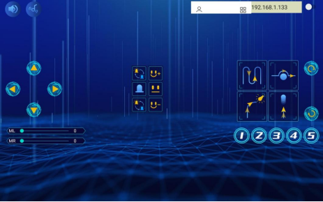

**IOS系统设备（手机/iPad）APP**
a.打开App Store。

b.在搜索框输入“**Beetlebot**”，点击搜索，出现下载界面，点击“”，就可以下载安装Beetlebot的APP。接下来的操作和安卓系统类似的，可以参考上面安卓系统的步骤进行操作。

3. 将WIFI模块串口测试扩展板插入电脑的USB口：
A. 将ESP8266串口WIFI ESP-01模块正确方向插入USB转ESP-01S WIFI模块串口测试扩展板上。

B. 先将USB转ESP-01S WIFI模块串口测试扩展板上的<span style="color: rgb(0, 209, 0);">拨码开关</span>拨到<span style="color: rgb(255, 76, 65);">Uart Download</span>端，再将USB转ESP-01S WIFI模块串口测试扩展板插入电脑的USB口。


4. ESP8266 代码：
<span style="color: rgb(255, 76, 65);">注意：打开Arduino IDE后，一定要先设置好ESP8266板型和COM口（设置方法参照前面 **<span style="color: rgb(61, 167, 66);">项目16 WIFI 测试</span>**）。手机和设备需要连接在同一个WiFi上，如果家里没有WiFi需要打开手机热点共享WiFi，打开手机热点共享WiFi是最好的方法。</span>

```
//**********************************************************************************
/*
ESP8266_Code
*/
// generated by KidsBlock
###include <Arduino.h>
###include <ESP8266WiFi.h>
###include <ESP8266mDNS.h>
###include <WiFiClient.h>
//#include <WiFi.h>

###ifndef STASSID
###define STASSID "ChinaNet_2.4G"  //用户的Wifi名称
###define STAPSK  "ChinaNet@233"   //用户的wifi密码
###endif
const char* ssid = STASSID;
const char* password = STAPSK;

//IPAddress local_IP(192,168,4,22);
//IPAddress gateway(192,168,4,22);
//IPAddress subnet(255,255,255,0);
//
//const char *ssid = "ESP8266_AP_TEST";
//const char *password = "12345678";

WiFiServer server(80);
String unoData = "";
int ip_flag = 0;
int ultra_state = 1;
String ip_str;


void setup() {
  Serial.begin(9600); 
//   WiFi.mode(WIFI_AP); //设置工作在AP模式
//
//  WiFi.softAPConfig(local_IP, gateway, subnet); //设置AP地址
//  while(!WiFi.softAP(ssid, password)){}; //启动AP
//  Serial.println("AP启动成功");
//
//  Serial.print("IP address: ");
//  Serial.println(WiFi.softAPIP()); // 打印IP地址
//
//  WiFi.softAPsetHostname("myHostName"); //设置主机名
//  Serial.print("HostName: ");
//  Serial.println(WiFi.softAPgetHostname()); //打印主机名
//
//  Serial.print("mac Address: ");
//  Serial.println(WiFi.softAPmacAddress()); //打印mac地址

  WiFi.mode(WIFI_STA);
  WiFi.begin(ssid, password);
  while (WiFi.status() != WL_CONNECTED) {
    delay(500);
    Serial.print(".");
  }
  Serial.print("IP ADDRESS: ");
  Serial.println(WiFi.localIP());
  if (!MDNS.begin("esp8266")) {
    //Serial.println("Error setting up MDNS responder!");
    while (1) {
      delay(1000);
    }
  }
 // Serial.println("mDNS responder started");
  server.begin();
  //Serial.println("TCP server started");
  MDNS.addService("http", "tcp", 80);
  ip_flag = 1;
}

void loop() {
  //Serial.println(WiFi.softAPgetStationNum()); //打印客户端连接数
  if(ip_flag == 1)
  {
    for(int i=3; i>0; i--)
    {
      Serial.print("IP: ");
      Serial.print(WiFi.localIP());
      Serial.println('#');
      delay(500);
    }
    ip_flag = 0;
    
  }
    MDNS.update();
    WiFiClient client = server.available();
    if (!client) {
      return;
    }
    //Serial.println("");
    while (client.connected() && !client.available()) {
      delay(1);
    }
    String req = client.readStringUntil('\r');
    int addr_start = req.indexOf(' ');
    int addr_end = req.indexOf(' ', addr_start + 1);
    if (addr_start == -1 || addr_end == -1) {
      //Serial.print("Invalid request: ");
      //Serial.println(req);
      return;
    }
    req = req.substring(addr_start + 1, addr_end);
    int len_val = String(req).length();
    String M_req = String(req).substring(0,6);
    //Serial.println(M_req);
    if(M_req == "/btn/u")
    {
      String s_M_req = String(req).substring(5,len_val);
      Serial.print(s_M_req);
      Serial.print("#");
    }
    if(M_req == "/btn/v")
    {
      String s_M_req = String(req).substring(5,len_val);
      Serial.print(s_M_req);
      Serial.print("#");
    }
    client.flush();
    String s;
    if (req == "/") {
      IPAddress ip = WiFi.localIP();
      String ipStr = String(ip[0]) + '.' + String(ip[1]) + '.' + String(ip[2]) + '.' + String(ip[3]);
      s = "HTTP/1.1 200 OK\r\nContent-Type: text/html\r\n\r\n<!DOCTYPE HTML>\r\n<html>Hello from ESP8266 at ";
      s += ipStr;
      s += "</html>\r\n\r\n";
      //Serial.println("Sending 200");
      Serial.println(WiFi.localIP());
      Serial.write('*');
      client.println(WiFi.localIP());
      ip_flag = 0;
    }
    else if(req == "/btn/F")
    {
      Serial.write('F');
      client.println(F("F"));
    }
    else if(req == "/btn/B")
    {
      Serial.write('B');
      client.println(F("B"));
    }
    else if(req == "/btn/L")
    {
      Serial.write('L');
      client.println(F("L"));
    }
    else if(req == "/btn/R")
    {
      Serial.write('R');
      client.println(F("R"));
    }
    else if(req == "/btn/S")
    {
      Serial.write('S');
      client.println(F("S"));
    }
    else if(req == "/btn/a")
    {
      Serial.write('a');
      client.println(F("a"));
    }
    else if(req == "/btn/b")
    {
      Serial.write('b');
      client.println(F("b"));
    }
    else if(req == "/btn/c")
    {
      Serial.write('c');
      client.println(F("c"));
    }
    else if(req == "/btn/d")
    {
      Serial.write('d');
      client.println(F("d"));
    }
    else if(req == "/btn/e")
    {
      Serial.write('e');
      client.println(F("e"));
    }
    else if(req == "/btn/f")
    {
      Serial.write('f');
      client.println(F("f"));
    }
    else if(req == "/btn/g")
    {
      Serial.write('g');
      client.println(F("g"));
    }
    else if(req == "/btn/z")
    {
      Serial.write('z');
      client.println(F("z"));
    }
    else if(req == "/btn/i")
    {
      Serial.write('i');
      client.println(F("i"));
    }
    else if(req == "/btn/j")
    {
      Serial.write('j');
      client.println(F("j"));
    }
    else if(req == "/btn/k")
    {
      Serial.write('k');
      client.println(F("k"));
    }
    else if(req == "/btn/y")
    {
      Serial.write('y');
      client.println(F("y"));
    }
    else if(req == "/btn/l")
    {
      Serial.write('l');
      client.println(F("l"));
    }
    else if(req == "/btn/m")
    {
      Serial.write('m');
      client.println(F("m"));
    }
    else if(req == "/btn/n")
    {
      Serial.write('n');
      client.println("n");
    }
    else if(req == "/btn/o")
    {
      Serial.write('o');
      client.println(F("o"));
    }
    else if(req == "/btn/p")
    {
      Serial.write('p');
      client.println(F("p"));
    }
    else if(req == "/btn/q")
    {
      Serial.write('q');
      client.println("q");
    }
    else if(req == "/btn/x")
    {
      Serial.write('x');
      client.println(F("x"));
    }
    else if(req == "/btn/1")
    {
      Serial.write('1');
      client.println(F("1"));
    }
    else if(req == "/btn/2")
    {
      Serial.write('2');
      client.println("2");
    }
    else if(req == "/btn/3")
    {
      Serial.write('3');
      client.println(F("3"));
    }
    else if(req == "/btn/4")
    {
      Serial.write('4');
      client.println("4");
    }
    else if(req == "/btn/5")
    {
      Serial.write('5');
      client.println(F("5"));
    }
    else if(req == "/btn/0")
    {
      Serial.write('0');
      client.println("0");
    }
    else {
      //s = "HTTP/1.1 404 Not Found\r\n\r\n";
      //Serial.println("Sending 404");
    }

    client.print(F("IP : "));
    client.println(WiFi.localIP());
}
//**********************************************************************************
```

**<span style="color: rgb(255, 76, 65);">特别注意：需要先将实验代码中的用户Wifi名称和用户Wifi密码改成你们自己的Wifi名称和Wifi密码。</span>**

Wifi名称和Wifi密码修改后，确保USB转ESP-01S WiFi模块串口测试扩展板上的拨码开关已经拨到Uart Download 端，并且也确定USB转ESP-01S WIFI模块串口测试扩展板已经插入电脑的USB口。然后按照<span style="color: rgb(255, 76, 65);">**项目16 WIFI 测试**</span>中的方法设置ESP8266板型和COM口，IDE右下角会显示对应的ESP8266板型和COM口，再点击将ESP8266 代码上传到ESP8266串口WIFI ESP-01模块上，上传成功。
（<span style="color: rgb(255, 76, 65);">注意：</span>如果上传失败，在板型和COM口没问题情况下，将USB转ESP-01S WIFI模块串口测试扩展板从电脑的USB口拔下来再次插到电脑的USB口）。


ESP8266 代码上传成功后，先将USB转ESP-01S WiFi模块串口测试扩展板从电脑的USB口拔下来，再将ESP8266串口WIFI ESP-01模块从USB转ESP-01S WiFi模块串口测试扩展板上拔下来。

5. WiFi控制点阵屏的实验代码：
<span style="color: rgb(255, 76, 65);">注意：打开Arduino IDE后，一定要先设置好Raspberry Pi Pico板型和COM口（设置方法参照“**开发环境设置**”文件）。如果家里没有WiFi需要打开手机热点共享WiFi。</span>

```
//**********************************************************************************
/*
项目 17 WiFi 控制点阵屏
*/
###include <Matrix_pico.h>
Matrix myMatrix(20,21);//定义GPIO20,GPIO21中的点阵引脚。
//数组，用于存储模式的数据，可以自己计算或从触摸工具检索
uint8_t Heart_LedArray[8]={0x00, 0x66, 0x99, 0x81, 0x42, 0x24, 0x18, 0x00};
uint8_t Ten_LedArray[8]={0x18, 0x18, 0x18, 0xff, 0xff, 0x18, 0x18, 0x18};
uint8_t Smile_LedArray[8]={0x00, 0xc3, 0x00, 0x00, 0x18, 0x81, 0x42, 0x3c};
uint8_t  LEDArray[8];
char wifiData;

void setup() {
  Serial1.begin(9600);
  myMatrix.begin(0x70);
  myMatrix.clear();
  myMatrix.write();
}

void loop() {
  if(Serial1.available() > 0)
  {
    wifiData = Serial1.read();
    Serial.print(wifiData);
    if(wifiData == '#')
    {
      Serial.println("");
    }
    delay(100);
    
    if(wifiData == 'i')
    {
      myMatrix.clear();
      myMatrix.write();
      matrix_display(Smile_LedArray); 
    }
    else if(wifiData == 'j')
    {
      myMatrix.clear();
      myMatrix.write();
      matrix_display(Ten_LedArray);
    }
    else if(wifiData == 'k')
    {
      myMatrix.clear();
      myMatrix.write();
      matrix_display(Heart_LedArray);
    }
    }
  }

//点阵显示模式函数
void matrix_display(unsigned char matrix_value[])
{
  for(int i=0; i<8; i++)
    {
      LEDArray[i]=matrix_value[i];
      for(int j=7; j>=0; j--)
      {
        if((LEDArray[i]&0x01)>0)
        myMatrix.drawPixel(j, i,1);
        LEDArray[i] = LEDArray[i]>>1;
      }
    } 
    myMatrix.write();
}
//**********************************************************************************

```
6.实验现象：
<span style="color: rgb(255, 76, 65);">特别注意：</span>安上电池，并且将小车底板上的电源开关拨到ON端，需要先将实验代码上传至Raspberry Pi Pico，上传成功后，再将ESP8266串口WiFi ESP-01模块按正确地方向插入小车上。


打开Arduino IDE，点击Arduino IDE页面上菜单栏的"工具" → "开发板："，选择“Raspberry Pi Pico”，选择正确的COM端口（<span style="color: rgb(255, 76, 65);">设置方法参照“**开发环境设置**”文件</span>），最后将实验代码上传至Raspberry Pi Pico主板。上传代码成功后，再将接在ESP8266串口WIFI ESP-01模块正确地方向插入小车的WiFi处，点击打开串口监视器窗口，将波特率设置为9600。这样，串口监视器就显示此时你们WiFi的IP地址。
（<span style="color: rgb(0, 209, 0);">WiFi的IP地址有时候会改变，如果原来的IP地址不行，需要重新检测WiFi的IP地址</span>）


打开APP，在WiFi按钮前面的文本框中输入检测到的WiFi IP地址（例如，上面串口监视器检测到的IP地址：192.168.0.15），再切换WiFi按钮来连接WiFi（白色WIFI按钮变成绿色WIFI按钮），同时WiFi IP地址前的文本框中会显示对应的WiFi IP地址“192.168.0.15”。这样，就说明APP已经连接上了WiFi。


<span style="color: rgb(255, 76, 65);">注意：</span>在文本框中输入检测到的WiFi IP地址，将白色WIFI按钮切换成绿色WIFI按钮，ESP8266串口WIFI ESP-01模块上的蓝色指示灯会闪烁，出现指示灯闪烁最亮的时候说明APP已经连接上WIFI。如果没有连接上WiFi，需要反复地连。

<br>
<br>

**APP已经连接上了WIFI后，开始进行如下操作：**

点击按钮，小车前面的8×8点阵显示“微笑”图案；点击按钮，小车前面的8×8点阵显示“十”图案；点击按钮，小车前面的8×8点阵显示“❤”图案。


### 项目18 WiFi控制多功能小车

1. 实验简介：
前面我们学习了很多个课程，每个功能都是单独一个代码，这样要实现一种功能就要烧录一次代码，会比较麻烦。因此，我们编写了综合性的代码，将所有功能编写到一起，再通过APP切换各个功能。

2. 添加库文件：
首先我们先确保安装了库文件，不然代码会编译出错，这里需要将提供的库文件都要添加，如何安装库文件请参考“<span style="color: rgb(255, 76, 65);">开发环境配置</span>”文件。如果库文件已安装，就跳过这一步骤。


3. ESP8266 代码：
ESP8266 代码和 **项目17** 是一样的，修改好自己的WiFi名称和WiFi密码。（<span style="color: rgb(255, 76, 65);">将ESP8266 代码烧入到ESP8266串口WIFI ESP-01模块，如果上一课已经烧录过了，就不需要重复烧录。</span>）

4. WiFi控制多功能小车的实验代码：

```
###define ML 15
###define ML_PWM 17
###define MR 14
###define MR_PWM 16
###define lightL_pin 26
###define lightR_pin 27
//超声波传感器
###include <UltrasonicSensor.h> //定义超声波模块函数库
###define Trig 10
###define Echo 11
UltrasonicSensor ultrasonic(10, 11);//连接Trig引脚和Echo引脚
const int servopin = 9;
###include<music.h>
###define buz 12  //蜂鸣器引脚
music Music(buz);
###include <Adafruit_NeoPixel.h>
Adafruit_NeoPixel rgb_display = Adafruit_NeoPixel(4,13,NEO_GRB + NEO_KHZ800);
boolean neo_state = 0;
int neo_flag=0;
int left_val=255;
int right_val=255;
String left_str;
String right_str;
char val;
###define trackL 7
###define trackR 8
###include <Matrix_pico.h>
Matrix myMatrix(20,21);
int matrix_flag;
boolean face1_flag = 0;
boolean face2_flag = 0;
int face_count=0;
uint8_t  LEDArray[8];
uint8_t matrix_smile[8]={0x42, 0xa5, 0xa5, 0x00, 0x00, 0x24, 0x18, 0x00};
uint8_t matrix_front[8]={0x18, 0x3c, 0x5a, 0x99, 0x18, 0x18, 0x18, 0x18};
uint8_t matrix_back[8]={0x18, 0x18, 0x18, 0x18, 0x99, 0x5a, 0x3c, 0x18};
uint8_t matrix_left[8]={0x08, 0x04, 0x02, 0xff, 0xff, 0x02, 0x04, 0x08};
uint8_t matrix_right[8]={0x10, 0x20, 0x40, 0xff, 0xff, 0x40, 0x20, 0x10};
uint8_t matrix_stop[8]={0xff, 0x81, 0xbd, 0xa5, 0xa5, 0xbd, 0x81, 0xff};
uint8_t matrix_tsundere[8]={0x00, 0xf7, 0x00, 0x08, 0x14, 0x20, 0x00, 0x00};
uint8_t matrix_squinting[8]={0x00, 0x41, 0x22, 0x14, 0x22, 0x41, 0x1c, 0x00};
uint8_t matrix_despise1[8]={0x00, 0x11, 0x77, 0x00, 0x1c, 0x00, 0x00, 0x00};
uint8_t matrix_speechless[8]={0x00, 0x77, 0x00, 0x1c, 0x14, 0x1c, 0x00, 0x00};
uint8_t matrix_heart[8]={0x00, 0x66, 0x99, 0x81, 0x81, 0x42, 0x24, 0x18};
uint8_t matrix_clear[8]={0x00,0x00,0x00,0x00,0x00,0x00,0x00,0x00};


void setup() {
  Serial1.setRX(1);
  Serial1.setTX(0);
  Serial1.begin(9600);
  pinMode(ML, OUTPUT);
  pinMode(ML_PWM, OUTPUT);
  pinMode(MR, OUTPUT);
  pinMode(MR_PWM, OUTPUT);
  pinMode(lightL_pin, INPUT);
  pinMode(lightR_pin, INPUT);
  pinMode(Trig, OUTPUT);
  pinMode(Echo, INPUT);
  pinMode(buz, OUTPUT);
  rgb_display.begin();
  myMatrix.begin(0x70);
  myMatrix.clear();
  myMatrix.write();
  pinMode(servopin, OUTPUT);
}

void loop() {
  if(Serial1.available() > 0)
  {
    val = Serial1.read();
    Serial.print(val);
    if(val == 'u')
    {
      Serial.println("left speed : ");
      left_str = Serial1.readStringUntil('#');
      left_val = String(left_str).toInt();
      Serial.println(left_val);
    }
    if(val == 'v')
    {
      Serial.println("right speed : ");
      right_str = Serial1.readStringUntil('#');
      right_val = String(right_str).toInt();
      Serial.println(right_val);
    }
  }
  switch(val)
  {
    case 'F': car_forward(); break;
    case 'B': car_back(); break;
    case 'L': car_left(); break;
    case 'R': car_right(); break;
    case 'S': car_stop(); break;
    case 'a': tone(buz, 294); delay(200); break;
    case 'b': noTone(buz); break;
    case 'c': Music.birthday(); break;
    case 'd': noTone(buz); break;
    case 'e': func_neo1(); break;
    case 'f': neo_stop(); break;
    case 'g': func_neo2(); break;
    case 'z': neo_state = 0; break;
    case 'i': face1(); break;
    case 'j': face_stop(); break;
    case 'k': face2(); break;
    case 'y': face1_flag=0; break;
    case 'l': tracking(); break;
    case 'm': avoid(); break;
    case 'n': followLightCar(); break;
    case 'o': followCar(); break;
  }
}


void followLightCar()
{
  int lightL = analogRead(lightL_pin);
  int lightR = analogRead(lightR_pin);
  Serial.print(lightL);
  Serial.print("  ");
  Serial.println(lightR);
  if((lightL > 3100) && (lightR > 3100))
  {
    digitalWrite(ML,LOW);
    analogWrite(ML_PWM,180);
    digitalWrite(MR,LOW);
    analogWrite(MR_PWM,150);
  }
  else if((lightL > 3100) && (lightR <= 3100))
  {
    car_left();
  }
  else if((lightL <= 3100) && (lightR > 3100))
  {
    car_right();
  }
  else
  {
    car_stop();
  }
}

void followCar()
{
  int distance = ultrasonic.distanceInCentimeters();//超声波测量的距离
  Serial.print("distance = ");
  Serial.println(distance);
  if((distance > 10) && (distance < 35))
  {
    digitalWrite(ML,LOW);
    analogWrite(ML_PWM,180);
    digitalWrite(MR,LOW);
    analogWrite(MR_PWM,150);
  }
  else if((distance > 6) && (distance <= 10))
  {
    car_stop();
  }
  else if(distance <= 6)
  {
    digitalWrite(ML,HIGH);
    analogWrite(ML_PWM,70);
    digitalWrite(MR,HIGH);
    analogWrite(MR_PWM,100);
  }
  else
  {
    car_stop();
  }
  
}


void avoid()
{
  int distance = ultrasonic.distanceInCentimeters();
  Serial.print("distance = ");
  Serial.println(distance);
  if(distance <= 8)
  {
    car_stop();
    delay(300);
    servopulse(servopin,180);
    delay(100);
    int distanceL = ultrasonic.distanceInCentimeters();
    delay(50);
    servopulse(servopin,0);
    delay(100);
    int distanceR = checkdistance();
    delay(50);
    if(distanceL > distanceR)
    {
      car_left();
      servopulse(servopin,90);
      delay(500);
    }
    else
    {
      car_right();
      servopulse(servopin,90);
      delay(500);
    }
  }
  else
  {
    digitalWrite(ML,LOW);
    analogWrite(ML_PWM,180);
    digitalWrite(MR,LOW);
    analogWrite(MR_PWM,150);
  }
}

float checkdistance() {
  digitalWrite(Trig, LOW);
  delayMicroseconds(2);
  digitalWrite(Trig, HIGH);
  delayMicroseconds(10);
  digitalWrite(Trig, LOW);
  float distance = pulseIn(Echo, HIGH) / 58.00;
  delay(10);
  return distance;
}

void servopulse(int servopin,int myangle)//舵机运行角度
{
  for(int i=0; i<20; i++)
  {
    int pulsewidth = (myangle*11)+500;
    digitalWrite(servopin,HIGH);
    delayMicroseconds(pulsewidth);
    digitalWrite(servopin,LOW);
    delay(20-pulsewidth/1000);
  }  
}

void func_neo1()
{
  if(neo_state == 0)
  {
    neo_flag++;
    neo_state = 1;
  }
  if(neo_flag >= 6)
  {
    neo_flag = 6;
  }
  switch(neo_flag)
  {
    case 1: for (int i = 1; i <= 4; i = i + (1)) {
      rgb_display.setPixelColor(i-1, (((100 & 0xffffff) << 16) | ((0 & 0xffffff) << 8) | 0));rgb_display.show();
    }
    break;
    case 2: for (int i = 1; i <= 4; i = i + (1)) {
      rgb_display.setPixelColor(i-1, (((0 & 0xffffff) << 16) | ((100 & 0xffffff) << 8) | 0));rgb_display.show();
    }
    break;
    case 3: for (int i = 1; i <= 4; i = i + (1)) {
      rgb_display.setPixelColor(i-1, (((0 & 0xffffff) << 16) | ((0 & 0xffffff) << 8) | 100));rgb_display.show();
    }
    break;
    case 4: for (int i = 1; i <= 4; i = i + (1)) {
      rgb_display.setPixelColor(i-1, (((100 & 0xffffff) << 16) | ((100 & 0xffffff) << 8) | 0));rgb_display.show();
    }
    break;
    case 5: for (int i = 1; i <= 4; i = i + (1)) {
      rgb_display.setPixelColor(i-1, (((0 & 0xffffff) << 16) | ((100 & 0xffffff) << 8) | 100));rgb_display.show();
    }
    break;
    case 6: for (int i = 1; i <= 4; i = i + (1)) {
      rgb_display.setPixelColor(i-1, (((100 & 0xffffff) << 16) | ((100 & 0xffffff) << 8) | 100));rgb_display.show();
    }
    break;
  }
  
}

void func_neo2()
{
  if(neo_state == 0)
  {
    neo_flag--;
    neo_state = 1;
  }
  if(neo_flag <= 1)
  {
    neo_flag = 1;
  }
  switch(neo_flag)
  {
    case 1: for (int i = 1; i <= 4; i = i + (1)) {
      rgb_display.setPixelColor(i-1, (((100 & 0xffffff) << 16) | ((0 & 0xffffff) << 8) | 0));rgb_display.show();
    }
    break;
    case 2: for (int i = 1; i <= 4; i = i + (1)) {
      rgb_display.setPixelColor(i-1, (((0 & 0xffffff) << 16) | ((100 & 0xffffff) << 8) | 0)); rgb_display.show();
    }
    break;
    case 3: for (int i = 1; i <= 4; i = i + (1)) {
      rgb_display.setPixelColor(i-1, (((0 & 0xffffff) << 16) | ((0 & 0xffffff) << 8) | 100)); rgb_display.show();
    }
    break;
    case 4: for (int i = 1; i <= 4; i = i + (1)) {
      rgb_display.setPixelColor(i-1, (((100 & 0xffffff) << 16) | ((100 & 0xffffff) << 8) | 0));rgb_display.show();
    }
    break;
    case 5: for (int i = 1; i <= 4; i = i + (1)) {
      rgb_display.setPixelColor(i-1, (((0 & 0xffffff) << 16) | ((100 & 0xffffff) << 8) | 100)); rgb_display.show();
    }
    break;
    case 6: for (int i = 1; i <= 4; i = i + (1)) {
      rgb_display.setPixelColor(i-1, (((100 & 0xffffff) << 16) | ((100 & 0xffffff) << 8) | 100));rgb_display.show();
    }
    break;
  }
  
}

void neo_stop()
{
  neo_state = 0;
  for (int i = 1; i <= 4; i = i + (1)) {
    rgb_display.setPixelColor((i)-1, (((0 & 0xffffff) << 16) | ((0 & 0xffffff) << 8) | 0));rgb_display.show();
  }
}


void tracking()
{
  boolean trackL_val = digitalRead(trackL);
  boolean trackR_val = digitalRead(trackR);
  Serial.print(trackL_val);
  Serial.print("  ");
  Serial.println(trackR_val);
  if((trackL_val == 1) && (trackR_val == 1))
  {
    digitalWrite(ML,LOW);
    analogWrite(ML_PWM,140);
    digitalWrite(MR,LOW);
    analogWrite(MR_PWM,120);
  }
  else if((trackL_val == 1) && (trackR_val == 0))
  {
    digitalWrite(ML,HIGH);
    analogWrite(ML_PWM,200);
    digitalWrite(MR,LOW);
    analogWrite(MR_PWM,150);
  }
  else if((trackL_val == 0) && (trackR_val == 1))
  {
    digitalWrite(ML,LOW);
    analogWrite(ML_PWM,150);
    digitalWrite(MR,HIGH);
    analogWrite(MR_PWM,200);
  }
  else
  {
    car_stop();
  }
}


void face1()
{
  if(face1_flag==0){
    matrix_flag = 1;
  }
  if(matrix_flag == 1)
  {
    face_count++;
    if(face_count == 6)
    {
      face_count = 6;
    }
    matrix_flag = 0;
    face1_flag = 1;
  }
  switch(face_count)
  {
    case 1: myMatrix.clear();myMatrix.write();matrix_display(matrix_smile); break;
    case 2: myMatrix.clear();myMatrix.write();matrix_display(matrix_tsundere); break;
    case 3: myMatrix.clear();myMatrix.write();matrix_display(matrix_squinting); break;
    case 4: myMatrix.clear();myMatrix.write();matrix_display(matrix_despise1); break;
    case 5: myMatrix.clear();myMatrix.write();matrix_display(matrix_speechless); break;
    case 6: myMatrix.clear();myMatrix.write();matrix_display(matrix_heart); break;
  }
}

void face_stop()
{
  myMatrix.clear();myMatrix.write();
}

void face2()
{
  if(face1_flag==0){
    matrix_flag = 1;
  }
  if(matrix_flag == 1)
  {
    face_count--;
    if(face_count == 1)
    {
      face_count = 1;
    }
    matrix_flag = 0;
    face1_flag = 1;
  }
  switch(face_count)
  {
    case 1: myMatrix.clear();myMatrix.write();matrix_display(matrix_smile); break;
    case 2: myMatrix.clear();myMatrix.write();matrix_display(matrix_tsundere); break;
    case 3: myMatrix.clear();myMatrix.write();matrix_display(matrix_squinting); break;
    case 4: myMatrix.clear();myMatrix.write();matrix_display(matrix_despise1); break;
    case 5: myMatrix.clear();myMatrix.write();matrix_display(matrix_speechless); break;
    case 6: myMatrix.clear();myMatrix.write();matrix_display(matrix_heart); break;
  }
}

void matrix_display(uint8_t led_array[8]){
  for(int i=0; i<8; i++)
  {
    LEDArray[i]=led_array[i];
    for(int j=7; j>=0; j--)
    {
      if((LEDArray[i]&0x01)>0)
      myMatrix.drawPixel(j, i,1);
      LEDArray[i] = LEDArray[i]>>1;
    }
  }
  myMatrix.write();  // dot matrix shows
}


void car_forward()
{
  digitalWrite(ML,LOW);
  analogWrite(ML_PWM,left_val);
  digitalWrite(MR,LOW);
  analogWrite(MR_PWM,right_val);
}

void car_back()
{
  digitalWrite(ML,HIGH);
  analogWrite(ML_PWM,(255-left_val));
  digitalWrite(MR,HIGH);
  analogWrite(MR_PWM,(255-right_val));
}

void car_left()
{
  digitalWrite(ML,HIGH);
  analogWrite(ML_PWM,(255-left_val));
  digitalWrite(MR,LOW);
  analogWrite(MR_PWM,right_val);
}

void car_right()
{
  digitalWrite(ML,LOW);
  analogWrite(ML_PWM,left_val);
  digitalWrite(MR,HIGH);
  analogWrite(MR_PWM,(255-right_val));
}

void car_stop()
{
  digitalWrite(ML,LOW);
  analogWrite(ML_PWM,0);
  digitalWrite(MR,LOW);
  analogWrite(MR_PWM,0);
}
```

5. 实验APP操作及现象：
安上电池，并且将小车底板上的电源开关拨到ON端，需要先将实验代码上传至Raspberry Pi Pico，上传成功后，再将ESP8266串口WiFi ESP-01模块按正确地方向插入小车上。


打开APP，连接上WiFi，点击APP上的按钮来控制小车。

**APP操作，如下图：**


