# Python 教程

## 开发环境设置

在开始构建项目之前，你需要首先做一些准备，这是非常重要的，你不能跳过。
一、安装Thonny(重要)：
Thonny是一个免费、开源的软件平台，体积小，界面简单，操作简单，功能丰富，是一个适合初学者的Python IDE。在本教程中，我们使用这个IDE在整个过程中开发Raspberry Pi Pico。Thonny支持多种操作系统，包括Windows, Mac OS,  Linux。
1.下载Thonny软件：
(1) 进入软件官网：https://thonny.org下载Thonny软件，最好下载最新版的，否则可能不支持Raspberry Pi Pico。
(2) Thonny的开源代码库：https://github.com/thonny/thonny
请按照官网的指导安装或点击下面的链接下载安装。(请根据您的操作系统选择相应的选项.)
|操作系统|下载链接/方法|
| :--: | :--: |
|MAC OS：|https://github.com/thonny/thonny/releases/download/v3.2.7/thonny-3.2.7.pkg|
|Windows：|https://github.com/thonny/thonny/releases/download/v3.2.7/thonny-3.2.7.exe|
|Linux：|最新版本:
```
Binary bundle for PC (Thonny+Python): 
bash <(wget -O - https://thonny.org/installer-for-linux) 
With pip:
pip3 install thonny
Distro packages (may not be the latest version):
Debian, Rasbian, Ubuntu, Mint and others:
sudo apt install thonny
Fedora:
sudo dnf install thonny
```
|


2.Windows上安装Thonny软件：
A.下载后的Thonny图标如下。


B.双击“thonny-4.0.2.exe”，会出现下面对话框，我这里是选择“”进行操作的。你也可以选择“”进行操作的。


C.如果您不熟悉电脑软件安装，您可以一直单击“**Next**”直到安装完成。

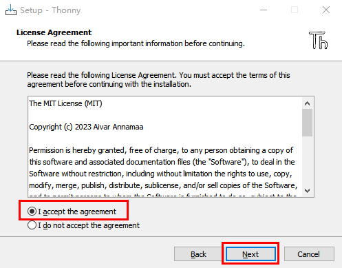

D.如果您需要更改Thonny软件的安装路径，可以单击“**Browse...**”进行修改。选择安装路径后，单击“**OK**”。
如果您不想更改安装路径，只需单击“**Next**”；然后又继续单击“**Next**”。


E.选中“**Create desktop icon**”，Thonny软件会在你的桌面上生成一个快捷方式，方便你稍后打开Thonny软件。


F.单击“**Install**”安装软件。
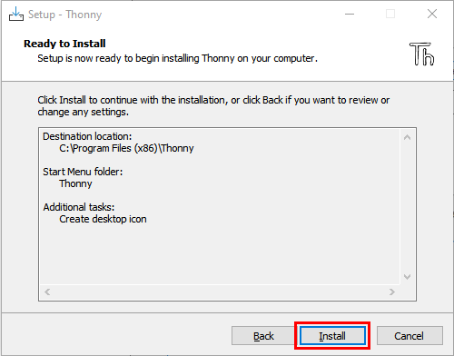

G.在安装过程中，您只需等待安装完成，千万不要点击“**Cancel**”，否则将无法安装成功。


H.一旦看到如下界面，就表示已经成功安装了Thonny软件，点击“**Finish**”就可以。


I.如果你在安装过程中选择了“**Create desktop icon**”，则可以在桌面上看到如下图标。


二、Thonny软件基本配置                                          
A.双击Thonny软件的桌面图标，可以看到如下界面，同时还可以进行语言选择(<span style="color: rgb(255, 76, 65);">这里选择简体中文</span>)和初始设置。设置完了点击“**Let’s go！**”。


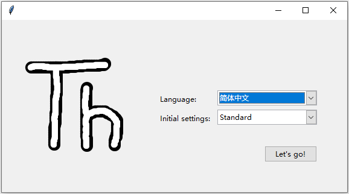


B.选择“**视图**”→“**文件**”和“**Shell**”。


三、安装驱动方法
（<span style="color: rgb(255, 76, 65);">注意：如果电脑已经安装了驱动程序，则不需要再安装驱动；如果没有，则需要进行以下操作：</span>）

**Windows 10 系统：**

在使用Raspberry Pi Pico主板之前，必须安装驱动程序，否则Raspberry Pi Pico主板将无法与计算机通信。将Raspberry Pi Pico主板用USB线连接到电脑上，一般Windows10系统的电脑会自动识别串口，并安装相应的驱动程序，在设备管理器里可以找到“USB串行设备”。


**Windows 7/8 系统：**

如果你的电脑仍在用Windows7/8操作系统，当把Raspberry Pi Pico主板插到USB口后，电脑会发现一个"Board CDC"设备，但不能自动识别它，也无法安装驱动。

首先找到我们提供的名为“pico-serial.inf”的文件,这个文件格式就是驱动文件，然后在设备管理器中，手动添加这个驱动程序给无法识别设备。打开电脑的“设备管理器”，我们双击或者右键单击“更新驱动程序软件”。

点击“浏览计算机以查找驱动程序软件”。

假设我们的驱动文件放在电脑桌面，我们点击“浏览...”找到文件对应的文件夹，点击“下一步”。
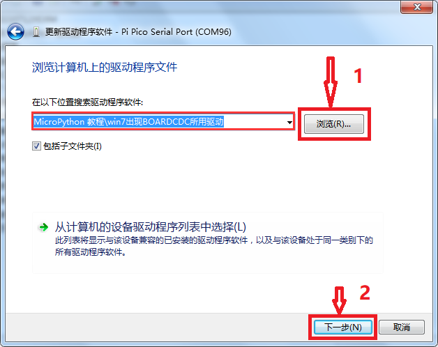
我们选择这个文件夹，然后点击确定，驱动安装成功。

这个时候再打开设备管理器，我们就可以看到Raspberry Pi Pico的驱动程序已经安装成功了，端口的位置多了一个Pi Pico Serial Port。

在拨下Raspberry Pi Pico主板前，最好先点“运行“菜单里的“**停止/重启后端进程**”或者点击界面右边的红色按钮，将Raspberry Pi Pico板断开连接，然后再拨出，会更好一些。


四、更新Micropython固件（重要）                               
要在Raspberry Pi Pico板上运行MicroPython程序，我们需要先烧入一个固件到Raspberry Pi Pico板中。
1.为什么我们需要更新固件
Raspberry Pi Pico板可以用C语言和MicroPython语言编程，并且Raspberry Pi Pico板出厂时没有MicroPython固件，使用MicroPython编程之前需要下载MicroPython固件。

<span style="color: rgb(255, 76, 65);">注意：</span>MicroPython固件只需要下载一次，当使用MicroPython编程时不需要再次下载。如果你已经下载了用C语言编写的 .uf2 程序固件，则MicroPython固件将会被覆盖，那下次你使用MicroPython时，你需要按照以下步骤更新Raspberry Pi Pico板的固件。

2.下载Micropython固件
方法1：Raspberry Pi Pico的官网：https://www.raspberrypi.com/documentation/microcontrollers/

A. 单击上面的链接，你可以看到以下界面：

B. 滚动鼠标，你又可以看到以下内容：

C. 单击“MicroPython(Getting started MicroPython)”进入固件下载页面。


方法2：通过单击下载链接：https://micropython.org/download/rp2-pico/rp2-pico-latest.uf2 ，可以直接下载。

方法3：如果你因为网络问题或其他原因无法下载，可以使用我们准备的 .uf2 文件，它位于以下文件路径：


3.烧入MicroPython固件的步骤
①连接microUSB线一端到你的电脑USB口。

②长按“Raspberry Pi Pico板”上的**白色按钮（BOOTSEL）**。然后，通过microUSB线另一端将Raspberry Pi Pico板与电脑连接。

③松开按钮，当连接成功时，在你的电脑上打开[设备管理器]，电脑将自动识别可移动磁盘(RPI-RP2)，如下所示:

④复制文件（rp2-pico-20230510-unstable-v1.20.0-62-g4e4bdbd19.uf2）到可移动磁盘(RPI-RP2)，并等待它完成，就像复制文件到U盘一样。


⑤当固件烧入完成后，Raspberry Pi Pico板会自动重启。之后，你可以运行Micropython。

五、Thonny软件连接上Raspberry Pi Pico板                         
 1.打开Thonny软件，点击“<span style="color: rgb(255, 76, 65);">运行</span>”并选择“<span style="color: rgb(255, 76, 65);">选择解释器…</span>”


2.选择“<span style="color: rgb(255, 76, 65);">Micropython (一般)</span>”或“<span style="color: rgb(255, 76, 65);">Micropython (Raspberry Pi Pico)</span>”均可。如何选择“**Micropython(Raspberry Pi Pico)**” 如下所示：
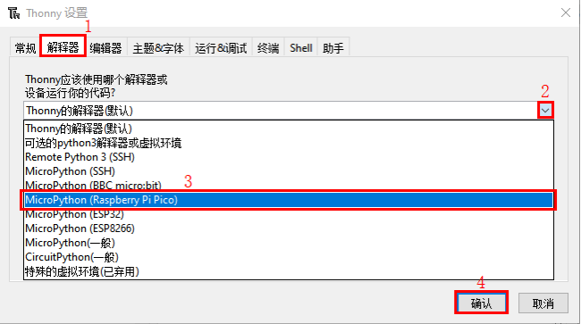

3.选择“<span style="color: rgb(255, 76, 65);">USB-SERIAL (COMx)</span>”，“<span style="color: rgb(255, 76, 65);">COMx</span>”的编号在不同的电脑之间可能会有所不同。你只需要确保选择“<span style="color: rgb(255, 76, 65);">USB-SERIAL (COMx)</span>”就行。

<span style="color: rgb(0, 209, 0);">**如何确定你的Raspberry Pi Pico板与电脑通信的端口?**</span>

步骤1: 当你的Raspberry Pi Pico板没有连接到电脑时，打开Thonny软件，点击“<span style="color: rgb(255, 76, 65);">运行</span>”，选择“<span style="color: rgb(255, 76, 65);">选择解释器...</span>”，弹出对话框，点击“<span style="color: rgb(255, 76, 65);">端口</span>”，可以查看当前连接的端口，如下图所示:


步骤2: 关闭对话框。将Raspberry Pi Pico板连接到电脑，再次单击“<span style="color: rgb(255, 76, 65);">运行</span>”并选择“<span style="color: rgb(255, 76, 65);">选择解释器...</span>”。单击弹出窗口中的“<span style="color: rgb(255, 76, 65);">端口</span>”，查看当前端口。现在又增加了一个端口，那么这个端口是用来与电脑通信的。


4.选择“<span style="color: rgb(255, 76, 65);">Micropython(Raspberry Pi Pico)</span>”和“<span style="color: rgb(255, 76, 65);">端口</span>”后，单击“<span style="color: rgb(255, 76, 65);">确认</span>”。


5.当在Thonny软件上显示以下消息时，表明Thonny软件已成功连接到Raspberry Pi Pico板。

到目前为止，所有的准备工作都已就绪。

六、测试代码(重要)                                               
1.测试Shell命令
在“Shell”窗口输入“print(Hello World!)”，按键盘上的“Enter”键。


2.在线运行代码：
要在线运行Raspberry Pi Pico，你需要把Raspberry Pi Pico板连接到电脑上。这样就可以使用Thonny软件编译或调试程序。
**优点：**
（1）你可以使用Thonny软件编译或调试程序。
（2）通过“Shell”窗口，你可以查看程序运行过程中产生的错误信息和输出结果，并可以在线查询相关功能信息，帮助改进程序。
**缺点：**
（1）要在线运行Raspberry Pi Pico，你必须将Raspberry Pi Pico板连接到一台电脑上并和Thonny软件一起运行。
（2）如果Raspberry Pi Pico板与电脑断开连接，当它们重新连接时，程序将无法再次运行。

**基本操作：**
（1）打开Thonny软件，并且单击“<span style="color: rgb(255, 76, 65);"></span>”。

（2）在新弹出的窗口中，点击“<span style="color: rgb(255, 76, 65);">此电脑</span>”。

在新的对话框中，进入文件夹(即路径)：..\4. Python 教程\1. 开发环境配置，选中“**00.0_HelloWorld.py**”,单击“<span style="color: rgb(255, 76, 65);">打开</span>”。


（3）单击“”来执行程序，“Hello World!”和“Welcome Keyes”将打印在“Shell”窗口。


**退出在线运行**
当在线运行时，单击Thonny软件上的“”或按Ctrl+C退出程序。


3.离线运行代码： 
在离线运行时，Raspberry Pi Pico板不需要连接电脑和Thonny软件。一旦上电，它就可以运行存储在Raspberry Pi Pico板中的main.py程序。
**优点：** 不需要连接电脑和Thonny软件就可以运行程序。
**缺点：** 出现错误或Raspberry Pi Pico板没电时，程序会自动停止，并且代码不容易更改。

**基本操作：**
一旦上电后，Raspberry Pi Pico 板会自动检查设备上是否存在**main\.py**。如果有，则运行main.py中的程序，然后进入shell命令系统。(<span style="color: rgb(255, 76, 65);">如果你想让代码离线运行，你可以将它保存为main\.py</span>); 如果main.py不存在，则直接进入shell命令系统。
（1）单击 “**文件**”→“**新建**” 创建并编写代码。

（2）在新建的文件中输入代码，这里我们以“**0_Onboard_LED_flashing.py**”代码为例。你也可以将“**第00课 板载LED闪烁**”文件夹中的“**0_Onboard_LED_flashing.py**”代码复制到新建的文件中。

（3）单击菜单栏上的“”, 你可以将代码保存到<span style="color: rgb(255, 76, 65);">此电脑</span>或<span style="color: rgb(255, 76, 65);">Raspberry Pi Pico</span>。

（4）我这里是选择“**Raspberry Pi Pico**”，在新弹出的窗口中输入“**main\.py**”并单击“**好的**”。


（5）你可以看到代码已经被上传到Raspberry Pi Pico板。

（6）断开Raspberry Pi Pico板的microUSB线，再重新连接，Raspberry Pi Pico板上的板载LED会反复闪烁。


**退出离线运行**
连接Raspberry Pi Pico板到电脑，单击Thonny软件上的“”或按Ctrl+C结束离线运行。


如果它不能工作，请点击Thonny软件上的“”多次或重新连接Raspberry Pi Pico板。

七、Thonny常见的操作 

<span style="color: rgb(0, 209, 0);">我们这里是将“4. Python 教程”文件夹中的“3. 项目课程”提前复制粘贴到**电脑D盘**为例，其操作如下：</span>


<span style="color: rgb(0, 209, 0);">其电脑D盘路径如下：</span>


<br />

<span style="color: rgb(255, 76, 65);">下面是以“**Project_01_Onboard_LED_Flashing.py**”为例</span>
<br />
<br />

**上传代码至Raspberry Pi Pico**

在“**项目01 板载LED闪烁**”文件夹中，鼠标右键单击选中“**Project_01_Onboard_LED_flashing.py**”，选择“<span style="color: rgb(255, 76, 65);">上传到/</span>”上传代码到Raspberry Pi Pico的根目录。


**下载代码至电脑**

在“Raspberry Pi Pico”中，鼠标右键单击选中“**Project_01_Onboard_LED_flashing.py**”，选择“**下载到/**”将代码下载到你的电脑。


**删除Raspberry Pi Pico根目录中的文件**

在“Raspberry Pi Pico”中，鼠标右键单击选中“**Project_01_Onboard_LED_flashing.py**”，选择“**删除**”，从Raspberry Pi Pico根目录中删除“**Project_01_Onboard_LED_flashing.py**”。


**删除电脑目录中的文件**

在“**项目01 板载LED闪烁**”文件夹中，鼠标右键单击选中“**Project_01_Onboard_LED_flashing.py**”，选择“**移动到回收站**”，即可从“**项目01 板载LED闪烁**”文件夹中删除。


**创建和保存代码**

（1）单击 “**文件**”→“**新建**” 创建并编写代码。

（2）在新建的文件中输入代码，这里我们以“**Project_01_Onboard_LED_flashing.py**”代码为例。你也可以将“**项目01 板载LED闪烁**”文件夹中的“**Project_01_Onboard_LED_flashing.py**”代码复制到新建的文件中。

（3）单击菜单栏上的“”, 你可以将代码保存到<span style="color: rgb(255, 76, 65);">此电脑</span>或<span style="color: rgb(255, 76, 65);">Raspberry Pi Pico</span>。

（4）我这里是选择“**Raspberry Pi Pico**”，在新弹出的窗口中输入“**main\.py**”并单击“**好的**”。


（5）你可以看到代码已经被上传到Raspberry Pi Pico板。

（6）单击“”，Raspberry Pi Pico板上的板载LED会周期性的闪烁。


## Beetlebot ESP32 3合1 智能小车初始形态安装步骤


安装1

安装所需零件：
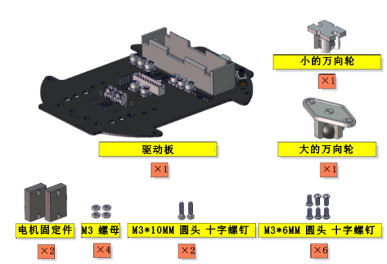

安装：


完成：


安装2

安装所需零件：


安装：


完成：


安装3

安装所需零件：


安装：


完成：


安装4

安装所需零件：


安装：


完成：
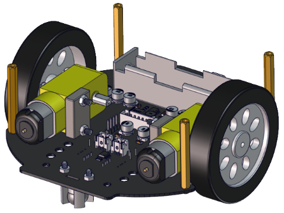

安装5

安装所需零件：


<span style="color: rgb(255, 76, 65);">先将电机、8*8点阵屏和上下pcb板的连接线都接上。</span>

|左电机|右电机|
| :--: | :--: |
|**L**|**R**|


|8*8点阵|小车PCB板|
| :--: | :--: |
|G|G|
|5V|5V|
|SDA|SDA|
|SCL|SCL|


安装：


完成：


安装6

安装所需零件：


安 装：


完成：


安装7

安装所需零件：


安装：


完成：


安装8

安装所需零件：


安装：


完成：


安装9

安装所需零件：


<span style="color: rgb(255, 76, 65);">安装前需要调节舵机角度为90°。</span>

|舵机|小车PCB板|
| :--: | :--: |
|棕线| G |
| 红线 | 5V |
| 橙黄线 | S1（G9）|


```
from machine import Pin, PWM
import time

## 定义GPIO9的输出频率为50Hz，并将其分配给PWM。
pwm = PWM(Pin(9)) 
pwm.freq(50)
'''
##Duty cycle corresponding to steering gear Angle
0°----2.5%----1638
45°----5%----3276
90°----7.5%----4915
135°----10%----6553
180°----12.5%----8192
'''
## 舵机角度与其占空比相适应。 
angle_0 = 1638
angle_45 = 3276
angle_90 = 4915
angle_135 = 6553
angle_180 = 8192
while True:
    pwm.duty_u16(angle_90)
    time.sleep(1)

```
上面的Python代码在资料中有提供，打开舵机的调整代码并烧录到Beetlebot的ESP32主板，完成。代码如下图位置：
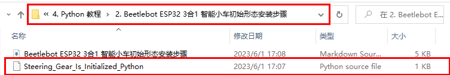

调整之后，正向前安装：
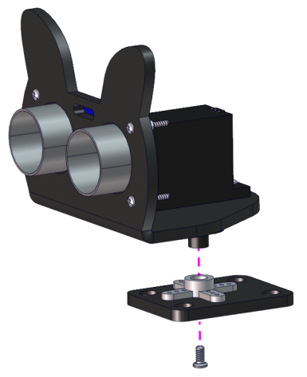

完成：


安装10

安装所需零件：


安装：


完成：


安装11

安装所需零件：


安装：


完成：


安装12

安装所需零件：


安装：


完成：


### 初始形态安装完成


### 初始形态接线图

超声波接线图：
|超声波传感器| 小车PCB板 |
| :--: | :--: |
|Vcc|5V|
|Trig|S2（G10）|
|Echo|S1（G11）|
| Gnd |G|


云台舵机接线图：
| 舵机 | 小车PCB板 |
| :--: | :--: |
| 棕线 | G |
| 红线 | 5V |
| 橙黄线 | S1（G9） |


左边光敏接线图：
|左边光敏传感器| 小车PCB板 |
| :--: | :--: |
| G| G |
| V| V |
|S|S（G26）|


右边光敏接线图：
|右边光敏传感器| 小车PCB板 |
| :--: | :--: |
| G| G |
| V| V |
|S|S（G27）|


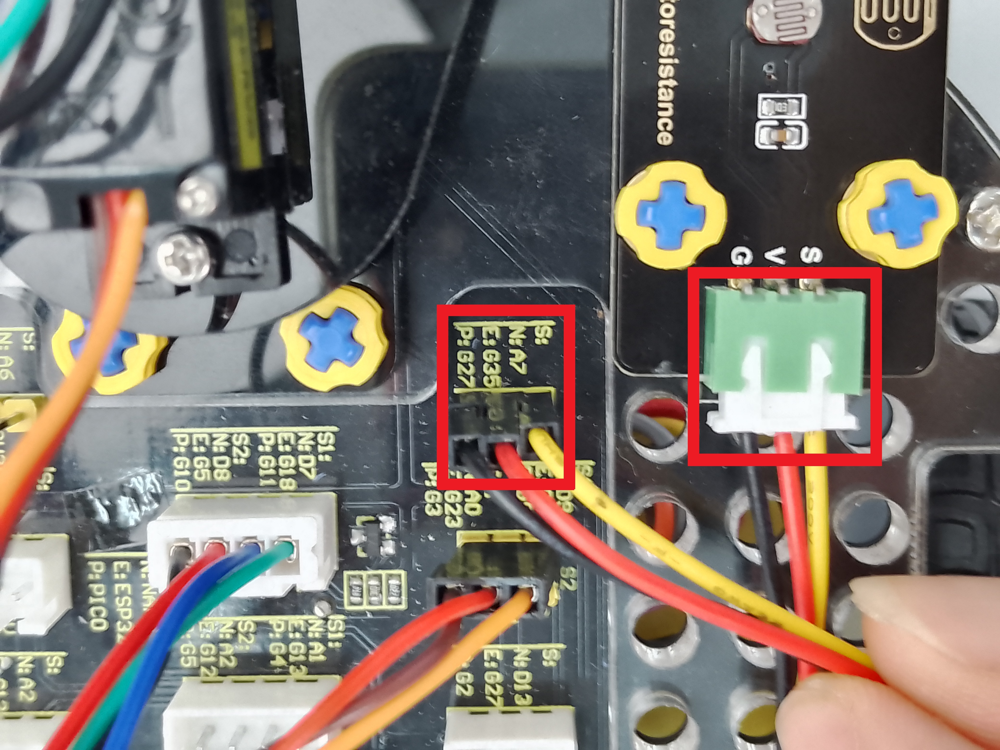

### 原型态安装完成示意图：


### 电池安装：

电池盒中标有( - )的一端是负极( - )，则另一端是正极( + )。


## 项目教程


### 项目01 板载LED闪烁

1.实验介绍：
Raspberry Pi Pico上有个板载LED，这个LED是固定接在Raspberry Pi Pico上的GP25引脚，在这个项目中，我们将来学习使板载LED闪烁的效果。

2.实验元件：
||  |
| :--: | :--: |
| Raspberry Pi Pico*1 |USB 线*1 |

3.实验接线：
在本项目中，用USB线将Raspberry Pi Pico和电脑连起来。连接方法请参照文档：<span style="color: rgb(255, 76, 65);">开发环境配置</span>


4.实验代码：
Raspberry Pi Pico板载LED是由GP25控制，当GP25输出高电平时，LED点亮;当输出低时，LED灯关闭。

本教程中使用的代码保存在：“**..\Keyes Beetlebot Pico 3合1 智能小车\4. Python 教程\3. 项目教程**” 的路径中。你可以把代码移到任何地方。例如，我们将代码保存在**D盘**中，<span style="color: rgb(0, 209, 0);">路径为D:\3. 项目教程</span>。


打开“**Thonny**”软件，点击“**此电脑**”→“**D:**”→“**3. 项目教程**”→“**项目01 板载LED闪烁**”，然后鼠标左键双击“**Project_01_Onboard_LED_Flashing.py**”。


```
from machine import Pin
import time

led = Pin(25, Pin.OUT)   # 从引脚25创建LED对象，设置引脚25输出

try:
    while True:
        led.value(1)    # 点亮LED
        time.sleep(0.5) # 延时 0.5s
        led.value(0)    # 关闭LED
        time.sleep(0.5) # 延时 0.5s
except:
    pass

```

5.实验结果：
确保Raspberry Pi Pico主板已经连接到电脑上，单击“”。


利用USB线上电，单击“”，代码开始执行，你会看到的现象是：Raspberry Pi Pico的LED开始闪烁，循环进行。按“Ctrl+C”或单击“”退出程序。


### 项目02: SK6812 RGB

1.实验简介：
小车扩展板上有4个RGB LED，RGB LED属于简单的发光模块，可以通过调节色彩调出不同颜色的灯效，可广泛应用于建筑物、桥梁、道路、花园、庭院、地板等领域的装饰照明与会场布置、圣诞节、万圣节、情人节、复活节、国庆节等节日期间烘托气氛等场景。在本实验中，使小车扩展板上的4个RGB实现各种灯光效果。

2.元件知识：
**SK6812RGB：** 小车扩展板上有4个RGB LED，从原理图中可以看出，这4个RGBLED都是串联起来的，在电压电流充足的情况下可以接几百个RGB LED，都可以用一根信号线控制任意一个RGB LED，并且让它显示任意一种颜色。每一颗RGBLED都是一个独立的像素点，每个像素点都是由R、G、B三基色颜色组成，可实现256级亮度显示，完成16777216种颜色的全真色彩显示，同时像素点内部包含了智能数字接口数据锁存信号整形放大驱动电路，还内置信号整形电路，有效保证了像素点光的颜色高度一致。


3.实验代码：
小车PCB板上的SK6812RGB是由Raspberry Pi Pico主板上的GPIO 13 控制。

本教程中使用的代码保存在：“**..\Keyes Beetlebot Pico 3合1 智能小车\4. Python 教程\3. 项目教程**” 的路径中。你可以把代码移到任何地方。例如，我们将代码保存在**D盘**中，<span style="color: rgb(0, 209, 0);">路径为D:\3. 项目教程</span>。


打开“**Thonny**”软件，点击“**此电脑**”→“**D:**”→“**3. 项目教程**”→“**项目02 SK6812 RGB**”，<span style="color: rgb(255, 76, 65);">选择“neopixel\.py”，右击鼠标选择“上传到/”，等待“neopixel\.py”被上传到Raspberry Pi Pico主板</span>，然后鼠标左键双击“**Project_02_SK6812_RGB.py**”。


```
###导入Pin, neopiexl和time模块。
import time
from machine import Pin
from neopixel import myNeopixel

###定义连接到新像素的引脚和led的数量。
NUM_LEDS = 4

np = myNeopixel(NUM_LEDS, 13)
red = (255, 0, 0)
green = (0, 255, 0)
blue = (0, 0, 255)
white = (255, 255, 255)
close = (0, 0, 0)
COLORS = [red, green, blue, white, close]

np.brightness(150) #亮度: 0 ~ 255
while True:
    for color in COLORS:
        np.fill(color[0], color[1], color[2])
        np.show()
        time.sleep(0.5)

```
4.实验现象：
确保Raspberry Pi Pico主板已经连接到电脑上，单击“”。


安上电池，将小车底板上的电源拨码开关拨到ON一端，开启电源。单击“”，代码开始执行，你会看到的现象是：小车PCB板上的4个RGB LED亮红灯，绿灯，蓝灯，白灯和熄灭，循环进行。按“Ctrl+C”或单击“”退出程序。


### 项目03: 演奏音乐

1.实验简介：
小车扩展板上有个喇叭功放元件，它常用来播放音乐，作为一些音乐播放设备的外接扩音设备。
在本实验中，我们利用喇叭功放元件来播放不同频率声音。

2.元件知识：
喇叭功放元件：喇叭功放元件（原理相当于无源蜂鸣器），其内部不带震荡电路，控制时需要在元件正极输入不同频率的方波，负极接地，从而控制喇叭功放元件响起不同频率的声音。

3.实验代码：
小车PCB板上的喇叭功放元件是由ESP32主板上的GPIO 12 控制。

本教程中使用的代码保存在：“**..\Keyes Beetlebot Pico 3合1 智能小车\4. Python 教程\3. 项目教程**” 的路径中。你可以把代码移到任何地方。例如，我们将代码保存在**D盘**中，<span style="color: rgb(0, 209, 0);">路径为D:\3. 项目教程</span>。


打开“**Thonny**”软件，点击“**此电脑**”→“**D:**”→“**3. 项目教程**”→“**项目03 演奏音乐**”，然后鼠标左键双击“**Project_03_Buzzer.py**”。


```
from machine import Pin
import time

###初始化蜂鸣器
buzzer = Pin(12,Pin.OUT)

###模拟两个不同的频率
while True:
    #输出500HZ频率声音
    for i in range(80):
        buzzer.value(1)
        time.sleep(0.001)
        buzzer.value(0)
        time.sleep(0.001)
    #输出250HZ频率声音
    for i in range(100):
        buzzer.value(1)
        time.sleep(0.002)
        buzzer.value(0)
        time.sleep(0.002)
```

4.实验现象：
确保Raspberry Pi Pico主板已经连接到电脑上，单击“”。


安上电池，将小车底板上的电源拨码开关拨到ON一端，开启电源。单击“”，代码开始执行，你会看到的现象是：小车PCB板上的喇叭功放元件就开始播放不同频率声音；按“Ctrl+C”或单击“”退出程序。


### 项目04: 点阵屏

1.实验简介：
8×8 点阵屏通过LED(发光二极管）组成，以灯珠亮灭来显示文字、图片、动画、视频等，8×8 点阵显示屏制作简单，安装方便，被广泛应用于各种公共场合，如汽车报站器、广告屏、银行窗口屏、叫号屏以及停车系统等等。在本实验中，将使用8×8 点阵屏来显示图案。

2.元件知识：
**8×8点阵屏：** LED点阵屏按照LED发光颜色可分为单色、双色、三色灯等，可显示红、黄、绿甚至是真彩色。根据LED的数量又分为4×4、8×8、16×16等不同类型。这里我们通过单色8×8点阵屏来了解其原理。
不同点阵屏封装不同，8×8点阵屏由8行8列共64个LED灯组成，其内部结构如下图：

每个LED放置在行线和列线的交叉点上，当对应的某一行电平拉高，某一列电拉低，则对应交叉点的LED就会点亮。8×8点阵屏有16个管脚，将有丝印的一边朝下，逆时针编号为1-8，9-16。

其对应内部管脚定义如下如所示：

比如我们要点亮第一行第一列LED灯，则对应将点阵屏的第9脚拉高，第13脚拉低，其他LED控制以此类推即可。
**HT16K33 8X8点阵驱动模块：** 上面介绍了8*8点阵的原理，想控制8*8点阵需要多达16个单片机的引脚。这样既浪费资源也浪费时间。这里用了一个驱动点阵屏的芯片：HT16K33。HT16K33是一款内存映射和多功能LED控制器驱动芯片。利用HT16K33芯片驱动1个8*8点阵，只需要利用单片机的I2C通信端口控制点阵，大大的节约了单片机资源。下图是HT16K33 芯片工作原理图。

我们基于以上原理设计了一个8X8点阵驱动模块，从上图我们可以看出，我们只要通过I2C 通讯利用单片机的2个引脚就可以很好的控制点阵显示。
**8X8点阵模块的参数：**
- 工作电压: 5V    
- 额定输入频率: 400KHZ 
- 输入功率: 2.5W  
- 输入电流: 500mA  
**取模工具的使用说明：**
点阵和驱动的原理都已经介绍完了，那点阵上显示的内容是怎么来的呢，有没有比较简便的方法？这里给大家介绍一款点阵取模工具，这块工具使用的是在线版，链接：http://dotmatrixtool.com/#
现在就一起看看怎么使用吧。
①打开链接如下图：

②我们的点阵是8X8的，所以调整高度为8，宽度为8，如下图：

③在Endian 这里选择Big Endian(MSB)这个模式

④将图案生成16进制的数据
如下图，按鼠标左键选中，右键取消，画好自己想要的图案，点击<span style="color: rgb(255, 76, 65);">Generate</span>，就会生成我们所需要的十六进制的数据了，这里是以下面的图案为例的。

这个生成的十六进制的代码（0x22, 0x14, 0x48, 0x40, 0x40, 0x48, 0x14, 0x22）就是点阵需要显示的内容，如果想要点阵显示这样的图案，则需要将这十六进制的代码放到程序里面。

3.实验接线：
| 8X8点阵 | 小车PCB板 |
| :--: | :--: |
| G | G |
| 5V | 5V |
| SDA | SDA |
| SCL | SCL |


4.实验代码：
8X8点阵是由Raspberry Pi Pico主板的GPIO20（SDA），GPIO21（SCL）控制。

本教程中使用的代码保存在：“**..\Keyes Beetlebot Pico 3合1 智能小车\4. Python 教程\3. 项目教程**” 的路径中。你可以把代码移到任何地方。例如，我们将代码保存在**D盘**中，<span style="color: rgb(0, 209, 0);">路径为D:\3. 项目教程</span>。


打开“**Thonny**”软件，点击“**此电脑**”→“**D:**”→“**3. 项目教程**”→“**项目04 点阵屏**”，<span style="color: rgb(255, 76, 65);">分别选择“ht16k33_matrix\.py”和“matrix_fonts\.py”，右击鼠标选择“上传到/”，等待“ht16k33_matrix\.py”和“matrix_fonts\.py”被上传到Raspberry Pi Pico主板</span>，然后鼠标左键双击“**Project_04_8×8_Dot_Matrix_Display.py**”。


```
from machine import Pin,I2C
import time
import json
import matrix_fonts
from ht16k33_matrix import ht16k33_matrix
制作图案的工具 https://gurgleapps.com/tools/matrix
###i2c 配置
clock_pin = 21
data_pin = 20
bus = 0
i2c_addr_left = 0x70
use_i2c = True

def scan_for_devices():
    i2c = machine.I2C(bus,sda=machine.Pin(data_pin),scl=machine.Pin(clock_pin))
    devices = i2c.scan()
    if devices:
        for d in devices:
            print(hex(d))
    else:
        print('no i2c devices')

if use_i2c:
    scan_for_devices()
    left_eye = ht16k33_matrix(data_pin, clock_pin, bus, i2c_addr_left)

def show_char(left):
    if use_i2c:
        left_eye.show_char(left)
        
def scroll_message(font,message='hello',delay=0.05): #滚动显示
    left_message = '   ' + message
    right_message = message + '   '
    length=len(right_message)
    char_range=range(length-1)
    for char_pos in char_range:
      right_left_char=font[right_message[char_pos]]
      right_right_char=font[right_message[char_pos+1]]
      left_left_char=font[left_message[char_pos]]
      left_right_char=font[left_message[char_pos+1]]
      for shift in range(8):
        left_bytes=[0,0,0,0,0,0,0,0]
        right_bytes=[0,0,0,0,0,0,0,0]
        for col in range(8):
          left_bytes[col]=left_bytes[col]|left_left_char[col]<<shift
          left_bytes[col]=left_bytes[col]|left_right_char[col]>>8-shift;
          right_bytes[col]=right_bytes[col]|right_left_char[col]<<shift
          right_bytes[col]=right_bytes[col]|right_right_char[col]>>8-shift;
        if use_i2c:
                left_eye.show_char(left_bytes)
        time.sleep(delay)

while True:
    show_char(matrix_fonts.textFont1['A']) #显示字母A
    time.sleep(1)
    show_char(matrix_fonts.textFont1['B'])
    time.sleep(1)
    show_char(matrix_fonts.textFont1['C'])
    time.sleep(1)
    scroll_message(matrix_fonts.textFont1, 'Hello World')
```

4.实验现象：
确保Raspberry Pi Pico主板已经连接到电脑上，单击“”。


安上电池，将小车底板上的电源拨码开关拨到ON一端，开启电源。单击“”，代码开始执行，你会看到的现象是：8*8点阵屏显示字母“A”，字母“B”，字母“C”，显示滚动“Hello World”。按“Ctrl+C”或单击“”退出程序。


### 项目05: 舵机转动

1.实验简介：
小车上有两个舵机，这里以接在引脚GPIO9的舵机为例，舵机是一种可以非常精确地旋转的电机。目前已广泛应用于玩具车、遥控直升机、飞机、机器人等领域。在这个项目中，我们将使用Raspberry Pi Pico主板控制舵机转动。

2.元件知识：
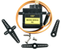
**舵机：** 舵机是一种位置伺服的驱动器，主要是由外壳、电路板、无核心马达、齿轮与位置检测器所构成。其工作原理是由接收机或者单片机发出信号给舵机，其内部有一个基准电路，产生周期为20ms，宽度为1.5ms 的基准信号，将获得的直流偏置电压与电位器的电压比较，获得电压差输出。经由电路板上的IC 判断转动方向，再驱动无核心马达开始转动，透过减速齿轮将动力传至摆臂，同时由位置检测器送回信号，判断是否已经到达定位。适用于那些需要角度不断变化并可以保持的控制系统。当电机转速一定时，通过级联减速齿轮带动电位器旋转，使得电压差为0，电机停止转动。
舵机有多种规格，但它们都有三根连接线，分别是棕色、红色、橙色(不同品牌可能有不同的颜色)。棕色为GND，红色为电源正极，橙色为信号线

舵机的伺服系统由可变宽度的脉冲来进行控制，橙色的控制线是用来传送脉冲的。一般而言，PWM控制舵机的基准信号周期为20ms（50Hz），理论上脉宽应在1ms到2ms之间，对应控制舵机角度是0°～180°。但是，实际上更多控制舵机的脉宽范围是0.5ms 到2.5ms，具体需要自己实际调试下。

经过实测，舵机的脉冲范围为0.65ms~2.5ms。180度舵机，对应的控制关系是这样的：
|高电平时间|舵机角度|基准信号周期时间（20ms）|
| :--: | :--: | :--: |
|0.65ms|0度|0.65ms高电平+19.35ms低电平|
|1.5ms|90度|1.5ms高电平+18.5ms低电平|
|2.5ms|180度|2.5ms高电平+17.5ms低电平|

舵机的规格参数：
|工作电压：|DC 4.8V〜6V|
| :--: | :--: |
|可操作角度范围：|可操作角度范围：|
|脉波宽度范围：|500→2500 μsec|
|外观尺寸：|22.9*12.2*30mm|
|空载转速：|0.12±0.01 sec/60度（DC 4.8V）  0.1±0.01 sec/60度（DC 6V）|
|空载电流：|200±20mA（DC 4.8V）  220±20mA（DC 6V）|
|停止扭力：|1.3±0.01kg·cm（DC 4.8V）  1.5±0.1kg·cm（DC 6V）|
|停止电流：|≦850mA（DC 4.8V）  ≦1000mA（DC 6V）|
|待机电流：|3±1mA（DC 4.8V）  4±1mA（DC 6V）|
|重量:|9±1g (不带舵机轴)|
|使用温度：|-30℃~60℃|

3.实验接线：
| 舵机 | 小车PCB板 |
| :--: | :--: |
| 棕线 | G |
| 红线 | 5V |
| 橙黄线 | S1（G9） |


4.实验代码1：
控制超声波传感器转动的舵机是由Raspberry Pi Pico主板的GPIO9控制。

本教程中使用的代码保存在：“**..\Keyes Beetlebot Pico 3合1 智能小车\4. Python 教程\3. 项目教程**” 的路径中。你可以把代码移到任何地方。例如，我们将代码保存在**D盘**中，<span style="color: rgb(0, 209, 0);">路径为D:\3. 项目教程</span>。


打开“**Thonny**”软件，点击“**此电脑**”→“**D:**”→“**3. 项目教程**”→“**项目05 舵机转动**”，并鼠标左键双击“**Project_05.1_Servo_Rotate.py**”。


```
from machine import Pin, PWM
import time

###定义GPIO9的输出频率为50Hz，并将其分配给PWM。
pwm = PWM(Pin(9))
pwm.freq(50)

'''
###占空比与舵机角度相对应
0°----2.5%----1638
45°----5%----3276
90°----7.5%----4915
135°----10%----6553
180°----12.5%----8192
'''
###舵机角度与其占空比相适应。 
angle_0 = 1638
angle_45 = 3276
angle_90 = 4915
angle_135 = 6553
angle_180 = 8192

while True:
    pwm.duty_u16(angle_0)
    time.sleep(1)
    pwm.duty_u16(angle_45)
    time.sleep(1)
    pwm.duty_u16(angle_90)
    time.sleep(1)
    pwm.duty_u16(angle_135)
    time.sleep(1)
    pwm.duty_u16(angle_180)
    time.sleep(1)

```
5.实验现象1：
确保Raspberry Pi Pico主板已经连接到电脑上，单击“”。


安上电池，将小车底板上的电源拨码开关拨到ON一端，开启电源。单击“”，代码开始执行，你会看到的现象是：舵机将转动。按“Ctrl+C”或单击“”退出程序。


6.实验代码2：
控制超声波传感器转动的舵机是由Raspberry Pi Pico主板的GPIO9控制。

本教程中使用的代码保存在：“**..\Keyes Beetlebot Pico 3合1 智能小车\4. Python 教程\3. 项目教程**” 的路径中。你可以把代码移到任何地方。例如，我们将代码保存在**D盘**中，<span style="color: rgb(0, 209, 0);">路径为D:\3. 项目教程</span>。


打开“**Thonny**”软件，点击“**此电脑**”→“**D:**”→“**3. 项目教程**”→“**项目05 舵机转动**”，选择“myservo\.py”，右击鼠标选择“上传到/”，等待“myservo\.py”被上传到Raspberry Pi Pico主板，然后鼠标左键双击“**Project_05.2_Servo_Sweep.py**”。


```
from myservo import Servo
import time

servo=Servo(9)
servo.ServoAngle(0)
time.sleep_ms(1000)

try:
    while True:       
        for i in range(0, 180, 1):
            servo.ServoAngle(i)
            time.sleep_ms(15)
        for i in range(180, 0, -1):
            servo.ServoAngle(i)
            time.sleep_ms(15)        
except:
    servo.deinit()

```
7.实验现象2：
确保Raspberry Pi Pico主板已经连接到电脑上，单击“”。


安上电池，将小车底板上的电源拨码开关拨到ON一端，开启电源。单击“”，代码开始执行，你会看到的现象是：舵机将从0°旋转到180°，然后反向方向，使其从180°旋转到0°，循环往复地重复这些动作，像扫地一样。按“Ctrl+C”或单击“”退出程序。


### 项目06: 电机驱动和调速

1.实验简介：
驱动电机的方法有很多，我们这个小车用到的是最常用的DRV8833电机驱动芯片，该芯片为玩具、打印机及其它电机一体化应用提供了一款双通道桥式电动驱动器解决方案。
在本实验中，我们使用扩展板上的DRV8833电机驱动芯片驱动小车的两个直流电机，通过编写代码实现小车分别向前，向后，向左，向右行走的效果。

2.元件知识：
**DRV8833电机驱动芯片：** 具有电流控制功能的双H桥电机驱动器，可以驱动两个直流电机、一个双极步进电机、电磁阀或其他电感负载。每个H桥的输出驱动器块由N沟道功率MOSFET组成，配置为H桥以驱动电机绕组。每个H桥包括调节或限制绕组电流的电路。
带有故障输出引脚的内部停机功能是用于过大电流保护、短路保护、欠压锁定和超温。还提供了低功耗睡眠模式。我们来看一下DRV8833电机驱动芯片驱动两个直流电机的电路图和示意图：


如果想更深了解DRV8833电机驱动芯片，可以查看我们提供的芯片规格书，在资料的“附件”文件夹里。


3.规格参数：
- 逻辑部分输入电压：DC 5V
- 驱动部分输入电压：DC 5V
- 逻辑部分工作电流：<30mA
- 驱动部分工作电流：<2A
- 最大耗散功率：10W（T=80℃）
- 电机转速：5V  200 rpm / min
- 电机驱动形式：DRV8833双路H桥驱动
- 控制信号输入电平：高电平2.3V<Vin<5V  ，低电平-0.3V<Vin<1.5V
- 工作温度：-25~130℃

4.驱动小车运行原理：
根据上面电机驱动板的电路图和示意图，我们知道左电机的方向引脚在GPIO15，调速引脚在GPIO17；右电机的方向引脚在GPIO14，调速引脚在GPIO16，按照以下表格的运动逻辑，就可以知道如何通过控制数字口，PWM口控制2个电机转动，从而实现智能小车的行走。其中PWM值范围为0-255，设置数字越大，电机转动越快。

|功能|GPIO15|GPIO17（PWM）|左电机|GPIO14|GPIO16（PWM）|右电机|
| :--: | :--: | :--: | :--: | :--: | :--: | :--: |
|前进|0|50000|正转|0|50000|正转|
|后退|1|10000|反转|1|10000|反转|
|左转|1|50000|反转|0|32768|正转|
|右转|0|32768|正转|1|50000|反转|
|停止|0|0|停止|0|0|停止|

5.实验代码：

本教程中使用的代码保存在：“**..\Keyes Beetlebot Pico 3合1 智能小车\4. Python 教程\3. 项目教程**” 的路径中。你可以把代码移到任何地方。例如，我们将代码保存在**D盘**中，<span style="color: rgb(0, 209, 0);">路径为D:\3. 项目教程</span>。


打开“**Thonny**”软件，点击“**此电脑**”→“**D:**”→“**3. 项目教程**”→“**项目06 电机驱动和调速**”，然后鼠标左键双击“**Project_06_Motor_Drive_And_Speed_Regulation.py**”。


```
from machine import Pin,PWM
import time

### 右轮
pin1=Pin(14,Pin.OUT)
pin2=PWM(Pin(16))
pin2.freq(50)
### 左轮
pin3=Pin(15,Pin.OUT)
pin4=PWM(Pin(17))
pin4.freq(50)

### 作为小车前进的函数
def car_forward(): 
  pin1.value(0)
  pin2.duty_u16(50000) 
  pin3.value(0)
  pin4.duty_u16(50000)

### 作为小车后退的函数
def car_back(): 
  pin1.value(1)
  pin2.duty_u16(10000)  
  pin3.value(1)
  pin4.duty_u16(10000)

### 作为小车向左的函数
def car_left(): 
  pin1.value(0)
  pin2.duty_u16(50000)  
  pin3.value(1)
  pin4.duty_u16(32768)

### 作为小车向右的函数
def car_right(): 
  pin1.value(1)
  pin2.duty_u16(32768)  
  pin3.value(0)
  pin4.duty_u16(50000)

### 作为小车停止的函数
def car_stop(): 
  pin1.value(0)
  pin2.duty_u16(0)  
  pin3.value(0)
  pin4.duty_u16(0)    
try:
    while True:
        car_forward() #小车前进
        time.sleep(2) # 延时2s
        car_back() # 小车后退
        time.sleep(2)    
        car_left() # 小车向左
        time.sleep(2)    
        car_right() # 小车向右
        time.sleep(2)    
        car_stop() # 小车停止
        time.sleep(2)     
except:
    pass 
    
```
6.实验现象：
确保Raspberry Pi Pico主板已经连接到电脑上，单击“”。


安上电池，将小车底板上的电源拨码开关拨到ON一端，开启电源。单击“”，代码开始执行，你会看到的现象是：小车前进2秒，后退2秒，左转2秒，右转2秒，停止2秒，循环。按“Ctrl+C”或单击“”退出程序。


### 项目06: 超声波传感器

1.实验简介：

小车上有个超声波传感器，超声波传感器是一种非常实惠的距离传感器，它可以检测前方是否存在障碍物，并且检测出传感器与障碍物的详细距离。它的原理和蝙蝠飞行的原理一样，就是超声波传感器发送出一种频率很高的超声波信号，超过正常人听力的声波范围。这些超声波的信号若是碰到障碍物，就会立刻反射回来，在接收到返回的信息之后，通过判断发射信号和接收信号的时间差，计算出传感器和障碍物的距离。超声波传感器主要用于各种机器人项目中的物体躲避和测距，也常被用于水位传感，甚至作为一个停车传感器。
在本实验中，我们使用超声波传感器来测量距离，并将数据打印在串口监视器上。

2.元件知识：
**HC-SR04超声波传感器：** 像蝙蝠一样使用声纳来确定与物体的距离，它提供了精准的非接触范围检测，高精度和稳定的读数。它的操作不受阳光或黑色材料的影响，就像精密的照相机(在声学上像布料这样比较软的材料很难被探测到)。它带有超声波发射器和接收器。

**参数：**
- 工作电压:+5V DC
- 静态电流: <2mA
- 工作电流: 15mA
- 有效角度: <15°
- 距离范围: 2cm – 400 cm
- 精度: 0.3 cm
- 测量角度: 30 degree
- 触发输入脉宽: 10us

**原理：**

最常用的超声测距的方法是回声探测法，如图：

超声波发射器向某一方向发射超声波，在发射时刻的同时计数器开始计时，超声波在空气中传播，途中碰到障碍物面阻挡就立即反射回来，超声波接收器收到反射回的超声波就立即停止计时。超声波也是一种声波，其声速V与温度有关。一般情况下超声波在空气中的传播速度为340m/s，根据计时器记录的时间t，就可以计算出发射点距障碍物面的距离s，即：s=340t/2：
(1)采用IO口TRIG触发测距，给至少10us的高电平信号;
(2)模块自动发送8个40khz的方波，自动检测是否有信号返回；
(3)有信号返回，通过ECHO输出一个高电平，单片机读取到高电平持续的时间就是超声波从发射到返回的时间。

超声波模块的电路图：


3.实验接线：
|超声波传感器| 小车PCB板 |
| :--: | :--: |
|Vcc|5V|
|Trig|S2（GPIO10）|
|Echo|S1（GPIO11）|
| Gnd |G|


4.实验代码：
超声波传感器的Trig引脚是由Raspberry Pi Pico主板的GPIO10控制，Echo引脚是由Raspberry Pi Pico主板的GPIO11控制。

本教程中使用的代码保存在：“**..\Keyes Beetlebot Pico 3合1 智能小车\4. Python 教程\3. 项目教程** ”的路径中。你可以把代码移到任何地方。例如，我们将代码保存在**D盘**中，<span style="color: rgb(0, 209, 0);">路径为D:\3. 项目教程</span>。


打开“**Thonny**”软件，点击“**此电脑**”→“**D:**”→“**3. 项目教程**”→“**项目07 超声波测距**”，然后鼠标左键双击“**Project_07_Ultrasonic_Ranging.py**”。


```
from machine import Pin 
import time

###定义超声波测距模块的控制引脚。 
trigPin=Pin(10,Pin.OUT,0)
echoPin=Pin(11,Pin.IN,0)
###设置声速。
soundVelocity=340
distance=0

### 子函数getSonar()用于启动超声波模块开始测量，并返回以厘米为单位的测量距离。
### 在这个函数中，首先让trigPin发送10us高电平启动超声波模块。
### 然后使用pulseIn()读取超声波模块并返回高电平持续时间。
### 最后根据时间计算测得的距离。
def getSonar():
    trigPin.value(1)
    time.sleep_us(10)
    trigPin.value(0)
    while not echoPin.value():
        pass
    pingStart=time.ticks_us()
    while echoPin.value():
        pass
    pingStop=time.ticks_us()
    pingTime=time.ticks_diff(pingStop,pingStart)
    distance=pingTime*soundVelocity//2//10000
    return int(distance)

### 延迟2秒，等待超声波模块稳定;
### 每500毫秒打印从超声波模块获得的数据。
time.sleep_ms(2000)
while True:
    time.sleep_ms(500)
    print('Distance: ',getSonar(),'cm' ) 
    
```
5.实验现象：
确保Raspberry Pi Pico主板已经连接到电脑上，单击“”。


安上电池，将小车底板上的电源拨码开关拨到ON一端，开启电源。单击“”，代码开始执行，你会看到的现象是：Thonny IDE下的”Shell”窗口中将打印超声波传感器和物体之间的距离值。按“Ctrl+C”或单击“”退出程序。
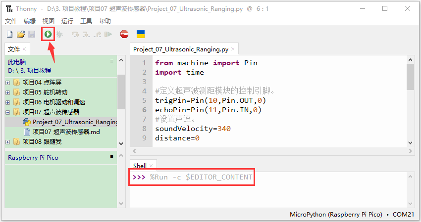


### 项目08: 跟随我

1.实验简介：
在上面实验中，我们已经了解了8*8点阵、电机驱动和调速、超声波传感器、舵机等硬件知识，那么在本实验中，我们将结合它们打造一款跟随小车! 在电路设计过程中，我们可以利用超声波传感器来检测小车与前方物体的距离。通过测量距离控制电机的旋转，从而控制小车的运动状态，使小车跟随物体运动。
2.工作原理：
|检测|检测前方物体的距离（单位：cm）|
| :--: | :--: |
|条件1|距离＜8|
|状态|小车后退|
|条件2|8≤距离<13|
|状态|小车停止|
|条件3|13≤距离<35|
|状态|小车前进|
|条件3|距离≥35|
|状态|小车停止|

3.流程图：
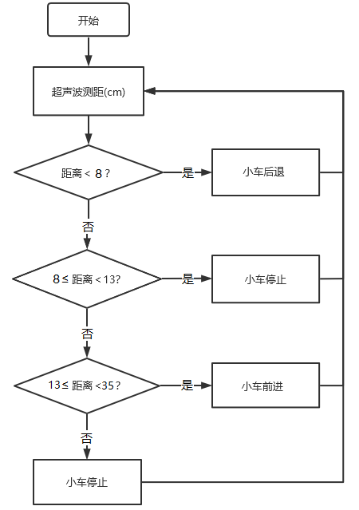

4.实验代码：
本教程中使用的代码保存在：“**..\Keyes Beetlebot Pico 3合1 智能小车\4. Python 教程\3. 项目教程**” 的路径中。你可以把代码移到任何地方。例如，我们将代码保存在**D盘**中，<span style="color: rgb(0, 209, 0);">路径为D:\3. 项目教程</span>。


打开“**Thonny**”软件，点击“**此电脑**”→“**D:**”→“**3. 项目教程**”→“**项目08 跟随我**”，然后鼠标左键双击“**Project_08_Follow_Me.py**”。


```
from machine import Pin, PWM
import time

'''
### 占空比与舵机角度相对应
0°----2.5%----1638
45°----5%----3276
90°----7.5%----4915
135°----10%----6553
180°----12.5%----8192
'''
### 定义GPIO9的输出频率为50Hz，占空比为4915，并分配给PWM。
servoPin = PWM(Pin(9))
servoPin.freq(50)
servoPin.duty_u16(4915)
time.sleep(1)

### 设置超声波传感器的引脚和声速
trigPin=Pin(10,Pin.OUT,0)
echoPin=Pin(11,Pin.IN,0)
soundVelocity=340
distance=0

### 右轮
pin1=Pin(14,Pin.OUT)
pin2=PWM(Pin(16))
pin2.freq(50)
### 左轮
pin3=Pin(15,Pin.OUT)
pin4=PWM(Pin(17))
pin4.freq(50)

### 作为小车前进的函数。
def car_forward(): 
  pin1.value(0)
  pin2.duty_u16(30000) 
  pin3.value(0)
  pin4.duty_u16(30000)

### 作为小车后退的函数。
def car_back(): 
  pin1.value(1)
  pin2.duty_u16(30000)  
  pin3.value(1)
  pin4.duty_u16(30000)
  
### 作为小车停止的函数。  
def car_stop():
  pin2.deinit()
  pin4.deinit()
  pin1.value(0)
  pin2.duty_u16(0)  
  pin3.value(0)
  pin4.duty_u16(0) 

### 子函数getSonar()用于启动超声波模块开始测量，并返回以厘米为单位的测量距离。
### 在这个函数中，首先让trigPin发送10us高电平启动超声波模块。
### 然后使用pulseIn()读取超声波模块并返回高电平持续时间。
### 最后根据时间计算测得的距离。
def getSonar(): 
    trigPin.value(1)
    time.sleep_us(10)
    trigPin.value(0)
    while not echoPin.value():
        pass
    pingStart=time.ticks_us()
    while echoPin.value():
        pass
    pingStop=time.ticks_us()
    pingTime=time.ticks_diff(pingStop,pingStart)
    distance=pingTime*soundVelocity//2//10000
    time.sleep_ms(10)
    return int(distance)

while True:
    Distance=getSonar() # 用超声波测量距离。
    print(Distance) # 发送一个脉冲来计算以厘米为单位的距离，并打印结果。
    if Distance<8: # 如果距离小于8
        pin2=PWM(Pin(16))
        pin2.freq(50)
        pin4=PWM(Pin(17))
        pin4.freq(50) 
        car_back() #小车后退
    elif Distance>=8 and Distance<13: # 如果这个距离大于等于8，它就小于13。
        car_stop() # Car stop
    elif Distance>=13 and Distance<35: # 如果这个距离大于等于13，它就小于35。
        pin2=PWM(Pin(16))
        pin2.freq(50)
        pin4=PWM(Pin(17))
        pin4.freq(50)
        car_forward() #小车前进
    else:
       car_stop() #小车后退
       
```
5.实验现象：
确保Raspberry Pi Pico主板已经连接到电脑上，单击“”。


安上电池，将小车底板上的电源拨码开关拨到ON一端，开启电源。单击“”，代码开始执行，你会看到的现象是：小车可以随着前方障碍物的移动而移动（只能在一条线直上，不能转弯）。按“Ctrl+C”或单击“”退出程序。


### 项目09: 躲避障碍物


1.实验简介：
在上一实验中，我们制作了一个超声波跟随小车。实际上，利用同样硬件，我只需要更改一个测试代码就可以将跟随小车变为避障小车。那超声波避障小车，是怎么实现的呢？当然也是通过超声波传感器的测距来实现的。通过超声波传感器检测机器人前方障碍物，然后根据这一个数据获得机器人运动方向。

2.工作原理：


3.流程图：


4.实验代码：
本教程中使用的代码保存在：“**..\Keyes Beetlebot Pico 3合1 智能小车\4. Python 教程\3. 项目教程**” 的路径中。你可以把代码移到任何地方。例如，我们将代码保存在**D盘**中，<span style="color: rgb(0, 209, 0);">路径为D:\3. 项目教程</span>。


打开“**Thonny**”软件，点击“**此电脑**”→“**D:**”→“**3. 项目教程**”→“**项目09 躲避障碍物**”，<span style="color: rgb(255, 76, 65);">分别选择“ht16k33_matrix\.py”和“matrix_fonts\.py”，右击鼠标选择“上传到/”，等待“ht16k33_matrix\.py”和“matrix_fonts\.py”被上传到Raspberry Pi Pico主板</span>，然后鼠标左键双击“**Project_09_Avoid_Obstacles.py**”。


```
from machine import Pin,I2C,PWM
import time
import json
import matrix_fonts
from ht16k33_matrix import ht16k33_matrix

'''
###占空比与舵机角度相对应
0°----2.5%----1638
45°----5%----3276
90°----7.5%----4915
135°----10%----6553
180°----12.5%----8192
'''
### 定义GPIO9的输出频率为50Hz，占空比为4915，并分配给PWM。
servoPin = PWM(Pin(9))
servoPin.freq(50)
servoPin.duty_u16(4915)
time.sleep(1)

### 设置超声波传感器的引脚和声速。
trigPin=Pin(10,Pin.OUT,0)
echoPin=Pin(11,Pin.IN,0)
soundVelocity=340
distance=0

### 右轮
pin1=Pin(14,Pin.OUT)
pin2=PWM(Pin(16))
pin2.freq(50)
### 左轮
pin3=Pin(15,Pin.OUT)
pin4=PWM(Pin(17))
pin4.freq(50)

### 作为小车前进的函数。
def car_forward(): 
  pin1.value(0)
  pin2.duty_u16(20000) 
  pin3.value(0)
  pin4.duty_u16(20000)

### 作为小车向左的函数。
def car_left(): 
  pin1.value(0)
  pin2.duty_u16(20000)  
  pin3.value(1)
  pin4.duty_u16(40000)

### 作为小车向右的函数。
def car_right(): 
  pin1.value(1)
  pin2.duty_u16(40000)  
  pin3.value(0)
  pin4.duty_u16(20000)

### 作为小车停止的函数。
def car_stop():
  pin2.deinit()
  pin4.deinit()
  pin1.value(0)
  pin2.duty_u16(0)  
  pin3.value(0)
  pin4.duty_u16(0) 
    
### 子函数getSonar()用于启动超声波模块开始测量，并返回以厘米为单位的测量距离。
### 在这个函数中，首先让trigPin发送10us高电平启动超声波模块。
### 然后使用pulseIn()读取超声波模块并返回高电平持续时间。
### 最后根据时间计算测得的距离。  
def getSonar(): 
    trigPin.value(1)
    time.sleep_us(10)
    trigPin.value(0)
    while not echoPin.value():
        pass
    pingStart=time.ticks_us()
    while echoPin.value():
        pass
    pingStop=time.ticks_us()
    pingTime=time.ticks_diff(pingStop,pingStart)
    distance=pingTime*soundVelocity//2//10000
    time.sleep_ms(10)
    return int(distance)

制作图案的工具 https://gurgleapps.com/tools/matrix
###i2c配置
clock_pin = 21
data_pin = 20
bus = 0
i2c_addr_left = 0x70
use_i2c = True

def scan_for_devices():
    i2c = machine.I2C(bus,sda=machine.Pin(data_pin),scl=machine.Pin(clock_pin))
    devices = i2c.scan()
    if devices:
        for d in devices:
            print(hex(d))
    else:
        print('no i2c devices')

if use_i2c:
    scan_for_devices()
    left_eye = ht16k33_matrix(data_pin, clock_pin, bus, i2c_addr_left)

def show_char(left):
    if use_i2c:
        left_eye.show_char(left)
        
while True:
    Distance=getSonar() # 用超声波测量距离。
    if Distance>0 and Distance<10: # 如果距离大于0，它就小于10。
        car_stop() # 小车停止
        show_char(matrix_fonts.textFont1['!']) # 显示标点符号!
        time.sleep(0.2)
        servoPin.duty_u16(8192)
        time.sleep(0.3)
        a1=getSonar()
        time.sleep(0.2)
        servoPin.duty_u16(1638)
        time.sleep(0.3)
        a2=getSonar()
        time.sleep(0.2)
        if a1>a2:
            pin2=PWM(Pin(16))
            pin2.freq(50)
            pin4=PWM(Pin(17))
            pin4.freq(50)
            car_left()
            show_char(matrix_fonts.textFont1['>'])
            servoPin.duty_u16(4915)
            time.sleep(0.3)
            show_char(matrix_fonts.textFont1['^'])
        else:
            pin2=PWM(Pin(16))
            pin2.freq(50)
            pin4=PWM(Pin(17))
            pin4.freq(50)
            car_right()
            show_char(matrix_fonts.textFont1['<'])
            servoPin.duty_u16(4915)
            time.sleep(0.3)
            show_char(matrix_fonts.textFont1['^'])
    else:
        pin2=PWM(Pin(16))
        pin2.freq(50)
        pin4=PWM(Pin(17))
        pin4.freq(50)
        car_forward() #小车前进
        show_char(matrix_fonts.textFont1['^'])

```
5.实验现象：
确保Raspberry Pi Pico主板已经连接到电脑上，单击“”。


安上电池，将小车底板上的电源拨码开关拨到ON一端，开启电源。单击“”，代码开始执行，你会看到的现象是：在小车周围摆放一些障碍物，小车可以可以自动避障。按“Ctrl+C”或单击“”退出程序。


### 项目10: 红外循迹读值

1.实验简介：
小车上有2个红外循迹，实际上就是2对ST188L3红外对管，常应用于循迹小车循线。红外循迹可以用来检测黑白线，在本实验中，我们使用ST188L3红外对管来检测黑白线，并将数据打印在串口监视器上。

2.元件知识：
**红外循迹传感器：** 红外循迹传感器的红外对管分为两部分，一部分是红外发射端，另一部分是红外接收端。

黑线或黑色物体对红外线有很好的吸收效果。当红外循迹发射端向黑线发射时，发射的红外线被吸收而未形成反射信号，红外循迹接收端未接收到信号，这样红外循迹输出高电平(1);白线或白色物体对红外线没有吸收作用，红外循迹发射端的红外信号会反射回接收端，这样红外循迹输出低电平(0)。

下表给出了小车底板上的红外循迹传感器检测不同颜色物体的所有情况下的数值。其中检测到黑线、黑色物体或无物体代表1，检测到白线或白色物体代表0。

|左边红外循迹传感器|右边红外循迹传感器|值（二进制）|
| :--: | :--: | :--: |
|0|0|00|
|0|1|01|
|1|0|10|
|1|1|11|

<span style="color: rgb(255, 76, 65);">警告：反射式光学传感器(包括红外循迹)应避免在阳光等有红外干扰的环境中使用。阳光中含有许多不可见光，如红外线和紫外线。在强光环境下，反射式光学传感器不能正常工作。</span>

3.实验代码：
小车PCB板上的左边红外循迹是由Raspberry Pi Pico主板的GPIO7控制，右边红外循迹是由Raspberry Pi Pico主板的GPIO8控制。

本教程中使用的代码保存在：“**..\Keyes Beetlebot Pico 3合1 智能小车\4. Python 教程\3. 项目教程**” 的路径中。你可以把代码移到任何地方。例如，我们将代码保存在**D盘**中，<span style="color: rgb(0, 209, 0);">路径为D:\3. 项目教程</span>。


打开“**Thonny**”软件，点击“**此电脑**”→“**D:**”→“**3. 项目教程**”→“**项目10 红外循迹读值**”，然后鼠标左键双击“**Project_10_Tracking_Sensor_Read_Value.py**”。


```
from machine import Pin
import time

tracking_left = Pin(7, Pin.IN)
tracking_right = Pin(8, Pin.IN)

while True:
    L_value = tracking_left.value()
    R_value = tracking_right.value()
    print("L_value:%d, R_value:%d" %(L_value, R_value))
    time.sleep(0.5)

```
4.实验现象：
确保Raspberry Pi Pico主板已经连接到电脑上，单击“”。


安上电池，将小车底板上的电源拨码开关拨到ON一端，开启电源。单击“”，代码开始执行，你会看到的现象是：在小车的红外循迹下面放个黑色的东西，移动它，你会看到不同的指示灯亮起来，同时在Thonny IDE下的”Shell”窗口中将打印红外循迹读取的值。按“Ctrl+C”或单击“”退出程序。


<span style="color: rgb(255, 76, 65);">旋转电位器可调节灵敏度，将指示灯调节至亮与不亮的临界点时，灵敏度最高。</span>

### 项目11: 循线行走


1.实验简介：
在前面的项目中，我们详细的介绍了在上面实验中，我们已经了解了电机驱动和调速、红外循迹等硬件知识。在本实验中，小车会根据红外循迹传送的数值做出不同的动作。

2.工作原理：
|左边红外循迹传感器|右边红外循迹传感器|值（二进制）|动作|
| :--: | :--: | :--: | :--: |
|0|0|00|停止|
|0|1|01|向右转|
|1|0|10|向左转|
|1|1|11|向前走|


3.流程图：


4.实验代码：
本教程中使用的代码保存在：“**..\Keyes Beetlebot Pico 3合1 智能小车\4. Python 教程\3. 项目教程**” 的路径中。你可以把代码移到任何地方。例如，我们将代码保存在**D盘**中，<span style="color: rgb(0, 209, 0);">路径为D:\3. 项目教程</span>。


打开“**Thonny**”软件，点击“**此电脑**”→“**D:**”→“**3. 项目教程**”→“**项目11 循线行走**”，然后鼠标左键双击“**Project_11_Follow_Line_To_Walk.py**”。


```
from machine import Pin, PWM
import time

###定义GPIO9的输出频率为50Hz，占空比为4915，并分配给PWM。
servoPin = PWM(Pin(9))
servoPin.freq(50)
servoPin.duty_u16(4915)
time.sleep(1)

###设置循迹传感器的引脚
tracking_left = Pin(7, Pin.IN)
tracking_right = Pin(8, Pin.IN)

### 右轮
pin1=Pin(14,Pin.OUT)
pin2=PWM(Pin(16))
pin2.freq(50)
### 左轮
pin3=Pin(15,Pin.OUT)
pin4=PWM(Pin(17))
pin4.freq(50)

### 作为小车前进的函数。
def car_forward(): 
  pin1.value(0)
  pin2.duty_u16(20000) 
  pin3.value(0)
  pin4.duty_u16(20000) 

### 作为小车向左的函数。
def car_left(): 
  pin1.value(0)
  pin2.duty_u16(20000)  
  pin3.value(1)
  pin4.duty_u16(4000) 

### 作为小车向右的函数。
def car_right(): 
  pin1.value(1)
  pin2.duty_u16(40000)  
  pin3.value(0)
  pin4.duty_u16(20000)

### 作为小车停止的函数。
def car_stop():
  pin2.deinit()
  pin4.deinit()
  pin1.value(0)
  pin2.duty_u16(0)  
  pin3.value(0)
  pin4.duty_u16(0)

while True:
    L_value = tracking_left.value() #左红外跟踪值赋给变量L_value。
    R_value = tracking_right.value() #右红外跟踪值赋给变量R_value。
    if L_value == 1 and R_value == 1: #左右红外跟踪均检测到黑线。
        pin2=PWM(Pin(16))
        pin2.freq(50)
        pin4=PWM(Pin(17))
        pin4.freq(50) 
        car_forward() #小车前进
    elif L_value == 1 and R_value == 0:
        pin2=PWM(Pin(16))
        pin2.freq(50)
        pin4=PWM(Pin(17))
        pin4.freq(50) 
        car_left() #小车向左
    elif L_value == 0 and R_value == 1:
        pin2=PWM(Pin(16))
        pin2.freq(50)
        pin4=PWM(Pin(17))
        pin4.freq(50) 
        car_right() #小车向右
    else:
        car_stop() #小车停止
        
```
5.实验现象：
确保Raspberry Pi Pico主板已经连接到电脑上，单击“”。
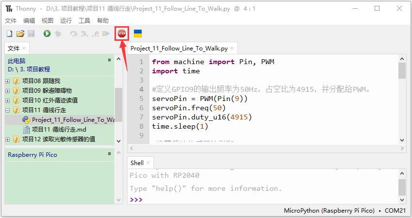

安上电池，将小车底板上的电源拨码开关拨到ON一端，开启电源。单击“”，代码开始执行，你会看到的现象是：把小车放在循迹轨道（**我们提供有**）上，小车就开始根据红外循迹传送的数值做出不同的动作。按“Ctrl+C”或单击“”退出程序。


### 项目12: 读取光敏传感器的值

1.实验简介：

我们都知道人类可以通过自己的眼睛在黑暗中寻找光源，那么机器人是怎样完成这项任务呢？让机器人完成这项任务首先需要给机器人安装上能看见光亮的眼睛，即光敏传感器，这样就能让机器人通过光源的强弱来寻找光源。我们的小车上左右各装有1个光敏传感器，当外界环境光线的强、弱发生变化的时候，光敏传感器的电阻也跟随发生相应的改变，并把这种变化传输给小车上的Raspberry Pi Pico主板，Raspberry Pi Pico主板就像人的大脑一样可以判断和思考，指挥着小车寻找光线。两个光敏传感器不停的检测是否有光线，检测到光线后就判断左、右两边哪个方向的光线较强，最后就指挥小车向着光线强的方向前进。

在本实验中，我们将了解光敏传感器的工作原理。

2.元件知识：
**光敏传感器：** 它主要采用光敏电阻元件，该电阻元件电阻大小随着光照强度的变化而变化。传感器信号端连接单片机模拟口，当光线越强时，模拟口电压越大，即单片机的模拟值也大；反之，光照强度越弱时，模拟口电压越小，即单片机的模拟值也小。这样，就可以利用光敏传感器读取对应的模拟值来反映环境光线强度。

3.实验接线：
通过前面的安装接线知道，两个光敏传感器的信号脚位已经接到了Raspberry Pi Pico主板的GPIO26和GPIO27，下面我们就利用接到G26的光敏传感器来完成下面的实验，首先我们来读取模拟值。
|左边光敏传感器| 小车PCB板 |
| :--: | :--: |
| G| G |
| V| V |
|S|S（G26）|


4.实验代码：
左边光敏传感器是由Raspberry Pi Pico主板的GPIO26控制。

本教程中使用的代码保存在：“**..\Keyes Beetlebot Pico 3合1 智能小车\4. Python 教程\3. 项目教程**” 的路径中。你可以把代码移到任何地方。例如，我们将代码保存在**D盘**中，<span style="color: rgb(0, 209, 0);">路径为D:\3. 项目教程</span>。


打开“**Thonny**”软件，点击“**此电脑**”→“**D:**”→“**3. 项目教程**”→“**项目12 读取光敏传感器的值**”，然后鼠标左键双击“**Project_12_Read_Photosensor_Value.py**”。


```
from machine import ADC, Pin
import time

### 将光敏电阻初始化为引脚26 (ADC功能)
adc = ADC(Pin(26))

### 循环打印光敏电阻的当前adc值 
try:
    while True:
        adcValue = adc.read_u16() # 读取光敏电阻的ADC值
        print("ADC Value:", adcValue) #发送光敏电阻ADC值并打印结果。
        time.sleep(0.5)
except:
    pass
    
```

5.实验现象：
确保Raspberry Pi Pico主板已经连接到电脑上，单击“”。


安上电池，将小车底板上的电源拨码开关拨到ON一端，开启电源。单击“”，代码开始执行，你会看到的现象是：当光线增强时，Thonny IDE下的“Shell”窗口中打印模拟值增大；反之，打印的模拟值减小。按“Ctrl+C”或单击“”退出程序。


### 项目13: 寻光车

1.实验简介：
前面实验已经了解过光敏传感器的工作原理、电机驱动与调速，在本实验中，我们利用光敏传感器检测光线强弱来实现小车寻光效果，哪边光敏传感器接收到的光线较强，小车就往那边走。

2.工作原理：
|左光敏传感器的模拟值|右光敏传感器的模拟值|功能|
| :--: | :--: | :--: |
|大于50000|大于50000|向前移动|
|大于50000|小于等于50000|向左移动|
|小于等于50000|大于50000|向右移动|
|小于50000|小于50000|停止|

3.实验接线：
|左边光敏传感器|小车PCB板|右边光敏传感器|小车PCB板|
| :--: | :--: | :--: | :--: |
| G| G| G | G |
| V | V | V | V |
| S |S（GPIO26）| S |S（GPIO27）|
  

4.流程图：


5.实验代码：
左边光敏传感器是由Raspberry Pi Pico主板的GPIO26控制，右边光敏传感器是由Raspberry Pi Pico主板的GPIO27控制。

（<span style="color: rgb(255, 76, 0);">程序代码中的条件值50000可以根据实际环境中的光线强度进行调整。</span>）

本教程中使用的代码保存在：“**..\Keyes Beetlebot Pico 3合1 智能小车\4. Python 教程\3. 项目教程**” 的路径中。你可以把代码移到任何地方。例如，我们将代码保存在**D盘**中，<span style="color: rgb(0, 209, 0);">路径为D:\3. 项目教程</span>。


打开“**Thonny**”软件，点击“**此电脑**”→“**D:**”→“**3. 项目教程**”→“**项目13 寻光车**”，然后鼠标左键双击“**Project_13_Light_Following_Car.py**”。


```
from machine import Pin, ADC, PWM
import time

###定义GPIO9的输出频率为50Hz，占空比为4915，并分配给PWM。
servoPin = PWM(Pin(9))
servoPin.freq(50)
servoPin.duty_u16(4915)
time.sleep(1)

### 初始化左光阻至引脚26 (ADC功能)
adc1 = ADC(Pin(26))

### 将右光阻初始化为引脚27 (ADC功能)
adc2 = ADC(Pin(27))

### 右轮
pin1=Pin(14,Pin.OUT)
pin2=PWM(Pin(16))
pin2.freq(50)
### 左轮
pin3=Pin(15,Pin.OUT)
pin4=PWM(Pin(17))
pin4.freq(50)

### 作为小车前进的函数。
def car_forward(): 
  pin1.value(0)
  pin2.duty_u16(18000) 
  pin3.value(0)
  pin4.duty_u16(18000) 

### 作为小车向左的函数。
def car_left(): 
  pin1.value(0)
  pin2.duty_u16(18000)  
  pin3.value(1)
  pin4.duty_u16(50000) 

### 作为小车向右的函数。
def car_right(): 
  pin1.value(1)
  pin2.duty_u16(50000)  
  pin3.value(0)
  pin4.duty_u16(18000)

### 作为小车停止的函数。
def car_stop():
  pin2.deinit()
  pin4.deinit()
  pin1.value(0)
  pin2.duty_u16(0)  
  pin3.value(0)
  pin4.duty_u16(0)  

while True:
    adcValue1 = adc1.read_u16() # 读取左光敏电阻的ADC值。
    adcValue2 = adc2.read_u16() # 读取右光敏电阻的ADC值。
    print("ADC Value1:", adcValue1 ,"ADC Value2:", adcValue2)
    time.sleep(0.5)
    if adcValue1 > 50000 and adcValue2 > 50000: #由左、右光阻测量的范围值。
        pin2=PWM(Pin(16))
        pin2.freq(50)
        pin4=PWM(Pin(17))
        pin4.freq(50)
        car_forward() #小车前进
    elif adcValue1 > 50000 and adcValue2 <= 50000:
        pin2=PWM(Pin(16))
        pin2.freq(50)
        pin4=PWM(Pin(17))
        pin4.freq(50)
        car_left() #小车向左
    elif adcValue1 <= 50000 and adcValue2 > 50000:
        pin2=PWM(Pin(16))
        pin2.freq(50)
        pin4=PWM(Pin(17))
        pin4.freq(50)
        car_right() #小车向右
    else:
        car_stop() #小车停止
        
```
6.实验现象：
确保Raspberry Pi Pico主板已经连接到电脑上，单击“”。


安上电池，将小车底板上的电源拨码开关拨到ON一端，开启电源。单击“”，代码开始执行，你会看到的现象是：用手电筒光对着小车上光敏传感器，寻光车能够跟随着光移动。按“Ctrl+C”或单击“”退出程序。


### 项目14: 红外遥控和接收

1.实验简介：
红外遥控在日常生活中随处可见，它被用来控制各种家电，如电视、音响、录影机和卫星信号接收器。红外遥控是由红外发射和红外接收系统组成的，也就是一个红外遥控器、红外接收器和一个能解码的单片机组成的，小车上有个红外接收器。

在本实验中，使用红外接收器和红外遥控器相结合，读取红外遥控器上的按键值并将按键值打印在串口监视器上。

2.元件知识：
**红外(IR)遥控器：** 是一种具有一定数量按钮的设备。按下不同的按钮会使位于遥控器前端的红外发射管以不同的编码发送红外信号。红外遥控技术应用广泛，如电视、空调等。因此，在当今科技发达社会，红外遥控技术使你切换电视节目和调节空调温度都很方便。
我们使用的遥控器如下所示：
该红外遥控器采用NEC编码，信号周期为110ms。


**红外(IR)接收器：** 它是一种元件，可以接收红外光，所以可以用它来检测红外遥控器发出的红外光信号。红外接收器解调接收到的红外光信号，并将其转换回二进制，然后将信息传递给微控制器。
红外信号调制过程图：


3.实验代码：
小车PCB板上的红外接收器是由Raspberry Pi Pico主板的GPIO6控制。

本教程中使用的代码保存在：“**..\Keyes Beetlebot Pico 3合1 智能小车\4. Python 教程\3. 项目教程**” 的路径中。你可以把代码移到任何地方。例如，我们将代码保存在**D盘**中，<span style="color: rgb(0, 209, 0);">路径为D:\3. 项目教程</span>。


打开“**Thonny**”软件，点击“**此电脑**”→“**D:**”→“**3. 项目教程**”→“**项目14 红外遥控和接收**”，<span style="color: rgb(255, 76, 65);">选择“irrecvdata\.py”，右击鼠标选择“上传到/”，等待“irrecvdata\.py”被上传到ESP32主板</span>，然后鼠标左键双击“**Project_14_Infrared_Remote_And_Receiver.py**”。


```
from irrecvdata import irGetCMD #导入红外解码器。

recvPin = irGetCMD(6) #将红外解码器与引脚(6)相关联。

###得到红外键值后，在“Shell”中重复打印。
try:
    while True:
        irValue = recvPin.ir_read() #调用ir_read()读取按下的键的值并将其赋值给IRValue。
        if irValue:
           print(irValue) # 发送红外线接收器的irValue并打印结果。
except:
    pass

```
5.实验现象：
确保Raspberry Pi Pico主板已经连接到电脑上，单击“”。


安上电池，将小车底板上的电源拨码开关拨到ON一端，开启电源。单击“”，代码开始执行，你会看到的现象是：将红外遥控器发射器对准红外接收头，按下红外控制器上的按键，Thonny IDE下的”Shell”窗口将打印当前接收到的按键编码值。按“Ctrl+C”或单击“”退出程序。

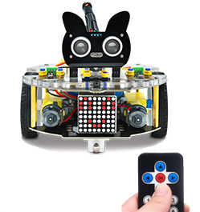


写下红外遥控器与每个按钮相关联的代码，因为你稍后将需要这些信息。


### 项目15: 红外遥控车


1.实验简介：
在上面实验中，我们已经了解了8*8点阵、电机驱动和调速、红外接收器和红外遥控器等硬件知识，在本实验中，我们将使用红外遥控器和红外接收器来控制小车做一些动作。

2.工作原理：
|按键|按键代码|功能|
| :--: | :--: | :--: |
|| FF629D |前进，点阵屏显示“前进”图案|
|| FFA857 | 后退，点阵屏显示“后退”图案 |
|| FF22DD | 向左转，点阵屏显示“左转”图案|
|| FFC23D |向右转，点阵屏显示“右转”图案 |
|| FF02FD|停止，点阵屏显示“停止”图案 |

3.流程图：


4.实验代码：
本教程中使用的代码保存在：“**..\Keyes Beetlebot Pico 3合1 智能小车\4. Python 教程\3. 项目教程**” 的路径中。你可以把代码移到任何地方。例如，我们将代码保存在**D盘**中，<span style="color: rgb(0, 209, 0);">路径为D:\3. 项目教程</span>。


打开“**Thonny**”软件，点击“**此电脑**”→“**D:**”→“**3. 项目教程**”→“**项目15 红外遥控车**”，<span style="color: rgb(255, 76, 65);">分别选择“ht16k33_matrix\.py”，“matrix_fonts\.py”和“irrecvdata\.py”，右击鼠标选择“上传到/”，等待“ht16k33_matrix\.py”，“matrix_fonts\.py”和“irrecvdata\.py”被上传到ESP32主板</span>，然后鼠标左键双击“**Project_15_Infrared_Remote_Control_Car.py**”。


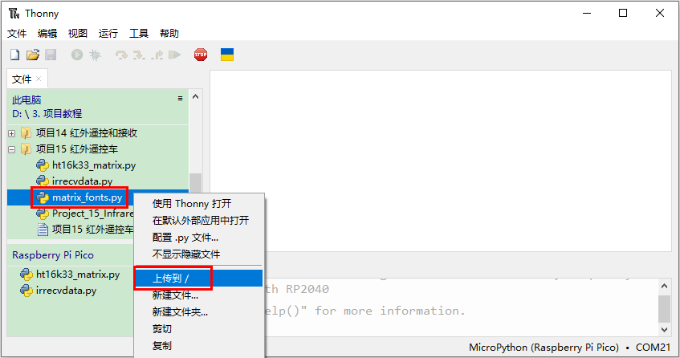


```
###导入库
from machine import Pin,I2C,PWM
import time
import json
import matrix_fonts
from ht16k33_matrix import ht16k33_matrix
from irrecvdata import irGetCMD 

recvPin = irGetCMD(6) #将红外解码器与引脚(6)相关联。
'''
###占空比与舵机角度相对应
0°----2.5%----1638
45°----5%----3276
90°----7.5%----4915
135°----10%----6553
180°----12.5%----8192
'''
定义GPIO9的输出频率为50Hz，占空比为4915，并将它们分配给PWM。
servoPin = PWM(Pin(9))
servoPin.freq(50)
servoPin.duty_u16(4915)
time.sleep(1)

### 右轮
pin1=Pin(14,Pin.OUT)
pin2=PWM(Pin(16))
pin2.freq(50)
### 左轮
pin3=Pin(15,Pin.OUT)
pin4=PWM(Pin(17))
pin4.freq(50)

制作图案的工具 https://gurgleapps.com/tools/matrix
###i2c配置
clock_pin = 21
data_pin = 20
bus = 0
i2c_addr_left = 0x70
use_i2c = True

def scan_for_devices():
    i2c = machine.I2C(bus,sda=machine.Pin(data_pin),scl=machine.Pin(clock_pin))
    devices = i2c.scan()
    if devices:
        for d in devices:
            print(hex(d))
    else:
        print('no i2c devices')

if use_i2c:
    scan_for_devices()
    left_eye = ht16k33_matrix(data_pin, clock_pin, bus, i2c_addr_left)

def show_char(left):
    if use_i2c:
        left_eye.show_char(left)
    
### 作为小车前进的函数。
def car_forward(): 
  pin1.value(0)
  pin2.duty_u16(50000) 
  pin3.value(0)
  pin4.duty_u16(50000)

### 作为小车后退的函数。
def car_back(): 
  pin1.value(1)
  pin2.duty_u16(10000)  
  pin3.value(1)
  pin4.duty_u16(10000)

### 作为小车向左行驶的函数。
def car_left(): 
  pin1.value(0)
  pin2.duty_u16(50000)  
  pin3.value(1)
  pin4.duty_u16(32768)

### 作为小车向右行驶的函数。
def car_right(): 
  pin1.value(1)
  pin2.duty_u16(32768)  
  pin3.value(0)
  pin4.duty_u16(50000)

### 作为小车停车的功能。
def car_stop():
  pin2.deinit()
  pin4.deinit()
  pin1.value(0)
  pin2.duty_u16(0)  
  pin3.value(0)
  pin4.duty_u16(0) 
  
def handleControl(value): 
    if value == '0xff629d':
        pin2=PWM(Pin(16))
        pin2.freq(50)
        pin4=PWM(Pin(17))
        pin4.freq(50)
        car_forward() #小车前进
   # 点阵显示向前图案
        show_char(matrix_fonts.textFont1['^'])
    elif value == '0xffa857':
        pin2=PWM(Pin(16))
        pin2.freq(50)
        pin4=PWM(Pin(17))
        pin4.freq(50)
        car_back() # 小车后退
    # 点阵显示后退图案
        show_char(matrix_fonts.textFont1['v'])
    elif value == '0xff22dd': 
        pin2=PWM(Pin(16))
        pin2.freq(50)
        pin4=PWM(Pin(17))
        pin4.freq(50)
        car_left() # 小车向左
    # 点阵显示向左图案
        show_char(matrix_fonts.textFont1['>'])
    elif value == '0xffc23d': 
        pin2=PWM(Pin(16))
        pin2.freq(50)
        pin4=PWM(Pin(17))
        pin4.freq(50)
        car_right() # 小车向右
    # 点阵显示向右图案
        show_char(matrix_fonts.textFont1['<'])
    elif value == '0xff02fd':
        car_stop() # 小车停止
    # 点阵显示停止图案
        show_char(matrix_fonts.textFont1['!']) 
try:
    while True:
        irValue = recvPin.ir_read() #调用ir_read()读取按下的键的值并将其赋值给IRValue。
        if irValue:
            print(irValue)
            handleControl(irValue)
except:
    pass

```

5.实验现象：
确保Raspberry Pi Pico主板已经连接到电脑上，单击“”。


安上电池，将小车底板上的电源拨码开关拨到ON一端，开启电源。单击“”，代码开始执行，你会看到的现象是：按下红外遥控器对应按键，小车跟着遥控器按下的按键做出相应的动作。按“Ctrl+C”或单击“”退出程序。


